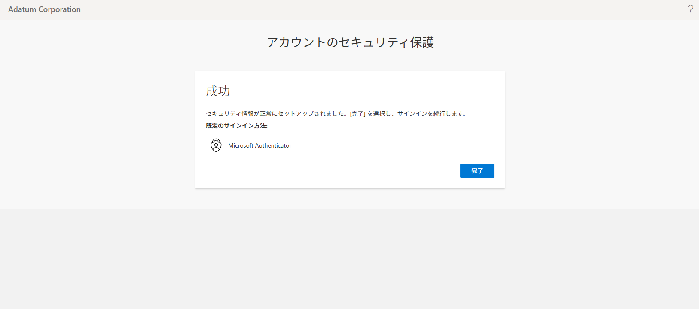

---
lab:
    title: '01 - ユーザーの作成とロールを管理する'
    learning path: '01'
---

# ラボ 01：ユーザーの作成とロールを管理する

#### 推定時間: 15 分

### タスク 1 - 新しいユーザーを追加する

1. Azure Portalにサインインしていることを確認の上、上部の検索ダイアログより「Microsoft Entra ID」 を検索してクリックします。

2. Microsoft Entra IDの画面が表示されます。左側のナビゲーション メニューより「ユーザー」 をクリックします。

3. 「+ 新しいユーザー」 →「新しいユーザーの作成」をクリックします。

4. 「新しいユーザーの作成」ブレードが表示されます。  次の情報を使用して「レビューと作成」をクリックします。

    > 注：指定の無い項目は、「空欄」または「デフォルト値」で結構です。
    >
    > 注：割り当てタブは設定しません。

    | タブ名 | 項目 | 値 |
    | :--- | :--- | ---- |
    | 基本 | ユーザー プリンシパル名 | ChrisG |
    | 基本| 表示名 | Chris Green |
    | 基本 | パスワード | Pa55w.rd12345 |
    | 基本 | パスワードの自動生成 | チェックを外す |
    | プロパティ | 名 | Chris |
    | プロパティ | 姓 | Green |
    | プロパティ | 利用場所 | 日本 |

    

5. 確認と作成画面が表示されます。内容を確認し、「作成」をクリックします。

6. 作成後に「ユーザー」ブレードが表示されます。作成したユーザーがあることを確認してください。

    > 注：画面内の「更新」ボタンあるいはブラウザの更新を行うと、作成されたユーザーが表示されます。

### タスク 2 - ログインしてアプリを作成する

1. 新しい InPrivate ブラウザー ウィンドウを開きます。

    > 注:演習の中ではWebブラウザの機能を使って別セッションでサインインします。
    >
    > 　  どのWebブラウザもウィンドウ右上の設定ボタンから表示することが可能です。
    >
    > 　  Microsoft Edgeでは「InPrivate」ウィンドウ
    >
    > 　  Google Chromeでは「シークレット」ウィンドウ
    >
    > 　  Mozilla Fire Foxでは「プライベート」ウィンドウ

    

2. Chris Green として、Azure portal ([https://portal.azure.com](https://portal.azure.com)) を開きます。

    > 注:XXXXはご自身のアカウント番号を入力してください。

    | 設定 | 値 |
    | :--- | :--- |
    | ユーザー名| `ChrisG@XXXXXXXXXXX.onmicrosoft.com` |
    | パスワード| Pa55w.rd12345 |

    

3. パスワードを更新します。

    | 設定 | 値 |
    | :--- | :--- |
    | 現在のパスワード| Pa55w.rd12345 |
    | 新しいパスワード| Pa55w.rd1234 |
    | パスワードの確認| Pa55w.rd1234 |

    

4. 「サインインの状態を維持しますか?」と表示される場合があります。「いいえ」を選択してください。

     > 注:誤って「はい」を選択しても、演習に影響はありせん。

5. 表示される「Portal MFA Enforcement」ウィンドウで、「Sign-in with MFA」 を選択します。

    

6. 「アカウントをセキュリティで保護しましょう」画面が表示されます。「次へ」をクリックします。

    

7. 「アカウントのセキュリティ保護」の「最初にアプリを取得します」画面で「次へ」をクリックします。

    

8. 「アカウントのセキュリティ保護」の「アカウントのセットアップ」画面で「次へ」をクリックします。

    

9. 「アカウントのセキュリティ保護」の「QR コードをスキャンします」画面が表示されます。お手持ちのスマートフォンのMicrosoft Authenticatorアプリにて、「+」(画面右上にあります) - 「職場または学校のアカウント」 - 「QRコードをスキャン」と選択して、QRコードをスキャンします。 InPrivate ブラウザー ウィンドウに戻り「次へ」をクリックします。

10. 「サインイン要求を承認」画面で表示された番号を使用して、Authenticatorアプリの認証を実施します。

    

11. 「通知が承認されました」と表示されます。「次へ」をクリックします。

12. 「成功」と表示されます。「完了」をクリックします。

1. 「サインインの状態を維持しますか?」と表示される場合があります。「いいえ」を選択してください。

1. 「Microsoft Azure へようこそ」ダイアログが表示された場合は、「キャンセル」ボタンをクリックします。

2. Azure Portalの検索ダイアログより「エンタープライズ アプリケーション」を検索してクリックします。

3. 「エンタープライズ アプリケーション」ブレードが表示されます。「+ 新しいアプリケーション」をクリックしてください。

4. 「Microsoft Entra ギャラリーを参照する」ブレードが表示されます。「アプリケーションを検索」ダイアログに「AWS IAM Identity Center (successor to AWS Single Sign-On)」と入力します。

5. 検索結果に「AWS IAM Identity Center (successor to AWS Single Sign-On)」が表示されます。クリックしてください。

6. 画面右側に「AWS IAM Identity Center (successor to AWS Single Sign-On)」と表示されますが、「作成」がクリックできないことを確認してください。

      > 注:これはアプリケーションを登録する権限がないため、作成することが出来ません。

7. Azure Portalの右上隅にある `ChrisG@XXXXXXXXXXX.onmicrosoft.com` の名前をクリックして、サインアウトします。

       

### タスク 3 - ユーザーにロールを割り当てる

1. `admin@XXXXXXXXXXX.onmicrosoft.com`でサインインしているWebブラウザに戻ります。

2. 「Microsoft Entra ID」ブレードに移動します。

3. 左側のナビゲーション メニューの「ユーザー」をクリックします。

4. Chris Green のアカウントをクリックします。

5. 左側のナビゲーション メニューの「管理」を展開し、「割り当てられたロール」をクリックします。

6. 「+ 割り当ての追加」をクリックします。

7. 「ロールの選択」ドロップダウンリストで「アプリケーション管理者」を選択します。

8. 「次へ」をクリックします。

9. 「割り当て」をクリックします。

10. 「Chris Green | 割り当てられたロール」ブレードの「アクティブな割り当て」タブに追加した「アプリケーション管理者」ロールが表示されたことを確認します。

     > 注:ロールは追加してから反映に30秒～60秒ほど時間がかかることがあります。「最新の情報に更新」ボタンをクリックしてください。

     

### タスク 4 - アプリケーションのアクセス許可を確認する

1. 新しい InPrivate ブラウザー ウィンドウを開きます。

2. Chris Green として、Azure portal ([https://portal.azure.com](https://portal.azure.com)) を開きます。

    | 設定 | 値 |
    | :--- | :--- |
    | ユーザー名| `ChrisG@XXXXXXXXXXX.onmicrosoft.com` |
    | パスワード| Pa55w.rd1234 |

    必要に応じ、携帯電話を使用したMFAでサインインしてください

3. Azure Portalの検索ダイアログより「エンタープライズ アプリケーション」を検索してクリックします。

4. 「エンタープライズ アプリケーション」ブレードが表示されます。「+ 新しいアプリケーション」をクリックしてください。

5. 「Microsoft Entra ギャラリーを参照する」ブレードが表示されます。「アプリケーションを検索」ダイアログに「AWS single sign-on」と入力します。

6. 検索結果に「AWS IAM Identity Center (successor to AWS Single Sign-On)」が表示されます。クリックしてください。

7. 「作成」がクリック出来ることを確認し、アプリケーションの登録を行ってください。

8. Azure Portalの右上隅にある `ChrisG@XXXXXXXXXXX.onmicrosoft.com` の名前をクリックして、サインアウトします。

     

### タスク 5 - Chris Green からアプリケーション管理者を削除する

**※　前のタスクから5分ほど、時間をおいて実施してください。**

1. `admin@XXXXXXXXXXX.onmicrosoft.com`でサインインしているWebブラウザに戻ります。

2. 「Microsoft Entra ID」ブレードに移動します。

3. 左側のナビゲーション メニューの「ロールと管理者」をクリックし、一覧から アプリケーション管理者 のロールクリックします。

4. 「アプリケーション管理者 | 割り当て」ブレードの「アクティブな割り当て」タブで「Chris Green 」の名前が表示されます。

5. 「Chris Green」 の名前の左にあるチェックボックスを「オン」にします。

6. ダイアログの上部にあるオプションから「割り当ての削除」をクリックします。

7. 確認ボックスが開いたら、「はい」と答えます。

8. アクティブな割り当ての一覧から「Chris Green」 が消えたことを確認します。(ロールは削除してから反映に30秒～60秒ほど時間がかかることがあります。「最新の情報に更新」ボタンをクリックしてください。)

     > 注:割り当てを解除することにより、再び「Chris Green」はアプリケーションの登録ができなくなりました。

     > 注:権限は無くなりましたが、登録したアプリケーションが無効になることはありません。

この演習では、Entra ロールを割り当てる演習を実施して頂きました。
