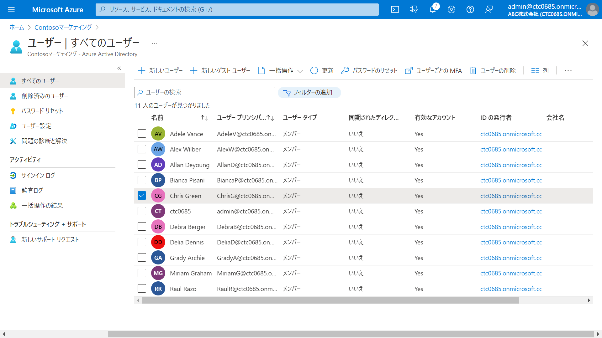

---
lab:
    title: '02 - ユーザーの削除および復元'
    learning path: '01'
---

# ラボ 02：ユーザーの削除および復元

#### 推定時間: 5 分

### タスク1 - Microsoft Entra ID からユーザーを削除する

1. [Microsoft Entra ID]( https://portal.azure.com/#blade/Microsoft_AAD_IAM/ActiveDirectoryMenuBlade/Overview) に`admin@XXXXXXXXXXX.onmicrosoft.com`でサインインします。

1. 左側のナビゲーション メニューの「ユーザー」 を選択します。

1. 「ユーザー | すべてのユーザー」 ブレードで、「Chris Green」 を選択します。

    
    
1. ユーザー アカウントを選択した状態で、 「削除」 を選択します。

1. ダイアログ ボックスを確認してから、「OK」 を選択します。

    

## タスク2 - 削除済みユーザーの復元

1. 左側のナビゲーション メニューの「削除されたユーザー」 を選択します。
1. 削除したユーザーのリストを確認し、「Chris Green」を選択します。
1. メニューで 「ユーザーの復元」 を選択します。
1. ダイアログ ボックスを確認してから、「OK」 を選択します。
1. 左側のナビゲーション メニューの「すべてのユーザー」 を選択します。
1. 「Chris Green」が復元されたことを確認します。

この演習では、ユーザーアカウントの削除と復元を行いました。
