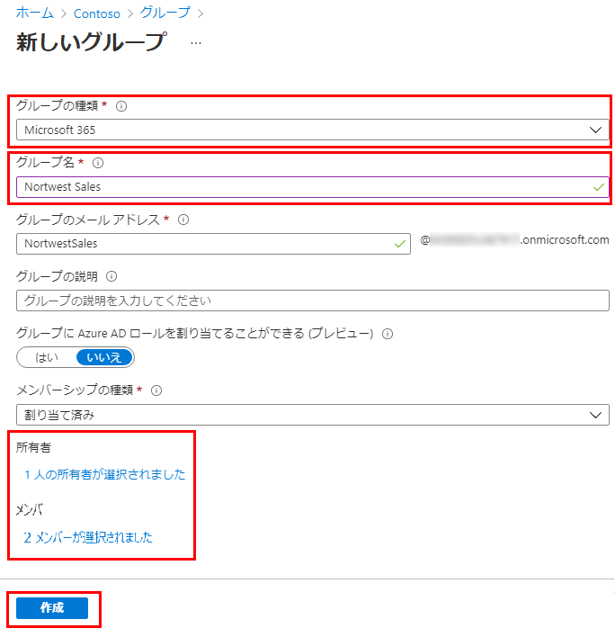

---
lab:
    title: '06 - Microsoft365グループの追加とライセンスの割り当て'
    learning path: '01'
---

# ラボ 06：Microsoft365グループの追加とライセンスの割り当て

#### 推定時間: 10 分

### タスク1 - Azure Active Directory で Microsoft 365 グループを作成する

1. [Azure Active Directory]( https://portal.azure.com/#blade/Microsoft_AAD_IAM/ActiveDirectoryMenuBlade/Overview) に`admin@ctcXXXX.onmicrosoft.com`でサインインします。

1. 左側のナビゲーション メニューの「グループ」 を選択します。

1. 「グループ」ブレードのメニューで、「新しいグループ」 を選択します。

1. 次の情報を使用し「作成」をクリックします。

    > 注:指定の無い項目は、「空欄」または「デフォルト値」で結構です。

    | 設定 | 値 |
    | :--- | :--- |
    | グループの種類| Microsoft 365 |
    | グループ名| Northwest Sales |
    | メンバーシップの種類| 割り当て済み|
    | 所有者| `admin@ctcXXXX.onmicrosoft.com`  |
    | メンバー| Alex Wilber と Bianca Pisani |

    

1. 完了したら、「Northwest sales」 という名前のグループが 「すべてのグループ」 リストに表示されていることを確認します。

### タスク2 - グループ ライセンス割り当てを変更する

1. [Azure Active Directory]( https://portal.azure.com/#blade/Microsoft_AAD_IAM/ActiveDirectoryMenuBlade/Overview) に`admin@ctcXXXX.onmicrosoft.com`でサインインします。
1. 左側のナビゲーション メニューの「グループ」 を選択します。
1. 前の演習で作成した 「Northwest Sales」 を選択します。
1. 左側のナビゲーション メニューの「ライセンス」 を選択します。
1. 「+ 割り当て」 ボタンを選択します。 

1. 「ライセンス割り当ての更新」ブレードの 「ライセンスの選択」 で、「Azure Active Directory Premium P2」 のチェック ボックスをオンにします。

1. 完了したら、「保存」 を選択します。

1. 一つ前の画面「sg-SC300-O365」ページで、「Azure Active Directory Premium P2」が追加されたことを確認します。

この演習では、Microsoft365グループを作成しました。
