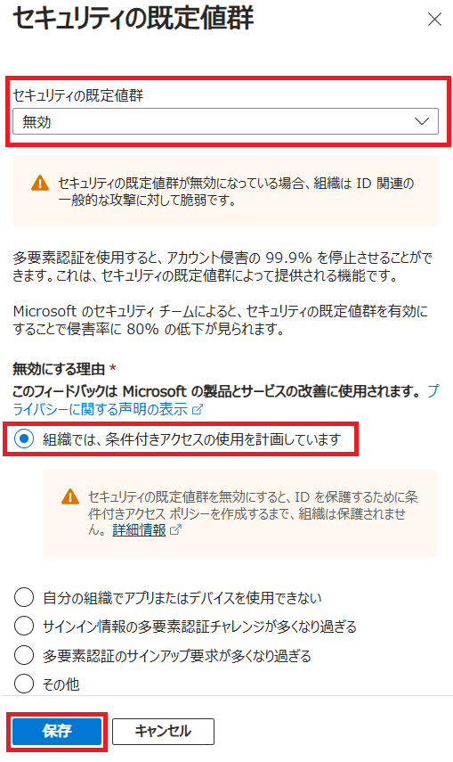

---
lab:
    title: '10 - セキュリティの既定値をオフにする'
    learning path: '02'
---

# ラボ 09：セキュリティの既定値をオフにする

#### 推定時間: 10 分

### ※この演習環境は既にセキュリティの既定値がオフのため、設定箇所をご確認ください。

### タスク 1 - セキュリティ既定値群を無効化する

1. [Microsoft Entra ID](https://entra.microsoft.com/) に`admin@XXXXXXXXXXX.onmicrosoft.com`でサインインします。

1. 「Contoso | 概要」ブレードの「プロパティ」タブ を選択します。

1. 「Contoso | プロパティ」ブレードの下部にある 「セキュリティの既定値群の管理」 を選択します。

1. 「セキュリティの既定値群の有効化」 トグルを 「無効」 に設定します。

1. 「組織では、条件付きアクセスの使用を計画しています」ラジオボタンを選択し「保存」をクリックします。

    

    

    

    この演習では、セキュリティ規定値の設定をオフにしました。

    後続のLabで、条件付きアクセスポリシーが作成できるか確認します。
