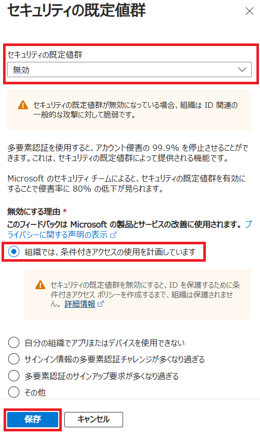

---
lab:
    title: '10 - セキュリティの既定値をオフにする'
    learning path: '02'
---

# ラボ 10：セキュリティの既定値をオフにする

#### 推定時間: 10 分

### ※この演習環境は既にセキュリティの規定値がオフのため、設定箇所をご確認ください。

### タスク 1 - セキュリティ規定値群を無効化する

1. [Microsoft Entra ID]( https://portal.azure.com/#blade/Microsoft_AAD_IAM/ActiveDirectoryMenuBlade/Overview) に`admin@XXXXXXXXXXX.onmicrosoft.com`でサインインします。

1. 「Contosoマーケティング | 概要」ブレードの左側のナビゲーションにある「プロパティ」 を選択します。

1. 「Contosoマーケティング | プロパティ」ブレードの下部にある 「セキュリティの既定値群の管理」 を選択します。

1. 「セキュリティの既定値群の有効化」 トグルを 「いいえ」 に設定します。

1. 以下のチェックボックスにチェックを入れ「保存」をクリックします。

    ☑自分の組織では条件付きアクセスを使用している

    

    

    

    この演習では、セキュリティ規定値の設定をオフにしました。

    後続のLabで、条件付きアクセスポリシーが作成できるか確認します。
