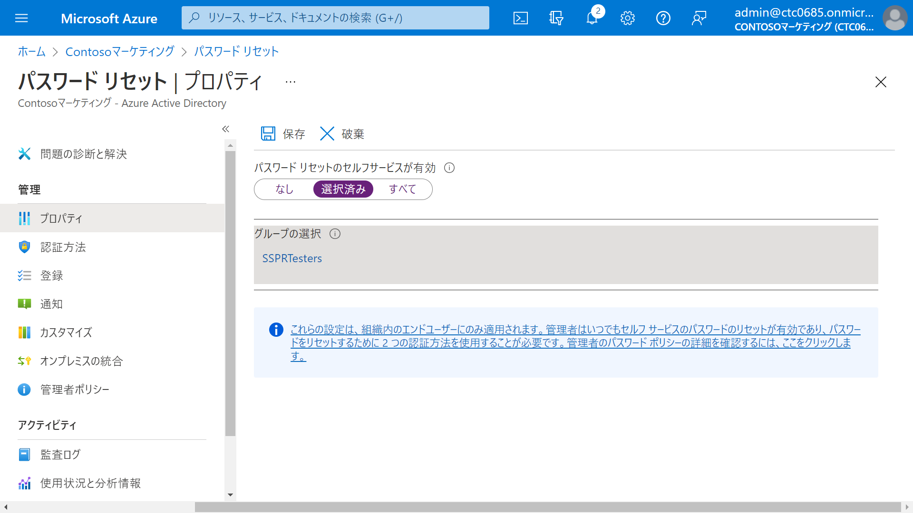
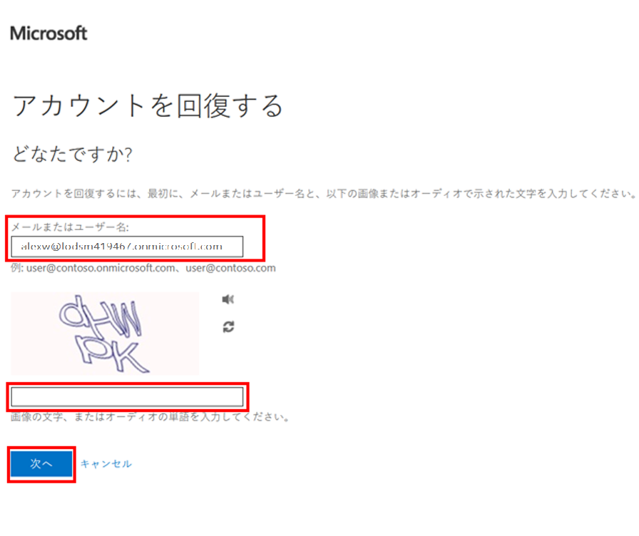

---
lab:
    title: '11 - パスワードリセットのセルフサービスを構成する'
    learning path: '02'
---

# ラボ 10：パスワードリセットのセルフサービスを構成する
#### 推定時間: 15 分

### タスク 1 - SSPR を割り当てるグループを作成する

1. [Microsoft Entra ID]( https://portal.azure.com/#blade/Microsoft_AAD_IAM/ActiveDirectoryMenuBlade/Overview) に`admin@XXXXXXXXXXX.onmicrosoft.com`でサインインします。

2. 左側のナビゲーション メニューの「グループ」を選択し「+ 新しいグループ」を選択します。

2. 次の情報を使用し「作成」をクリックします。

    > 注:指定の無い項目は、「空欄」または「デフォルト値」で結構です。
    
    | 設定 | 値 |
    | :--- | :--- |
    | グループの種類| セキュリティ |
    | グループ名| SSPRTesters |
    | グループの説明| SSPR のロールアウトのテスター |
    | メンバーシップの種類| 割り当て済み |
    | メンバー| Alex Wilber |
    | | Allan Deyoung |
    | | Bianca Pisani |

### タスク 2 - テスト グループの SSPR を有効にする

1. Micrsoft Entra IDのトップ画面へ戻ります。

    > 注:「Contosoマーケティング | 概要」ブレードです。

2. 左側のナビゲーション メニューの「パスワード リセット」 を選択します。

3. 「パスワード リセット | プロパティ」ブレードの「セルフサービスによるパスワードのリセット」 で、「選択済み」 を選択します。

4. 「SSPRSecurityGroupUsers」 をクリックします。

5. 「既定のパスワード リセット ポリシー」ウィンドウで、「SSPRTesters」 グループを選択します。

6. 「保存」 をクリックします。

    

    

### タスク 3 - Alex Wilber 自身が電話番号を登録する

1. 新しい InPrivate ブラウザー ウィンドウを開きます。
2. [[Azure Portal]( https://portal.azure.com)]に`AlexW@XXXXXXXXXXX.onmicrosoft.com` でサインインします。（初期パスワードは初日朝にSkillableから取得した User Password です)
4. 「詳細情報が必要」画面が表示されます。「次へ」を選択してください。
5. 「アカウントのセキュリティ保護」画面が表示されます。「別の方法を設定します」をクリックした後、「電話」を選択し、確認をクリックします。その後ご自身の電話番号を設定し、「次へ」をクリックします。
6. SMSに届いたコードを入力します。
7. そのままサインインを継続し、Azure Portalが表示されたら、いったんブラウザーを閉じます。

### タスク 4 - SSPR をテストする

1. 新しい InPrivate ブラウザー ウィンドウを開きます。

2. [Azure Portal]( https://portal.azure.com) に`AlexW@XXXXXXXXXXX.onmicrosoft.com`でサインインします。

3. 「パスワードの入力」ページで、「パスワードを忘れた場合」 を選択します。

4. 「アカウントの復元」ページで、要求された情報を入力し、「次へ」 を選択します。

    

5. 「確認ステップ 1」 タスクで、「携帯電話に SMS 送信」 を選択し、電話番号を入力して、「SMS送信」 を選択します。

6. SMSに届いたコードを入力し、「次へ」 を選択します。

7. 「新しいパスワードの選択」ステップで、パスワード を「Pa55w.rd1234」 で設定します。

9. 「パスワードがリセットされました」と表示されます。

10. 「新しいパスワードでサインインするには、ここをクリックします。」を使用し、AlexWとしてサインインします。

11. 完了したら、ブラウザーを閉じます。

      

### タスク 5 - SSPRTesters グループに属していないユーザーを検証する

1. 新しい InPrivate ブラウザー ウィンドウを開きます。

   1. [Azure Portal]( https://portal.azure.com) に`GradyA@XXXXXXXXXXX.onmicrosoft.com`でサインインします。

2. 「パスワードの入力」ページで、「パスワードを忘れた場合」 を選択します。

3. 「アカウントの復元」ページで、要求された情報を入力し、「次へ」 を選択します。

4. 画面内に「申し訳ございません。使用のアカウントでパスワードのリセットが有効になっていないため、自分でパスワードをリセットすることはできません。」と表示されSSPRが実施できないことを確認します。

   

この演習では、SSPRの実装とテストを実施しました。
