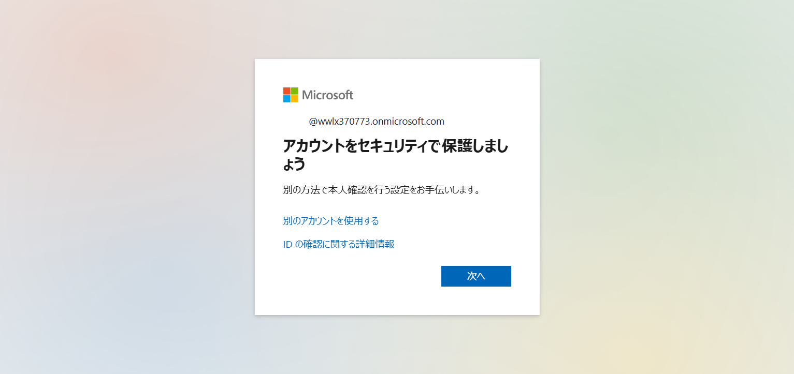
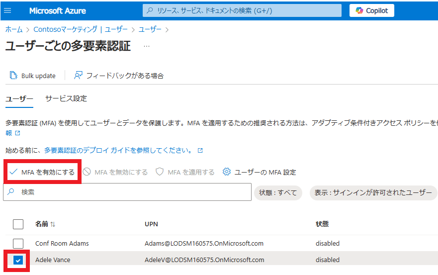

---
lab:
    title: '12 - AzureMFAを実装する'
    learning path: '02'
    module: 'モジュール 01 - Azure Multi-Factor Authentication の計画と管理を行う'
---

# ラボ11：AzureMFAを実装する

#### 推定時間: 20 分

### 事前準備 - Officeユーザーポータルのアクセスに多要素認証が要求されないことを確認する。

1. 新しい InPrivate ブラウザー ウィンドウを開きます。

2. [https://www.office.com](https://www.office.com/) に`DeliaD@XXXXXXXXXXX.onmicrosoft.com`でサインインします。（初期パスワードは Skillable より取得した User Password です。）
3. InPrivate ブラウザー を閉じます。

## 演習 1 - Azure でMulti-Factor Authenticationを確認して有効にする

### タスク 1 - Delia Dennis の MFA の条件付きアクセス ルールを設定する

1. [https://portal.azure.com](https://portal.azure.com) に`admin@XXXXXXXXXXX.onmicrosoft.com`でサインインします。

2. 左側のナビゲーション メニューの「セキュリティ」をクリックします。

3. 「セキュリティ | はじめに」ブレードで「保護」カテゴリの「条件付きアクセス」をクリックします。

4. 「セキュリティ | 概要」ブレードで「ポリシー」をクリックします。

5. 「条件付きアクセス | ポリシー」ブレードで「新しいポリシー」をクリックし、「新しいポリシーを作成する」をクリックします。

    

6. 名前を設定します。

    | 設定 | 値            |
    | ---- | ------------- |
    | 名前 | MFA_for_Delia |

7. 「ユーザー」を設定します。

    | 設定     | 値                                                           |
    | -------- | ------------------------------------------------------------ |
    | ユーザー | 「ユーザーまたはエージェント (プレビュー) が選択されていません」リンクをクリック |
    | 対象     | ユーザーとグループの選択                                     |
    |          | ユーザーとグループ に☑を入れる                               |
    | 選択     | Delia Dennis                                                 |

8. 「ターゲットリソース」 を設定します。

    | 設定               | 値                                                           |
    | ------------------ | ------------------------------------------------------------ |
    | ターゲットリソース | 「ターゲット リソースが選択されていません」リンクをクリック  |
    | 対象               | リソースの選択                                               |
    | 選択               | 「特定のリソースを選択する」の下にある「なし」リンクをクリック　⇒　「Office365」を選択 |

9. 「アクセス制御」 で 「許可」 を設定します。

    (指定した項目以外はデフォルトのまま)

    | 設定             | 値                                                         |
    | ---------------- | ---------------------------------------------------------- |
    | アクセス権の付与 | 多要素認証を要求する に☑を入れ、一番下の「選択」をクリック |

10. 「ポリシーの有効化」 を 「オン」 に設定します。

11. 「作成」 をクリックし、ポリシーを作成します。

     ​    

### タスク 3 - Delia Dennis のサインインをテストする

1. 新しい InPrivate ブラウザー ウィンドウを開きます。

2. [https://www.office.com](https://www.office.com) に`DeliaD@XXXXXXXXXXX.onmicrosoft.com`でサインインします。（初期パスワードは初日朝にSkillableから取得した User Password です)

3. 以下のような画面が出て、多要素認証が求められることを確認します。

   

   その後、Microsoft Authenticatorによる多要素認証を完了してもよいですし、この時点でInPrivate ブラウザー ウィンドウを閉じて終了しても構いません。

   

## 演習 2 - ログインに必要になるように MFA を構成する

### タスク 1 - Entra ID のユーザーごとの MFA を構成する

1. [Microsoft Entra ID]( https://portal.azure.com/#blade/Microsoft_AAD_IAM/ActiveDirectoryMenuBlade/Overview) に`Admin@XXXXXXXXXXX.onmicrosoft.com`でサインインします。

2. 左側のナビゲーション メニューの「ユーザー」を選択し、さらに「ユーザーごとのMFA」を選択します。

    

    

3. 「ユーザーごとの多要素認証」画面が表示されます。一覧から「Adele Vance」にチェックを入れ、「MFAを有効にする」をクリックします。

    

4. 確認のポップアップが表示されたら「有効にする」ボタンをクリックします。

5. 「更新が正常に完了しました」と表示されたら「閉じる」 を選択します。

6. 「Adele」 の 状態が「Enabled」になっていることを確認してください。

    > 注:Delia Dennisは、条件付きアクセスポリシーで設定しているため、ここでは「無効」と表示されます。
    >
    > 　「多要素認証」画面と「条件付きアクセスポリシー」は連携せず、個々に動作します。
    
7. 「ユーザーごとの多要素認証」画面を閉じます。

     

### タスク 2 - Adele Vance としてサインインを試みる

1. 新しい InPrivate ブラウザー ウィンドウを開きます。

2. [https://www.office.com](https://www.office.com) に`AdeleV@XXXXXXXXXXX.onmicrosoft.com`でサインインします。（初期パスワードは初日朝にSkillableから取得した User Password です)

3. 以下のような画面が出て、多要素認証が求められることを確認します。

   

   その後、Microsoft Authenticatorによる多要素認証を完了してもよいですし、この時点でInPrivate ブラウザー ウィンドウを閉じて終了しても構いません。

   

   

この演習では、MFAの実装を行いました。

> 参考:MFAの設定手順の違い
>
> ■ 条件付きアクセスポリシーで設定する場合
>
>   - Microsoft Entra Premiumライセンスが必要になります。
>   - グループ単位、アプリケーション単位など細かな設定を行うことが可能です。
>
> ■ ユーザーブレードから設定する場合
>
>   - icrosoft Entra Freeで可能です。
>   - MFAを使用することは可能ですが、条件付きアクセスポリシーほど細かな設定は出来ません。

　
