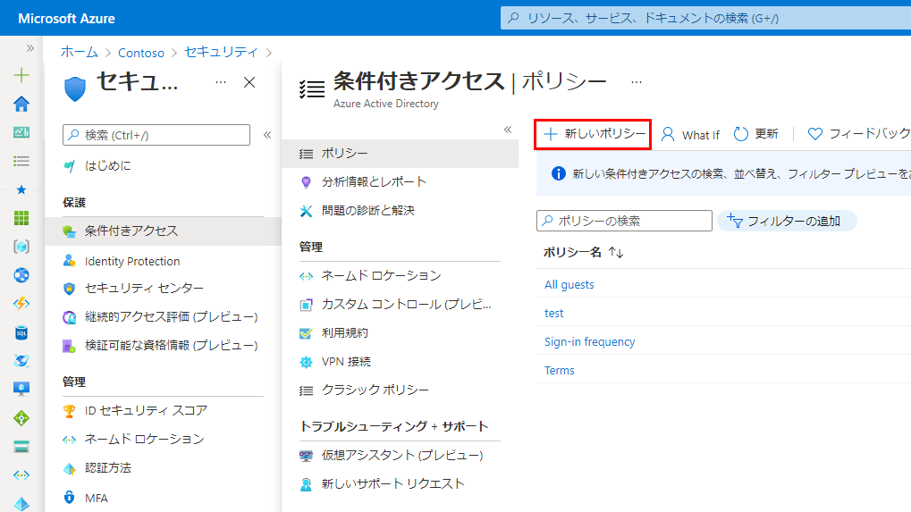
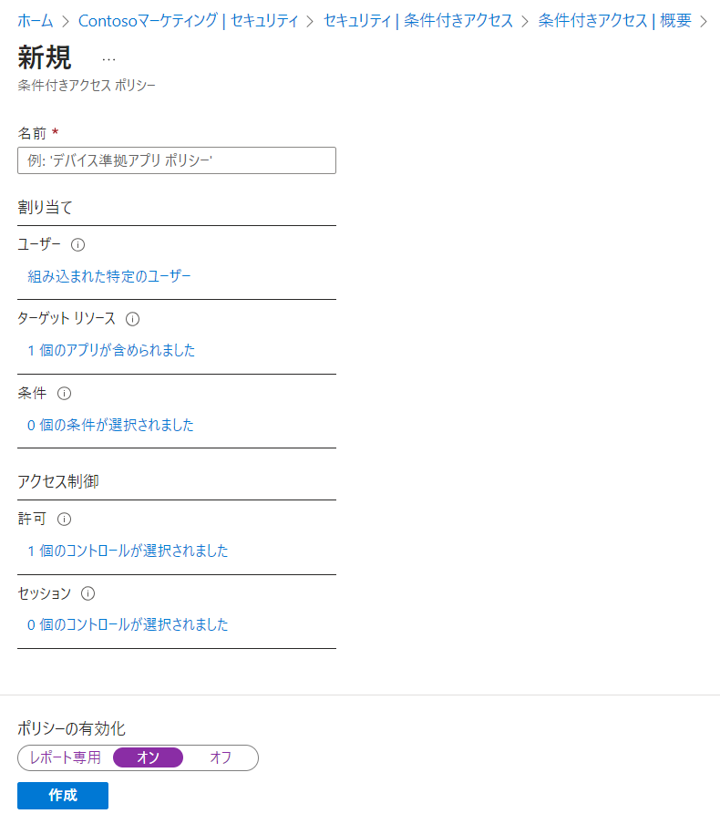
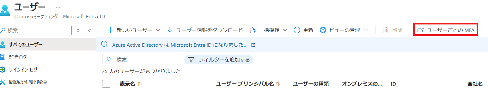

---
lab:
    title: '12 - AzureMFAを実装する'
    learning path: '02'
    module: 'モジュール 01 - Azure Multi-Factor Authentication の計画と管理を行う'
---

# ラボ12：AzureMFAを実装する

#### 推定時間: 20 分

## 演習 1 - Azure でMulti-Factor Authenticationを確認して有効にする

### タスク 1 - Azure Multi-Factor Authentication オプションを確認する

1. [https://portal.azure.com](https://portal.azure.com) に`admin@XXXXXXXXXXX.onmicrosoft.com`でサインインします。

2. Azure Portalにサインイン後、上部の検索ダイアログより「多要素認証」 を検索します。

3. 検索結果で、「多要素認証」を選択します。

4. 「多要素認証 | はじめに」ブレードで、「クラウドベースの多要素認証の追加設定」 を選択します。

    

5. 新しいブラウザー ページには、Azure ユーザーの MFA オプションとサービス設定が表示されます。

    

5. 画面下部の検証オプションを確認し、画面を閉じてください。

    > 注:このタスクで設定変更はありません。どのような設定があるか確認してください。

    

### タスク 2 - Delia Dennis の MFA の条件付きアクセス ルールを設定する

1. Azure Active Directoryのトップ画面へ戻ります。

2. 左側のナビゲーション メニューの「セキュリティ」をクリックします。

3. 「セキュリティ | はじめに」ブレードで「条件付きアクセス」をクリックします。

4. 「セキュリティ | 概要」ブレードで「ポリシー」をクリックします。

5. 「条件付きアクセス | ポリシー」ブレードで「新しいポリシー」をクリックし、「新しいポリシーを作成する」をクリックします。

    

6. 名前を設定します。

    | 設定 | 値            |
    | ---- | ------------- |
    | 名前 | MFA_for_Delia |

7. 「ユーザー」を設定します。

    | 設定     | 値                                                           |
    | -------- | ------------------------------------------------------------ |
    | ユーザー | 「0 個のユーザーとグループが選択されました」リンクをクリック |
    | 対象     | ユーザーとグループの選択                                     |
    |          | ユーザーとグループ に☑を入れる                               |
    | 選択     | Delia Dennis                                                 |

8. 「ターゲットリソース」 を設定します。

    | 設定               | 値                                                          |
    | ------------------ | ----------------------------------------------------------- |
    | ターゲットリソース | 「ターゲット リソースが選択されていません」リンクをクリック |
    | 対象               | アプリを選択                                                |
    | 選択               | 「なし」リンクをクリック　⇒　「Office365」を選択            |

9. 「条件」セクションを設定します。

    (指定した項目以外は未構成のまま)

    | 設定 | 値                                                           |
    | ---- | ------------------------------------------------------------ |
    | 場所 | 「未構成」リンクをクリック　⇒　構成「はい」を選択　⇒　対象「すべての場所」を選択 |

10. 「アクセス制御」 で 「許可」 を設定します。

    (指定した項目以外はデフォルトのまま)

    | 設定             | 値                                                         |
    | ---------------- | ---------------------------------------------------------- |
    | アクセス権の付与 | 多要素認証を要求する に☑を入れ、一番下の「選択」をクリック |

11. 「ポリシーの有効化」 を 「オン」 に設定します。

12. 「作成」 をクリックし、ポリシーを作成します。

       

       

### タスク 3 - Delia Dennis のサインインをテストする

1. 新しい InPrivate ブラウザー ウィンドウを開きます。

2. [https://www.office.com](https://www.office.com) に`DeliaD@XXXXXXXXXXX.onmicrosoft.com`でサインインします。

3. 「詳細情報が必要」と表示されます。「次へ」を選択してください。

4. 「アカウントのセキュリティ保護」画面が表示されます。「別の方法を設定します」をクリックします。

5. 「どの方法を使用しますか」では「電話」を選択し、確認をクリックしてください。

6. 自身の電話番号を入力し、SMSで届いたコードを入力し、「次へ」と「完了」までクリックしてください。

7. MFAの設定が完了しました。一度、サインアウトしてください。

8. もう一度、`DeliaD@XXXXXXXXXXX.onmicrosoft.com`でサインインを試みます。

9. サインインを行う途中「ID を確認する」と表示されます。「+XX XXXXXXXXXXXにSMSを送信」をクリックしてください。

10. 電話番号に届いたコードを入力し「検証」をクリックしてください。

11. サインインが完了します。

    

## 演習 2 - ログインに必要になるように MFA を構成する

### タスク 1 - Azure AD のユーザーごとの MFA を構成する

1. [Azure Active Directory]( https://portal.azure.com/#blade/Microsoft_AAD_IAM/ActiveDirectoryMenuBlade/Overview) に`Admin@XXXXXXXXXXX.onmicrosoft.com`でサインインします。

2. 左側のナビゲーション メニューの「ユーザー」を選択し、さらに「ユーザーごとの多要素認証」を選択します。

    

    

3. 「多要素認証」画面が表示されます。一覧から「Abele Vance」にチェックを入れ、「有効にする」をクリックします。

    

4. 通知ポップアップが表示されたら「multi-factor authを有効にする」ボタンをクリックします。

5. 「更新が正常に完了しました」と表示されたら「閉じる」 を選択します。

6. 「Adele」 の MFA ステータスが「有効」になっていることを確認してください。

    > 注:Webブラウザを再読み込みすると、「有効」のステータスに代わります。
    >
    > 注:Delia Dennisは、条件付きアクセスポリシーで設定しているため、ここでは「無効」と表示されます。
    >
    > 　「多要素認証」画面と「条件付きアクセスポリシー」は連携せず、個々に動作します。

7. 「多要素認証」画面を閉じます。

     

### タスク 2 - Adele Vance としてサインインを試みる

> 注:以降の手順は演習1-タスク3と同じです。演習を実施しなくても構いません。

1. 新しい InPrivate ブラウザー ウィンドウを開きます。
2. [https://www.office.com](https://www.office.com) に`AdeleV@XXXXXXXXXXX.onmicrosoft.com`でサインインします。
3. 「詳細情報が必要」と表示されます。「次へ」を選択してください。
4. 「アカウントのセキュリティ保護」画面が表示されます。「別の方法を設定します」をクリックします。
5. 「どの方法を使用しますか」では「電話」を選択し、確認をクリックしてください。
6. 自身の電話番号を入力し、SMSで届いたコードを入力し、「次へ」と「完了」までクリックしてください。
7. MFAの設定が完了しました。一度、サインアウトしてください。
8. もう一度、`DeliaD@XXXXXXXXXXX.onmicrosoft.com`でサインインを試みます。
9. サインインを行う途中「ID を確認する」と表示されます。「+XX XXXXXXXXXXXにSMSを送信」をクリックしてください。
10. 電話番号に届いたコードを入力し「検証」をクリックしてください。
11. サインインが完了します。

この演習では、MFAの実装を行いました。

> 参考:MFAの設定手順の違い
>
> ■ 条件付きアクセスポリシーで設定する場合
>
>   - Azure AD Premiumライセンスが必要になります。
>   - グループ単位、アプリケーション単位など細かな設定を行うことが可能です。
>
> ■ ユーザーブレードから設定する場合
>
>   - Azure AD Freeで可能です。
>   - MFAを使用することは可能ですが、条件付きアクセスポリシーほど細かな設定は出来ません。

　
