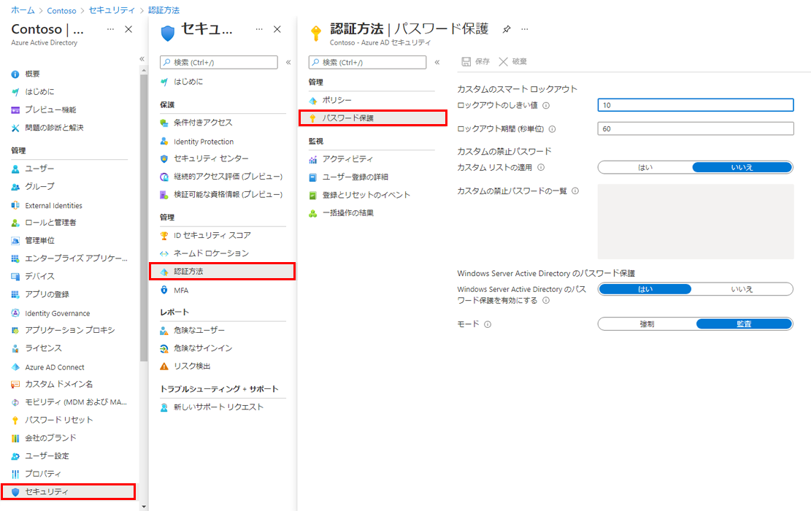

---
lab:
    title: '14 - スマートロックアウトを実装する'
    learning path: '02'
---

# ラボ13：スマートロックアウトを実装する

#### 推定時間: 15分


### タスク 1 - Azure AD スマート ロックアウトの値を管理する

1. [Microsoft Entra ID]( https://portal.azure.com/#blade/Microsoft_AAD_IAM/ActiveDirectoryMenuBlade/Overview) に`admin@XXXXXXXXXXX.onmicrosoft.com`でサインインします。

1. 左側のナビゲーション メニューの「セキュリティ」をクリックします。

1. 左側のナビゲーション メニューの「管理」カテゴリを展開し「認証方法」 を選択します。

1. 左側のナビゲーション メニューの「パスワード保護」 を選択します。

    

1. 「認証方法 | パスワード保護」ブレードで、次の情報を使用し「保存」をクリックします。

    > 注:指定の無い項目は、「空欄」または「デフォルト値」で結構です。

    | 設定                      | 値   |
    | :------------------------ | :--- |
    | ロックアウトのしきい値    | 3    |
    | ロックアウト期間 (秒単位) | 180  |


### タスク 2 - Grady で スマート ロックアウトを検証する

1. 新しい InPrivate ブラウザー ウィンドウを開きます。

1. [Azure Portal]( https://portal.azure.com/) に`GradyA@XXXXXXXXXXX.onmicrosoft.com`でサインイン時に3回以上パスワード認証を失敗します。

1. 認証画面にて、以下のメッセージが表示されます。

   ```
   「承認されていない使用を防ぐためにアカウントが一時的にロックされています。
   　後でもう一度お試しください。問題が解決しない場合は、管理者にお問い合わせください。」
   ```

   

### タスク 3 - Azure AD スマート ロックアウトの値を再変更する

> 注:以降の演習で影響を及ぼす可能性があるため、 検証後は再度設定値を緩くすることをお勧めします。
>
> 　 (例えば、adminのパスワードを３回失敗すると180秒、演習を実施することが出来ません。)

1. [Microsoft Entra ID]( https://portal.azure.com/#blade/Microsoft_AAD_IAM/ActiveDirectoryMenuBlade/Overview) に`admin@XXXXXXXXXXX.onmicrosoft.com`でサインインします。

1. 左側のナビゲーション メニューの「セキュリティ」をクリックします。

1. 左側のナビゲーション メニューの「管理」カテゴリを展開し「認証方法」 を選択します。

1. 左側のナビゲーション メニューの「パスワード保護」 を選択します。

1. 「認証方法 | パスワード保護」ブレードで、次の情報を使用し「保存」をクリックします。

   > 注:指定の無い項目は、「空欄」または「デフォルト値」で結構です。
   >
   > 注:下記の値より緩い数値でもOKです。

   | 設定                      | 値   |
   | :------------------------ | :--- |
   | ロックアウトのしきい値    | 10   |
   | ロックアウト期間 (秒単位) | 60   |


この演習では、スマートロックアウトの値を変更し、スマートロックアウトを検証しました。
