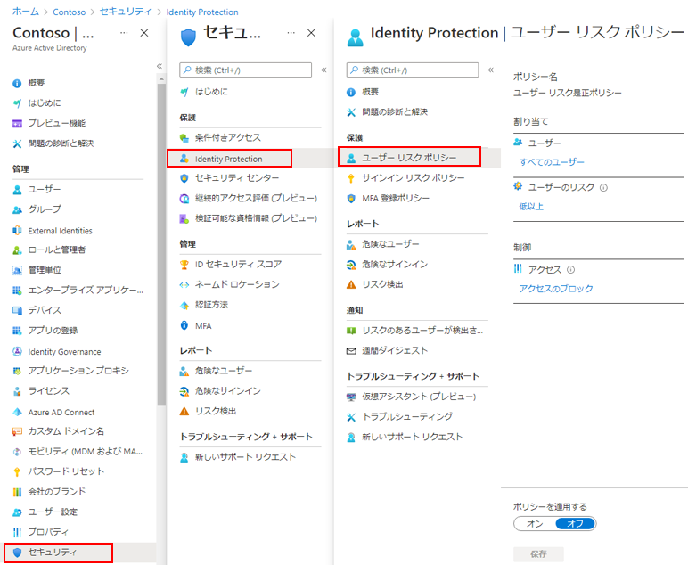

---
lab:
    title: '15 - Identity Protectionを実装する'
    learning path: '02'
---

# ラボ15：Identity Protectionを実装する

#### 推定時間: 10 分

### タスク 1 - ユーザー リスク ポリシーを有効にする

1. [Microsoft Entra ID]( https://portal.azure.com/#blade/Microsoft_AAD_IAM/ActiveDirectoryMenuBlade/Overview) に`admin@XXXXXXXXXXX.onmicrosoft.com`でサインインします。

1. 左側のナビゲーション メニューの「セキュリティ」をクリックします。

1. 「セキュリティ | はじめに」ブレードで 「Identity Protection」 を選択します。

1. 「Identity Protection | 概要」ブレードの左側のナビゲーションで、「ユーザー リスク ポリシー」 を選択します。

    

1. 「Identity Protection | ユーザー リスク ポリシー」ブレードで、次の情報を使用し「保存」をクリックします。

    > 注:指定の無い項目は、「空欄」または「デフォルト値」で結構です。

    | 設定               | 値                 |
    | :----------------- | ------------------ |
    | ユーザー           | すべてのユーザー   |
    | ユーザーのリスク   | 高                 |
    | アクセス           | アクセスのブロック |
    | ポリシーを適用する | 有効               |

    

### タスク 2 - サインイン リスク ポリシーを有効にする

1. 「Identity Protection | 概要」ブレードの左側のナビゲーションで、「サインイン リスク ポリシー」を選択します。

1. 「Identity Protection | サインイン リスク ポリシー」ブレードで、次の情報を使用し「保存」をクリックします。

   > 注:指定の無い項目は、「空欄」または「デフォルト値」で結構です。

   | 設定               | 値                 |
   | :----------------- | ------------------ |
   | ユーザー           | すべてのユーザー   |
   | ユーザーのリスク   | 高                 |
   | アクセス           | アクセスのブロック |
   | ポリシーを適用する | 有効               |

この演習では、Identity Protectionのユーザー/サインインポリシーの設定を変更しました。

> 参考:ポリシーの検証方法
>
>  このポリシーの挙動を確認ためには、実際に不正なアクセスや攻撃が行われないと確認できません。
>
>  なお、防いだ時の情報はIdentity Protection内にある「危険なユーザー」などでログを確認することが可能です。 
