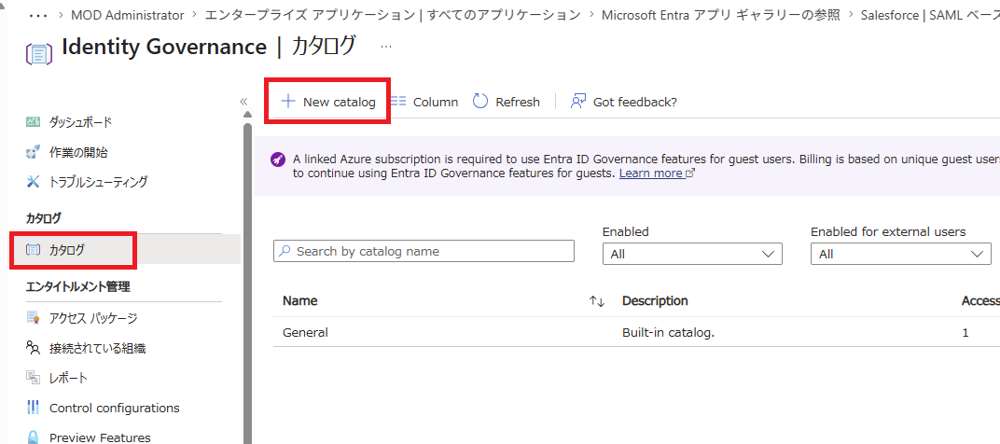
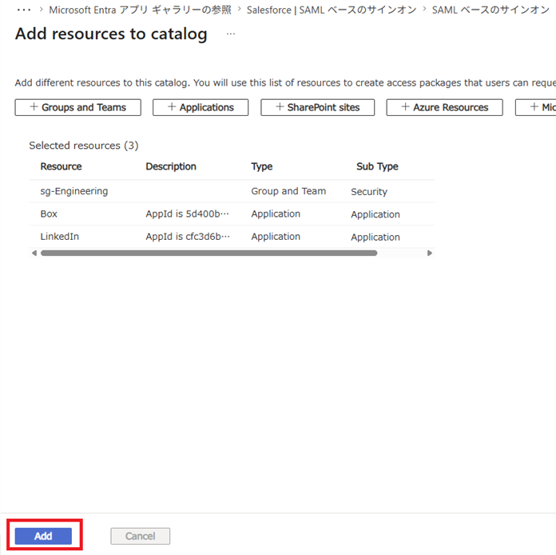
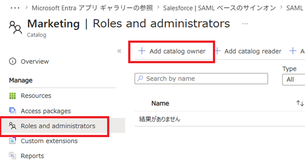
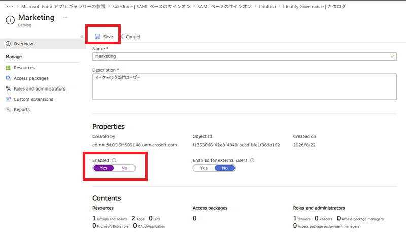

---
lab:
    title: '17 - エンタイトルメント管理を構成する'
    learning path: '04'
---

# ラボ15：エンタイトルメント管理を構成する

#### 推定時間: 15 分

### タスク 1 - カタログを作成する

1. [Microsoft Entra ID](https://entra.microsoft.com/) に`admin@XXXXXXXXXXX.onmicrosoft.com`でサインインします。

2. 左側のナビゲーション メニューの 「IDガバナンス」を展開し「エンタイトルメント管理」 をクリックします。

3. 「カタログ」-「+New catalog」 とクリックします。

   

4. 「新しいカタログ」ウィンドウで、次の情報を使用し「作成(Create)」をクリックします。

   > 注:指定の無い項目は、「空欄」または「デフォルト値」で結構です。

   | 設定                         | 値                         |
   | :--------------------------- | -------------------------- |
   | 名前(Name)                   | Marketing                  |
   | 説明(Description)            | マーケティング部門ユーザー |
   | Enabled for users to request | No                         |

5. 「Identity Governance | カタログ」ブレードの一覧に作成したカタログが表示されました。

   

#### タスク 2 - カタログにリソースを追加する

1. 「Identity Governance | カタログ」ブレードの一覧で 「Marketing」 をクリックします。

2. 「Marketing」ブレード左側のナビゲーション メニューで、「リソース（Resources）」 をクリックします。

3. 「Marketing | リソース（Resources）」ブレードで、「+ リソースを追加します（Add resources）」 をクリックします。

4. 「カタログへのリソースの追加（Add resources to catalog）」ブレードで、次の情報を使用し「追加（Add）」をクリックします。

   > 注:指定の無い項目は、「空欄」または「デフォルト値」で結構です。

| リソースの種類                       | 値                                                           |
| :----------------------------------- | :----------------------------------------------------------- |
| グループとチーム（Groups and Teams） | sg-SC300-O365 （上記グループがない場合は、sg- で始まる任意のグループを選択します） |
| アプリケーション（Applications）     | LinkedIn                                                     |
| アプリケーション（Applications）     | Box                                                          |

6. 「Marketing | リソース」ブレードにリダイレクトされます。追加したリソースが一覧に表示されたことを確認します。

   

### タスク 3 - カタログ所有者を追加する

1. 「ロールと管理者（Roles and administrators）」 - 「+ カタログ所有者の追加（Add catalog owner）」 とクリックします。

   

5. 「メンバーの選択」ウィンドウで、「Adele Vance」 を選び、「選択」 をクリックします。

6. 「Marketing | ロールと管理者」ブレードの一覧で、新しく追加したロールを確認します。

   

### タスク 4 - カタログを編集する

1. 「Marketing」ブレードの左側のナビゲーションで、「概要（Overview）」 をクリックします。

2. 上部のメニューで、「編集（Edit）」 をクリックします。

3. 「有効（Enabled）」 で 「はい(Yes)」 を選び、「保存（Save）」をクリックします。

   

この演習では、カタログの作成、リソースと所有者を追加、カタログの有効化を実施しました。
