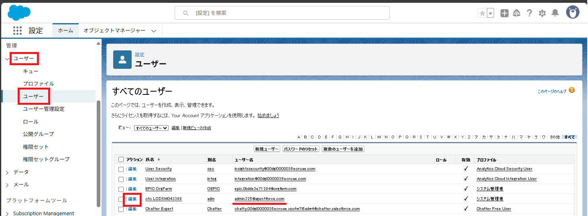
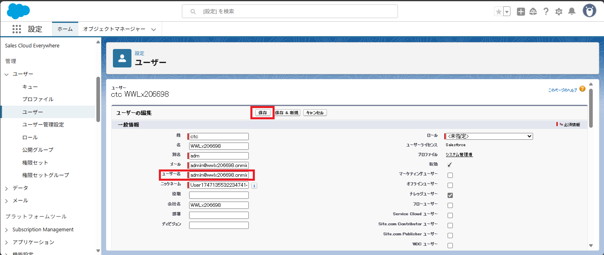

---
lab:
    title: '16 - エンタープライズアプリケーションでSSOを構成する'
    learning path: '03'
---

# ラボ 15：エンタープライズアプリケーションでSSOを構成する

#### 推定時間: 40 分

**※ 本演習は、「InPrivate/シークレットウィンドウ」ではないブラウザーで実施してください。クロスドメイン Cookie がブロックされないブラウザーが望ましいものとなります。**

### タスク 1 - Salesforceの利用を開始する

このタスクではSalesforceの無償アカウントを作成します。

1. [https://developer.salesforce.com/signup](https://developer.salesforce.com/signup)にアクセスします。

2. 「Sign up for your Salesforce Developer Edition」が表示されます。次の項目を入力し、チェックボックスにすべてチェックを入れ、「Sign me Up」をクリックします。

     > 注: XXXXはご自身のTenant Prefixになります。

     | 項目           | 値                                                           |
     | -------------- | ------------------------------------------------------------ |
     | First Name     | XXXXXXXXXXX                                                  |
     | Last Name      | ctc                                                          |
     | Job Title      | Student                                                      |
     | Work email     | `admin@XXXXXXXXXXX.onmicrosoft.com` (ラボ 準備で作成したユーザーを指定) |
     | Company        | XXXXXXXXXXX                                                  |
     | Country/Region | Japan                                                        |
     | State/Province | 東京都 - Tokyo                                               |
     
3. 「Almost there! Check your email.」と表示されます。登録したメールアドレスに確認メールが送信されます。

4. 届いたメールを確認します。[https://outlook.live.com/](https://outlook.live.com/)にアクセスし、サインインします。

     | 項目                      | 値                                                           |
     | ------------------------- | ------------------------------------------------------------ |
     | メール、電話、またはskype | `admin@XXXXXXXXXXX.onmicrosoft.com` (ラボ 準備で作成したユーザーを指定) |
     | パスワード                | ラボで使用しているパスワードと同じ                                                 |

5. 受信トレイにある「Salesforce へようこそ: パスワードのリセット」という件名のメールを開き、メール本文にある「パスワードをリセット」ボタンをクリックします。

6. Salesforceの「パスワードを変更する (Ready for a new password?)」ページにリダイレクトされます。「Reset Password」をクリックした後、次の項目を入力して「パスワード変更」をクリックします。

     | 項目                   | 値           |
     | ---------------------- | ------------ |
     | 新しいパスワード       | ラボで使用しているパスワードと同じ |
     | 新しいパスワードの確認 | ラボで使用しているパスワードと同じ |
     | セキュリティの質問     | 出生地は? |
     | 回答                   | 日本         |

     

7. 「セールス|ホーム」画面にリダイレクトされます。画面右上の「歯車」をクリックし、「設定」をクリックします。

     

8. 「設定|ホーム」画面にジャンプされます。

### タスク 2 - Salesforceでテストユーザーを準備する

このタスクでは、最後の動作確認で使用するテストユーザーを準備します。

1. 「設定|ホーム」画面の左側ツリーにあるIDを展開し、「ユーザー」をクリックします。「ユーザー」画面に移動したら「adminXXX@agentforce.com」の行の左にある「編集」をクリックします。

   

2. 「ユーザー」画面で「ユーザー名」項目を

   `admin@XXXXXXXXXXX.onmicrosoft.com` (「メール」と同じ値)

   に変更し、「保存」をクリックします。

   

   

### タスク 3 - SalesforceでSAML認証を有効化する

Azure ADとSalesforce間ではSAMLによってに認証を連携することが可能になります。ここでは、SalesforceのSAML認証を有効にします。

1. 「設定|ホーム」画面の左側ツリーにあるIDを展開し、「シングルサインオン設定」をクリックします。

     

2. 「シングルサインオン設定」画面にて、画面中央にある「編集」をクリックします。

     

3. 「SAML を使用した統合シングルサインオン」の項目にある「SAMLを有効化」のチェックボックスにチェックを入れ、「保存」をクリックします。

     

     

4. 画面が切り替わり、再び「シングルサインオン設定」画面で「SAML を有効化」にチェックがあれば完了です。画面はこのままにし、次のタスクへ進みます。

### タスク 4 -Azure のエンタープライズアプリケーションでSalesforceを登録する。

Azure ADをクラウドアプリケーションと連携する場合、エンタープライズアプリケーションで登録を行います。

1. Webブラウザを開き、「[https://portal.azure.com](https://portal.azure.com)」へアクセスします。

2. サインインが求められます。以下のユーザー名とパスワードを入力し、サインインしてください。

     > 注:XXXXはご自身のメールアドレス番号になります。

     | 項目                      | 値                                  |
     | ------------------------- | :---------------------------------- |
     | メール、電話、またはskype | `admin@XXXXXXXXXXX.onmicrosoft.com` |
     | パスワード                | ラボで使用しているパスワードと同じ                        |

     > 英語表記となっていた場合、日本語表記に変更した方が進めやすくなります。 画面右上
     > の歯車のマーク「Settings」をクリックした後、左の「Language + region」をクリック
     > し、Language と Regional format でいずれも日本語を選択し、 [Apply] - [OK] をクリッ
     > クします。

3. 上部検索バーに「エンタープライズ アプリケーション」と入力し、該当サービスをクリックします。

     

     

4. 「エンタープライズ アプリケーション | すべてのアプリケーション」ブレードが表示されます。

5. 「+新しいアプリケーション」をクリックします。

6. 「アプリケーションを検索」欄で「Salesforce」と入力して検索します。

7. 「Salesforce」をクリックします。

8. 「作成」をクリックします

9. 作成をクリック後、画面が遷移され「Salesforce | 概要」ブレードが表示されます。画面左側の「管理」カテゴリにある「シングルサインオン」をクリックします。

     

     

10. 「Salesforce | シングル サインオン」ブレードが表示されます。シングルサインオン方式の選択で「SAML」をクリックします。

     

11. 「Salesforce | SAML ベースのサインオン」画面が表示されます。画面中央の必須項目を埋める必要があります。画面はこのままにし、次のタスクへ進みます。

### タスク 5 -SSOに必要な情報をSalesforceのプロパティから取得する

1. SaleForceの画面に戻ります。画面左側のツリーより「会社の設定」を展開し、「私のドメイン」をクリックします。画面中央にある「現在の [私のドメイン] の URL」に記載のドメインをメモします。

     > 例：ctcXXXX-dev-ed.my.salesforce.com

     

2. 情報の取得は以上です。画面はこのままにし、次のタスクへ進みます。

### タスク 6 -エンタープライズアプリケーションのSSO設定を行い検証する

エンタープライズアプリケーションのSSO設定に必要項目を入力し、SalesforceとAzureADユーザーがSSOできるか検証をします。

1. Azure Portalの「Salesforce | SAML ベースのサインオン」を再び表示します。

     > 注:Webブラウザと閉じた場合は、上部検索バーに「エンタープライズアプリケーション」と入力し、サービスをクリックします。
     >
     > 　 その後「エンタープライズ アプリケーション | すべてのアプリケーション」ブレードより「Salesforce」をクリックします。
     >
     > 　 さらに「Salesforce | 概要」ブレードから左側ツリーにある「シングルサインオン」をクリックします。

     

2. 「Salesforce | SAML ベースのサインオン」ブレードの画面中央にある「基本的なSAML構成」の「編集」をクリックします。

3. 「基本的な SAML 構成」画面が表示されます。次の項目を入力し「保存」をクリックします。

     > 注:XXXXはご自身のメールアドレス番号になります。

     > 注:[あなたがメモしたURL]はタスク4-5でメモしたURLです。

     | 項目                   | 値                                                           |
     | ---------------------- | ------------------------------------------------------------ |
     | 識別子(エンティティID) | `https://あなたがメモしたURL`　　　例:`https://orgfarm-XXXXXXXXXX-dev-ed.develop.my.salesforce.com` |
     | 応答 URL               | `https://あなたがメモしたURL`　　　例:`https://orgfarm-XXXXXXXXXX-dev-ed.develop.my.salesforce.com` |
     | サインオン URL         | `https://あなたがメモしたURL`　　　例:`https://orgfarm-XXXXXXXXXX-dev-ed.develop.my.salesforce.com` |

     

4. 一度、「基本的な SAML 構成」の画面を閉じます。「Salesforce でシングル サインオンをTest」というメッセージでテストが要求されたら「いいえ、あとでtestします」を選択してください。

5. 「Salesforce | SAML ベースのサインオン」ブレードに戻り、画面中央にある「SAML署名証明書」項目の「フェデレーション メタデータ XML」をダウンロードします。

     > 注:ダウンロードしたデータは、次のタスクで使用します。

     

6. 「Salesforce.xml」が演習を実施しているWindows環境にダウンロードされたことを確認します。

     

7. この後の操作で再びAzure Portalを使用します。画面はこのままにし、次のタスクへ進みます。

### タスク 7 -Salesforce上でフェデレーションメタデータを登録する

検証が完了したため、別ユーザーでも恒久的にサインインできるようAzure上で生成されたフェデレーションメタデータをSalesforceへアップロードします。

1. SalesforceのWebブラウザ画面に戻ります。画面右側のツリーから「ID」を展開し、「シングルサインオン設定」を表示した後、「メタデータファイルから新規作成」をクリックします。

     

4. 「SAML シングルサインオン構成」画面の中央にある「ファイルを選択」をクリックし、前の手順でダウンロードした「Salesforce.xml」をアップロードします。アップロード後に「作成」をクリックします。

     

5. 「SAML シングルサインオン構成」画面に切り替わります。次の項目を入力し「保存」をクリックします。

     | 項目      | 値      |
     | --------- | ------- |
     | 名前      | EntraID |
     | API参照名 | EntraID |

     

6. 「SAML シングルサインオン構成」が表示されます。

     

7. 画面左側ツリーにある「会社の設定」を展開し、「私のドメイン」を選択します。「私のドメイン」画面を下にスクロールし、「認証設定」の「編集」をクリックします。

     

9. 「認証設定」画面で「認証サービス」があります。「EntraID」にチェックを入れて「保存」をクリックします。

     

10. これでSalesforce側の設定は終わりです。一度画面を最小化してください。

### タスク 8 -エンタープライズアプリケーションでSSOさせたいユーザーを設定する

Entra IDのユーザーでSalesforceにSSOする場合、ユーザーと役割を設定する必要があります。

1. Azure Portalの画面に戻ります。

   > 注:Webブラウザと閉じた場合は、上部検索バーに「エンタープライズアプリケーション」と入力し、サービスをクリックします。
   >
   > 　 その後「エンタープライズ アプリケーション | すべてのアプリケーション」ブレードより「Salesforce」をクリックします。
   >
   > 　 さらに「Salesforce | 概要」ブレードから左側ツリーにある「シングルサインオン」をクリックします。

   

   

2. 画面左側ツリーにある「所有者」をクリックします。その後、「+追加」をクリックします。

   

   

3. 「所有者の選択」画面が表示されます。`admin@XXXXXXXXXXX.onmicrosoft.com`のユーザーをクリックし、「選択」をクリックします。

   

   

4. 「Salesforce | 所有者」ブレードの一覧に選択したユーザーが表示されたことを確認します。

5. 画面左側ツリーにある「ユーザーとグループ」をクリックします。その後「+ユーザーまたはグループの追加 (Add user/group)」をクリックします。

   

   

6. 「割り当ての追加」画面で、次の項目を入力し「割り当て」をクリックします。

   > 参考:「タスク２」で作成したテストユーザーに対応した設定となります。
   >
   
   | 項目                     | 値                                    |
   | ------------------------ | ------------------------------------- |
   | ユーザー                 | `admin@XXXXXXXXXXX.onmicrosoft.com　` |
   | ロールを選択してください | System Administrator                  |
   
   
   
   
   
7. 「Salesforce | ユーザーとグループ」ブレードの一覧に選択したユーザーが表示されたことを確認します。

8. これで、SSOさせるユーザーの登録が完了しました。一度画面を最小化してください。

   > 参考:この手順ではEntra IDにあるadminユーザーとSalesforceのユーザーが一致していたため、
   >
   > 　　 ユーザーとグループの追加でSSOを構成することができます。
   >
   > 　　 別途ユーザーをSSOさせたい場合、Entra IDユーザーとSalesforceの両方で
   >
   > 　　 同一のサインインIDと役割(プロファイル)を構成しないとSSOは成功しません。
   >
   > 　　ユーザーを自動同期させる場合は、別途「プロビジョニング」の設定が必要になります。

### タスク 9 -SalesforceにSSOでサインインする

1. InPrivateモードあるいはシークレットモードのWebブラウザで「`https://あなたがメモしたURL`」にアクセスします。

   > 例:`https://orgfarm-XXXXXXXXXX-dev-ed.develop.my.salesforce.com`

   > 注:タスク6-3で入力したURLです。

2. サインイン画面の下部にある「次を使用してログイン EntraID (英語表記の場合 Log in with EntraID)」をクリックします。

   

   

3. Microsoftのサインイン画面が表示されます。次の項目を入力し「割り当て」をクリックします。

   > 注:XXXXはご自身のメールアドレス番号になります。

   | 項目                | 値                                |
   | ------------------- | --------------------------------- |
   | メール、電話、Skpye | admin@XXXXXXXXXXX.onmicrosoft.com |
   | パスワード          | ラボで使用しているパスワードと同じ                      |

   

4. Salesforceの画面が表示されました。これでEntraIDユーザーを使用してSalesforceにSSOすることが可能になります。

   

この演習では、エンタープライズアプリケーションを使用して、Salesforceとシングルサインオンを構成しました。

