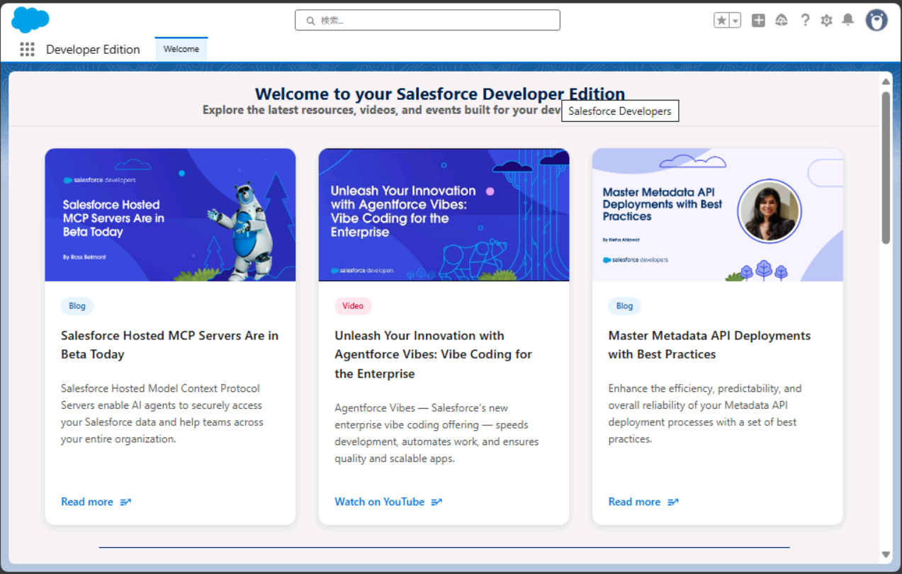

---
lab:
    title: '16 - エンタープライズアプリケーションでSSOを構成する'
    learning path: '03'
---

# ラボ 16：エンタープライズアプリケーションでSSOを構成する

#### 推定時間: 40 分

### タスク 1 - Salesforceの利用を開始する

このタスクではSalesforceの無償アカウントを作成します。

1. [https://developer.salesforce.com/signup](https://developer.salesforce.com/signup)にアクセスします。

2. 「Sign up for your Salesforce Developer Edition」が表示されます。次の項目を入力し、チェックボックスにすべてチェックを入れ、「Sign me Up」をクリックします。

     > 注: XXXXはご自身のメールアドレス番号になります。

     | 項目           | 値                                                           |
     | -------------- | ------------------------------------------------------------ |
     | First Name     | XXXX                                                         |
     | Last Name      | ctc                                                          |
     | Email          | `admin@ctcXXXX.onmicrosoft.com` (ラボ 準備で作成したユーザーを指定) |
     | Role           | Developer                                                    |
     | Company        | ctcXXXX                                                      |
     | Country/Region | Japan                                                        |
     | Postal Code    | ctcXXXX.portal                                               |
     | Username       | `admin@ctcXXXX.onmicrosoft.com` (ラボ 準備で作成したユーザーを指定) |

     

     

3. 「Please check your email to confirm your account.」と表示されます。登録したメールアドレスに確認メールが送信されます。

     

     

4. 届いたメールを確認します。[https://outlook.live.com/](https://outlook.live.com/)にアクセスし、サインインします。

     | 項目                      | 値                                                           |
     | ------------------------- | ------------------------------------------------------------ |
     | メール、電話、またはskype | `admin@ctcXXXX.onmicrosoft.com` (ラボ 準備で作成したユーザーを指定) |
     | パスワード                | Pa55w.rd1234                                                 |

     

     

5. 受信トレイにある「Salesforce へようこそ: アカウントを確認してください」というメールを開き、「アカウントを確認」をクリックします。

     

     

6. Salesforceの「パスワードを変更する」ページにリダイレクトされます。次の項目を入力し、「パスワード変更」をクリックします。

     | 項目                   | 値           |
     | ---------------------- | ------------ |
     | 新しいパスワード       | Pa55w.rd1234 |
     | 新しいパスワードの確認 | Pa55w.rd1234 |
     | セキュリティの質問     | 出身地は?    |
     | 回答                   | 日本         |

     

     

7. 「設定|ホーム」画面にリダイレクトされます。Salesforceの登録が完了しました。

     

### タスク 2 - SalesforceでSAML認証を有効化する

Azure ADとSalesforce間ではSAMLによってに認証を連携することが可能になります。ここでは、SalesforceのSAML認証を有効にします。

1. 「設定|ホーム」画面の左側ツリーにあるIDを展開し、「シングルサインオン」をクリックします。

     

     

2. 「シングルサインオン設定」画面にて、画面中央にある「編集」をクリックします。

     

     

3. 「SAML を使用した統合シングルサインオン」の項目にある「SAMLを有効化」のチェックボックスにチェックを入れ、「保存」をクリックします。

     

     

4. 画面が切り替わり、再び「シングルサインオン設定」画面で「SAML を有効化」にチェックがあれば完了です。

### タスク 3 -Azure のエンタープライズアプリケーションでSalesforceを登録する。

Azure ADをクラウドアプリケーションと連携する場合、エンタープライズアプリケーションで登録を行います。

1. Webブラウザを開き、「[https://portal.azure.com](https://portal.azure.com)」へアクセスします。

2. サインインが求められます。以下のユーザー名とパスワードを入力し、サインインしてください。

     > 注:XXXXはご自身のメールアドレス番号になります。

     | 項目                      | 値                              |
     | ------------------------- | :------------------------------ |
     | メール、電話、またはskype | `admin@ctcXXXX.onmicrosoft.com` |
     | パスワード                | Pa55w.rd1234                    |

     

3. 上部検索バーに「エンタープライズ アプリケーション」と入力し、該当サービスをクリックします。

     

     

4. 「エンタープライズ アプリケーション | すべてのアプリケーション」ブレードが表示されます。画面中央にある「+新しいアプリケーション」をクリックします。

     

     

5. 「Azure AD ギャラリーの参照」ブレードが表示されます。画面左側にある「アプリケーションの検索」に「salesforce」と入力し、「salesforce」をクリックします。

     > 注:似た項目で「salesforce sandbox」がありますが、こちらは選択しないでください。

     

     

6. クリック後に、画面右に「Salesforce」の登録画面が表示されます。何も変更せず「作成」をクリックします。

     

     

7. 作成をクリック後、画面が遷移され「Salesforce | 概要」ブレードが表示されます。画面左側にある「シングルサインオン」をクリックします。

     

     

8. 「Salesforce | シングル サインオン」ブレードが表示されます。シングルサインオン方式の選択で「SAML」をクリックします。

     

     

9. 「Salesforce | SAML ベースのサインオン」画面が表示されます。画面中央の必須項目を埋める必要があります。画面はこのままにし、次のタスクへ進みます。

### タスク 4 -SSOに必要な情報をSalesforceのプロパティから取得する

1. Webブラウザを開き「[https://login.salesforce.com/](https://login.salesforce.com/)」へアクセスします。

2. サインインが求められます。以下のユーザー名とパスワードを入力し、サインインしてください。

     > 注:XXXXはご自身のメールアドレス番号になります。

     | 項目       | 値                   |
     | ---------- | :------------------- |
     | ユーザー名 | `admin@ctcXXXX.onmicrosoft.com` |
     | パスワード | Pa55w.rd1234         |

     

     

3. サインイン前に電話番号を登録する画面が表示される場合があります。その場合はご自身の電話番号を登録するか「後で知らせる」または「電話を登録しません」のいずれかを選択してください。

     > 注:必ずしも表示されるとは限りません。

     

     

4. 「設定|ホーム画面」が表示されます。画面左側のツリーより「会社の設定」を展開し、「私のドメイン」をクリックします。

     

     

5. 「私のドメイン」画面が表示されます。画面中央にある「現在の [私のドメイン] の URL」に記載あるドメインをメモします。

     > 例：ctcXXXX-dev-ed.my.salesforce.com

     

     

6. 情報の取得は以上です。一度画面を最小化してください。

### タスク 5 -エンタープライズアプリケーションのSSO設定を行い検証する

エンタープライズアプリケーションのSSO設定に必要項目を入力し、SalesforceとAzureADユーザーがSSOできるか検証をします。

1. Azure Prtalの「Salesforce | SAML ベースのサインオン」を再び表示します。

     > 注:Webブラウザと閉じた場合は、上部検索バーに「エンタープライズアプリケーション」と入力し、サービスをクリックします。
     >
     > 　 その後「エンタープライズ アプリケーション | すべてのアプリケーション」ブレードより「Salesforce」をクリックします。
     >
     > 　 さらに「Salesforce | 概要」ブレードから左側ツリーにある「シングルサインオン」をクリックします。

     

     

2. 「Salesforce | SAML ベースのサインオン」ブレードの画面中央にある「基本的なSAML構成」の「編集」をクリックします。

3. 「基本的な SAML 構成」画面が表示されます。次の項目を入力し「保存」をクリックします。

     > 注:XXXXはご自身のメールアドレス番号になります。

     > 注:[あなたがメモしたURL]はタスク4-5でメモしたURLです。

     | 項目                   | 値                                                           |
     | ---------------------- | ------------------------------------------------------------ |
     | 識別子(エンティティID) | `https://あなたがメモしたURL`　　　例:`https://ctcXXXX-dev-ed.my.salesforce.com` |
     | 応答 URL               | `https://あなたがメモしたURL`　　　例:`https://ctcXXXX-dev-ed.my.salesforce.com` |
     | サインオン URL         | `https://あなたがメモしたURL`　　　例:`https://ctcXXXX-dev-ed.my.salesforce.com` |

     

     

4. 「Salesforce | SAML ベースのサインオン」ブレードに戻り、画面中央にある「このアプリケーションをTest」をクリックします。

     

     

5. 「Salesforce でシングル サインオンをTest」画面が表示されます。「サインインをテストする方法を選択」を「現在のユーザーとしてサインイン」を選び、「サインインのテスト」をクリックします。

     

     

6. Webブラウザの別タブ(または別ウィンドウ)が開き、Salesforceの画面が表示されれば成功です。

     

     

7. 一度、別タブ(または別ウィンドウ)で開いたSalesforceの画面と閉じます。

8. 「Salesforce | SAML ベースのサインオン」ブレードに戻り、画面中央にある「SAML署名証明書」項目の「フェデレーション メタデータ XML」をダウンロードします。

     > 注:ダウンロードしたデータは、次のタスクで使用します。

     

     

9. 「Salesforce.xml」が自身のPCにダウンロードされたことを確認します。

     

     

10. この後の操作で再びAzure Portalを使用します。一度画面を最小化してください。

### タスク 6 -Salesforce上でフェデレーションメタデータを登録する

検証が完了したため、別ユーザーでも恒久的にサインインできるようAzure上で生成されたフェデレーションメタデータをSalesforceへアップロードします。

1. SalesforceのWebブラウザ画面に戻ります。

     

     

2. 画面右側のツリーから「ID」を展開し、「シングルサインオン設定」を表示します。

     

     

3. 「SAML シングルサインオン構成」の「メタデータから新規作成」をクリックします。

4. 「SAML シングルサインオン構成」画面の中央にある「ファイルを選択」をクリックし、前の手順でダウンロードした「Salesforce.xml」をアップロードします。アップロード後に「作成」をクリックします。

     

     

5. 「SAML シングルサインオン構成」画面が切り替わります。次の項目を入力し「保存」をクリックします。

     | 項目      | 値      |
     | --------- | ------- |
     | 名前      | AzureAD |
     | API参照名 | AzureAD |

     

     

6. 「SAML シングルサインオン構成」が表示されます。

     

     

7. 画面左側ツリーにある「会社の設定」を展開し、「私のドメイン」を選択します。

     

     

8. 「私のドメイン」画面の下部に「認証設定」があります。編集をクリックします。

     

     

9. 「認証設定」画面で「認証サービス」があります。「AzureAD」にチェックを入れて「保存」をクリックします。

     

     

10. これでSalesforce側の設定は終わりです。一度画面を最小化してください。

### タスク 7 -エンタープライズアプリケーションでSSOさせたいユーザーを設定する

AzureADユーザーでSalesforceにSSOする場合、ユーザーと役割を設定する必要があります。

1. Azure Portalの画面に戻ります。

   > 注:Webブラウザと閉じた場合は、上部検索バーに「エンタープライズアプリケーション」と入力し、サービスをクリックします。
   >
   > 　 その後「エンタープライズ アプリケーション | すべてのアプリケーション」ブレードより「Salesforce」をクリックします。
   >
   > 　 さらに「Salesforce | 概要」ブレードから左側ツリーにある「シングルサインオン」をクリックします。

   

   

2. 画面左側ツリーにある「所有者」をクリックします。その後、「+追加」をクリックします。

   

   

3. 「所有者の選択」画面が表示されます。`admin@ctcXXXX.onmicrosoft.com`のユーザーをクリックし、「選択」をクリックします。

   

   

4. 「Salesforce | 所有者」ブレードの一覧に選択したユーザーが表示されたことを確認します。

5. 画面左側ツリーにある「ユーザーとグループ」をクリックします。その後「+ユーザーまたはグループの追加」をクリックします。

   

   

6. 「割り当ての追加」画面で、次の項目を入力し「割り当て」をクリックします。

   > 注:XXXXはご自身のメールアドレス番号になります。

   > 参考:ここで指定している「ロール」はSalesforceに登録してあるユーザーの「プロファイル」と一致させています。
   >
   > 　　  Salesforceの画面で[管理]→[ユーザ]より確認できます。

   | 項目                     | 値                   |
   | ------------------------ | -------------------- |
   | ユーザー                 | ctcXXXX              |
   | ロールを選択してください | System Administrator |

   

   

7. 「Salesforce | ユーザーとグループ」ブレードの一覧に選択したユーザーが表示されたことを確認します。

8. これで、SSOさせるユーザーの登録が完了しました。一度画面を最小化してください。

   > 参考:この手順ではAzureADにあるadminユーザーとSalesforceのユーザーが一致していたため、
   >
   > 　　 ユーザーとグループの追加でSSOを構成することができます。
   >
   > 　　 別途ユーザーをSSOさせたい場合、AzureADユーザーとSalesforceの両方で
   >
   > 　　 同一のサインインIDと役割(プロファイル)を構成しないとSSOは成功しません。
   >
   > 　　ユーザーを自動同期させる場合は、別途「プロビジョニング」の設定が必要になります。

### タスク 8 -SalesforceにSSOでサインインする

1. Webブラウザで「`https://あなたがメモしたURL`」にアクセスします。

   > 例:`https://ctcXXXX-dev-ed.my.salesforce.com`

   > 注:タスク5-3で入力したURLです。

2. サインイン画面の下部にある「AzureAD」をクリックします。

   

   

3. Microsoftのサインイン画面が表示されます。次の項目を入力し「割り当て」をクリックします。

   > 注:XXXXはご自身のメールアドレス番号になります。

   | 項目                | 値                            |
   | ------------------- | ----------------------------- |
   | メール、電話、Skpye | admin@ctcXXXX.onmicrosoft.com |
   | パスワード          | Pa55w.rd1234                  |

   

4. Salesforceの画面が表示されました。これでAzureADユーザーを使用してSalesforceにSSOすることが可能になります。

   

この演習では、エンタープライズアプリケーションを使用して、Salesforceとシングルサインオンを構成しました。

