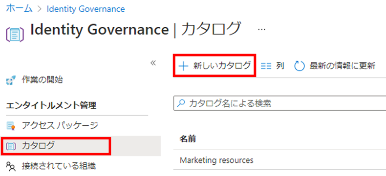
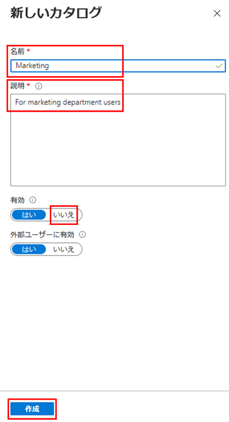
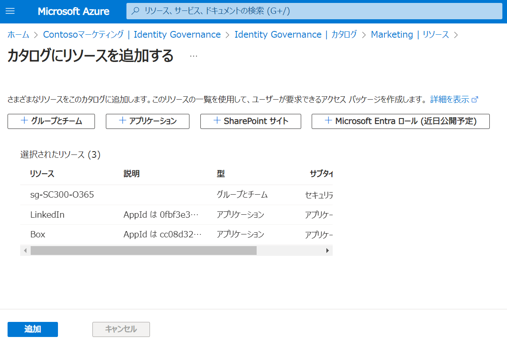
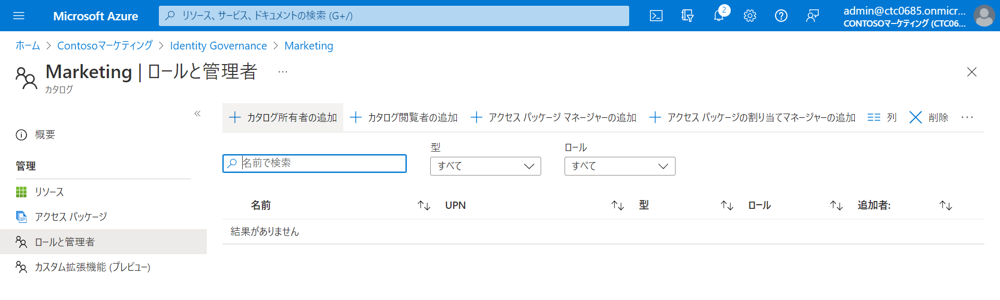
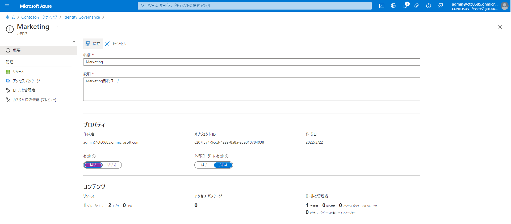

---
lab:
    title: '17 - エンタイトルメント管理を構成する'
    learning path: '04'
---

# ラボ17：エンタイトルメント管理を構成する

#### 推定時間: 15 分

### タスク 1 - カタログを作成する

1. [Azure Active Directory]( https://portal.azure.com/#blade/Microsoft_AAD_IAM/ActiveDirectoryMenuBlade/Overview) に`admin@ctcXXXX.onmicrosoft.com`でサインインします。

2. 左側のナビゲーション メニューの 「Identity Governance」 をクリックします。

3. 「Identity  Governance」ブレードの「カタログ」 をクリックします。

4. 「Identity Governance | カタログ」ブレードの 「+新しいカタログ」 をクリックします。

   

5. 「新しいカタログ」ウィンドウで、次の情報を使用し「作成」をクリックします。

   > 注:指定の無い項目は、「空欄」または「デフォルト値」で結構です。

   | 設定 | 値                         |
   | :--- | -------------------------- |
   | 名前 | Marketing                  |
   | 説明 | マーケティング部門ユーザー |
   | 有効 | いいえ                     |

   

6. 「Identity Governance | カタログ」ブレードの一覧に作成したカタログが表示されました。

   

#### タスク 2 - カタログにリソースを追加する

1. 「Identity Governance | カタログ」ブレードの一覧で 「Marketing」 をクリックします。

2. 「Marketing」ブレード左側のナビゲーション メニューで、「リソース」 をクリックします。

3. 「Marketing | リソース」ブレードで、「+ リソースを追加します」 をクリックします。

4. 「カタログへのリソースの追加」ブレードで、次の情報を使用し「追加」をクリックします。

   > 注:指定の無い項目は、「空欄」または「デフォルト値」で結構です。

| リソースの種類   | 値                                           |
| :--------------- | :------------------------------------------- |
| グループとチーム | sg-SC300-O365                                |
| アプリケーション | AWS Single-Account Access                    |
| アプリケーション | GitHub Enterprise Cloud - Enterprise Account |

6. 「Marketing | リソース」ブレードにリダイレクトされます。追加したリソースが一覧に表示されたことを確認します。

   

### タスク 3 - カタログ所有者を追加する

1. 一つ前のブレード「Identity Governance | カタログ」に移ります。

2. 「Marketing」ブレードの左側のナビゲーション メニューで、「ロールと管理者」をクリックします。

3. 上部のメニューで、利用可能なロールを確認し、「+ カタログ所有者の追加」 をクリックします。

   

4. 「メンバーの選択」ウィンドウで、「Adele Vance」 を選び、「選択」 をクリックします。

5. 「Marketing | ロールと管理者」ブレードの一覧で、新しく追加したロールを確認します。

   

### タスク 4 - カタログを編集する

1. 「Marketing」ブレードの左側のナビゲーションで、「概要」 をクリックします。

2. 上部のメニューで、「編集」 をクリックします。

3. 「有効」 で 「はい」 を選び、「保存」をクリックします。

   

この演習では、カタログの作成、リソースと所有者を追加、カタログの有効化を実施しました。
