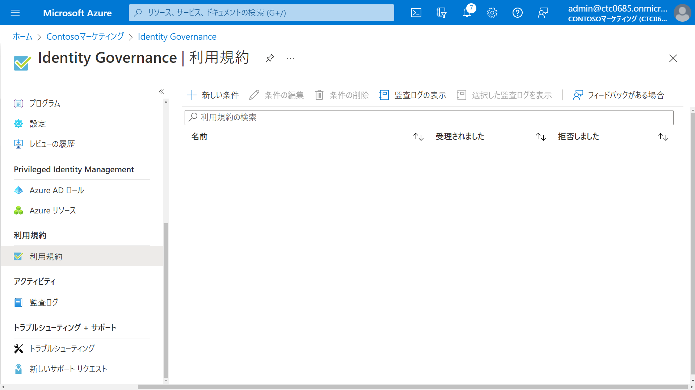
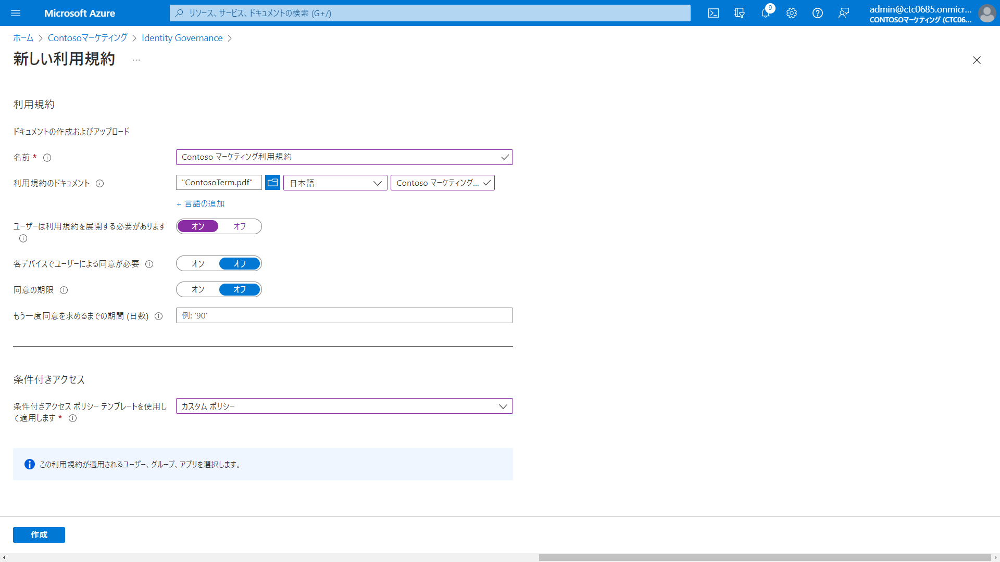

---
lab:
    title: '18 - 利用規約と同意レポートを追加する'
    learning path: '04'
---

# ラボ17：利用規約と同意レポートを追加する 

#### 推定時間: 10 分

### タスク1 - 利用規約を追加する

1. 利用規約として使用するPDFを[ここからダウンロード](https://ctctedu.blob.core.windows.net/sc-300-lab/ContosoTerm.pdf)して、自身のPCに保存します。

   > 保存したPDF「ContosoTerm.pdf」は演習で使用します。

1. [Microsoft Entra ID]( https://portal.azure.com/#blade/Microsoft_AAD_IAM/ActiveDirectoryMenuBlade/Overview) に`admin@XXXXXXXXXXX.onmicrosoft.com`でサインインします。

1. 左側のナビゲーション メニューの 「Identity Governance」 をクリックします。

1. 「Identity  Governance」ブレードの「利用規約」 を展開し、「利用規約」をクリックします。

1. 「Identity Governance | 利用規約」ブレードの「+ 新しい条件」 をクリックします。

   

1. 「新しい利用規約」ブレードで、次の情報を使用し「作成」をクリックします。

   > 注:指定の無い項目は、「空欄」または「デフォルト値」で結構です。

   > 前の手順書でダウンロードしたPDF「ContosoTerm.pdf」を使用します。

   | 設定                                       | 値                             |
   | :----------------------------------------- | ------------------------------ |
   | 名前                                       | Contoso マーケティング利用規約 |
   | 利用規約のドキュメント                     | ContosoTerm.pdf                |
   | 既定の言語を選択します                     | 日本語                         |
   | 表示名                                     | Contoso マーケティング利用規約 |
   | ユーザーは利用規約を展開する必要があります | オン                           |
   | 各デバイスでユーザーによる同意が必要       | オフ                           |
   | 同意の期限                                 | オフ                           |
   | 条件付きアクセス                           | カスタムポリシー               |
   
   
   
1. 利用規約が作成されると、「新規」ブレードに自動的に移動します。(「利用規約 "Contoso マーケティング利用規約" の作成で問題が発生しました」のメッセージ等で移動に失敗した場合、[Microsoft Entra ID](https://portal.azure.com/#blade/Microsoft_AAD_IAM/ActiveDirectoryMenuBlade/Overview) から、メニューの「セキュリティ」- 「条件付きアクセス」をクリックし、「＋新しいポリシーの作成」をクリックして、手動で移動してください。)

1. 「新規」ブレードで、次の情報を設定し「作成」をクリックします。

   > 注:指定の無い項目は、「空欄」または「デフォルト値」で結構です。

   | 設定               | 値                                     |
   | :----------------- | -------------------------------------- |
   | 名前               | Contoso マーケティング利用規約ポリシー |
   | ユーザー           | Adele Vance                            |
   | ターゲットリソース | すべてのリソース                       |
   | 許可               | ☑Contoso マーケティング利用規約        |
   | ポリシーの有効化   | オン                                   |

   

### タスク 2 - Adele Vanceとしてサインインする

1. 新しい InPrivate ブラウザー ウィンドウを開きます。

2. [https://www.office.com](https://www.office.com) に`AdeleV@ctcXXXX.onmicrosoft.com`でサインインします。(初期パスワードはSkillableから取得した「User Password」です。)

3. Microsoft Authenticator による多要素認証を設定します。

4. 「Contosoマーケティング の利用規約」が表示されます。利用規約の内容を表示し、「承諾する」をクリックします。

5. サインインが終了後、ブラウザーを閉じます。

   

### タスク3 - 同意したユーザーのレポートを表示する

1. [Microsoft Entra ID]( https://portal.azure.com/#blade/Microsoft_AAD_IAM/ActiveDirectoryMenuBlade/Overview) に`admin@XXXXXXXXXXX.onmicrosoft.com`でサインインします。

1. 左側のナビゲーション メニューの 「Identity Governance」 をクリックします。

1. 「Identity  Governance」ブレードの「利用規約」 をクリックします。

1. 「利用規約」で「監査ログの表示」をクリックします。

1. 同意した日時やユーザーを確認することが出来ます。（表示されるまで時間がかかることがあります）

この演習では、利用規約を登録し、同意後に履歴を確認する手順を実施しました。
