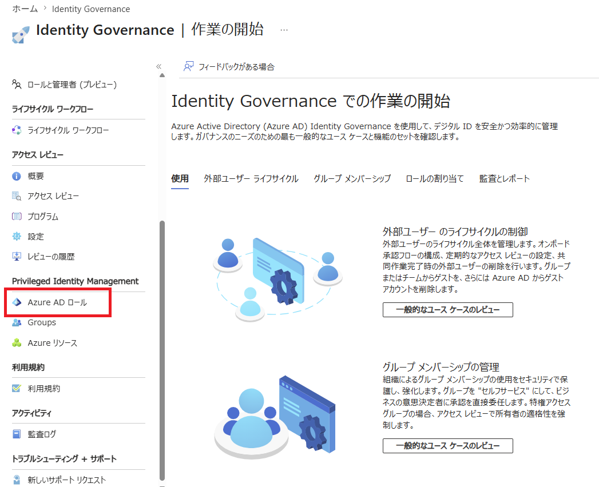
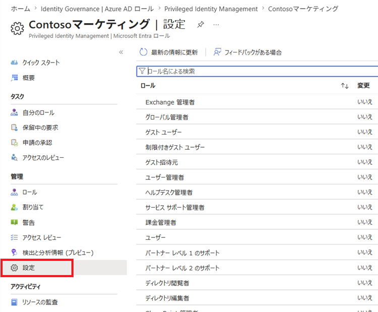
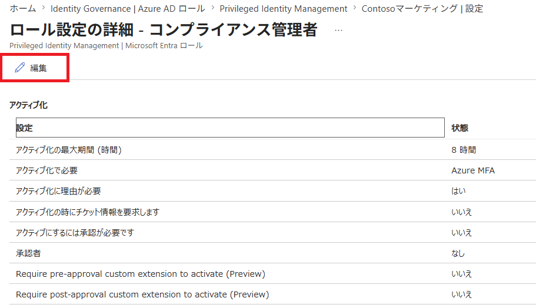
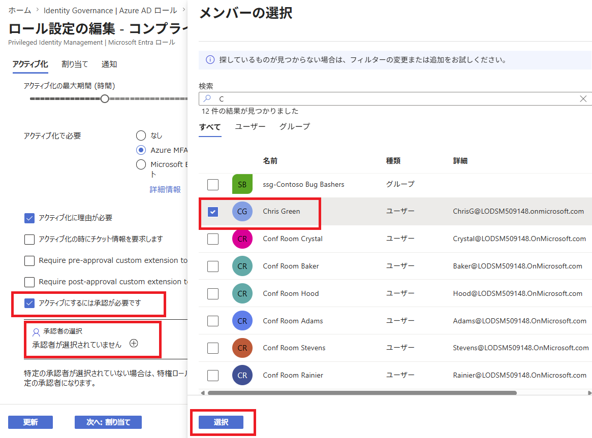

---
lab:
    title: '20 - Entraロール用に PIMを構成する'
    learning path: '04'
---

# ラボ18：Entra ロール用に PIMを構成する

#### 推定時間: 10 分

### タスク 1 - Entra ロールの設定を構成する

1. [Microsoft Entra ID](https://entra.microsoft.com/) に`admin@XXXXXXXXXXX.onmicrosoft.com`でサインインします。

1. 左側のナビゲーション メニューの 「IDガバナンス」セクションの「エンタイトルメント管理」 をクリックします。

1. 「エンタイトルメント管理」ブレードの「Privileged Identity Management」の「Azure AD ロール」 をクリックします。

    

1. 「Contosoマーケティング | クイック スタート」ブレード左側のナビゲーションツリーにて 「管理」の「設定」 をクリックします。

    

1. ロールの一覧を確認してから、「ロール名による検索」 に 「コンプライアンス」 と入力します。

1. 結果から 「コンプライアンス管理者」 をクリックします。

1. 「ロール設定の詳細 - コンプライアンス管理者」ブレードより 「編集」 をクリックします。

    

1. 「アクティブにするには承認が必要です」 チェック ボックスをオンにします。

1. 承認者に「Chris Green」を選択します。

    

1. 最後に「更新」をクリックします。

この演習では、Privileged Identity Managementを使ってEntraロールの承認者を設定しました。

