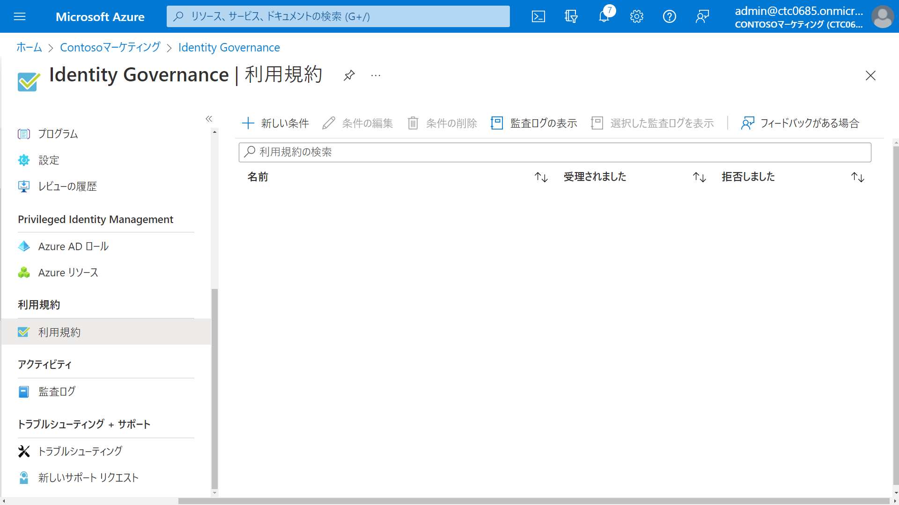
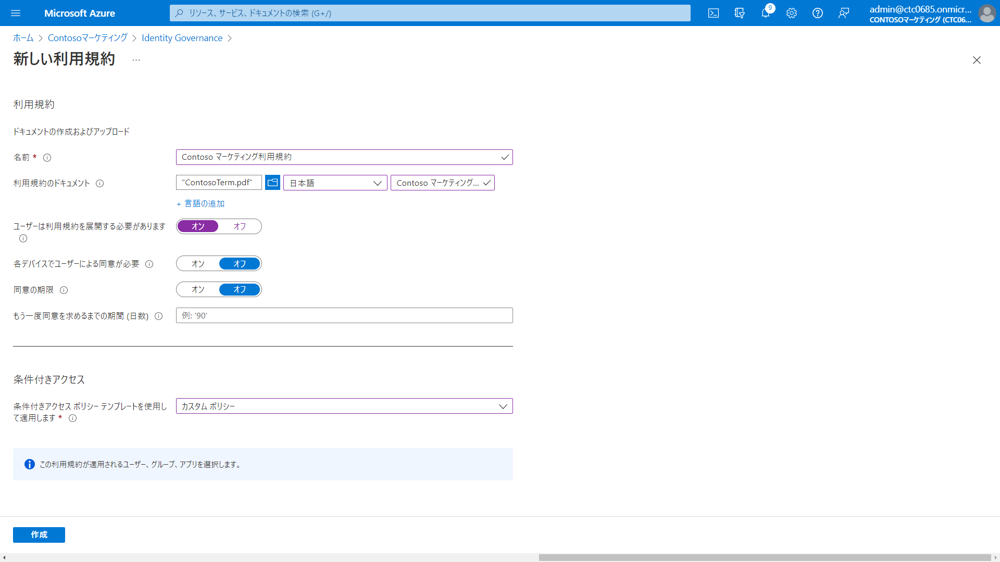

---
lab:
    title: '18 - 利用規約と同意レポートを追加する'
    learning path: '04'
---

# ラボ18：利用規約と同意レポートを追加する 

#### 推定時間: 20 分

### タスク1 - 利用規約を追加する

1. 利用規約として使用するPDFを[ここからダウンロード](https://ctctedu.blob.core.windows.net/sc-300-lab/ContosoTerm.pdf)して、自身のPCに保存します。

   > 保存したPDF「ContosoTerm.pdf」は演習で使用します。

1. [Microsoft Entra ID]( https://portal.azure.com/#blade/Microsoft_AAD_IAM/ActiveDirectoryMenuBlade/Overview) に`admin@XXXXXXXXXXX.onmicrosoft.com`でサインインします。

1. 左側のナビゲーション メニューの 「Identity Governance」 をクリックします。

1. 「Identity  Governance」ブレードの「利用規約」 をクリックします。

1. 「Identity Governance | 利用規約」ブレードの「+ 新しい条件」 をクリックします。

   

1. 「新しい利用規約」ブレードで、次の情報を使用し「作成」をクリックします。

   > 注:指定の無い項目は、「空欄」または「デフォルト値」で結構です。

   > 前の手順書でダウンロードしたPDF「ContosoTerm.pdf」を使用します。

   | 設定                                       | 値                             |
   | :----------------------------------------- | ------------------------------ |
   | 名前                                       | Contoso マーケティング利用規約 |
   | 利用規約のドキュメント                     | ContosoTerm.pdf                |
   | 既定の言語を選択します                     | 日本語                         |
   | 表示名                                     | Contoso マーケティング利用規約 |
   | ユーザーは利用規約を展開する必要があります | オン                           |
   | 各デバイスでユーザーによる同意が必要       | オフ                           |
   | 同意の期限                                 | オフ                           |
   | 条件付きアクセス                           | カスタムポリシー               |
   
   
   
1. 利用規約が作成されると、「新規」ブレードに自動的に移動します。

1. 「新規」ブレードで、次の情報を使用し「作成」をクリックします。

   > 注:指定の無い項目は、「空欄」または「デフォルト値」で結構です。

   | 設定                     | 値                                     |
   | :----------------------- | -------------------------------------- |
   | 名前                     | Contoso マーケティング利用規約ポリシー |
   | ユーザーまたワークロード | Adele Vance                            |
   | クラウドアプリまたは操作 | すべてのクラウドアプリ                 |
   | 許可                     | ☑Contoso マーケティング利用規約        |
   | ポリシーの有効化         | オン                                   |

   

### タスク 2 - Adele Vanceとしてサインインする

1. 新しい InPrivate ブラウザー ウィンドウを開きます。

2. [https://www.office.com](https://www.office.com) に`AdeleV@ctcXXXX.onmicrosoft.com`でサインインします。

3. 「詳細情報が必要」の画面が表示された場合は「次へ」をクリックします。

   > 注:表示されない場合は、手順10までスキップしてください。

4. 「アカウントのセキュリティ保護」が表示されます。画面下の「別の方法を設定します」をクリックします。

   >注:「Microsoft Authenticator」をスマートフォンにインストールして認証してもOKです。

5. 「どの方法を使用しますか?」と表示されたら、「電話」と選択し「確認」をクリックします。

6. SMSで受信したコードを入力し、「次へ」をクリックします。

7. ご自身の電話番号を入力し、「次へ」をクリックします。

8. 「SMS が検証されました。お使いの電話が正常に登録されました。」と表示されたら、「次へ」をクリックし、さらに「完了」をクリックします。

9. 「IDを確認する」画面が表示されます。SMSを送信し、届いたコードを入力し「検証」をクリックします。

10. 「Contosoマーケティング の利用規約」が表示されます。内容を表示し、「同意する」をクリックします。

11. サインインが終了後、ブラウザーを閉じます。

    

### タスク3 - 同意したユーザーのレポートを表示する

1. [Microsoft Entra ID]( https://portal.azure.com/#blade/Microsoft_AAD_IAM/ActiveDirectoryMenuBlade/Overview) に`admin@XXXXXXXXXXX.onmicrosoft.com`でサインインします。

1. 左側のナビゲーション メニューの 「Identity Governance」 をクリックします。

1. 「Identity  Governance」ブレードの「利用規約」 をクリックします。

1. 「Contosoマーケティング の利用規約」で「監査ログの表示」をクリックします。

1. 同意した日時やユーザーを確認することが出来ます。（表示されるまで時間がかかることがあります）

この演習では、利用規約を登録し、同意後に履歴を確認する手順を実施しました。
