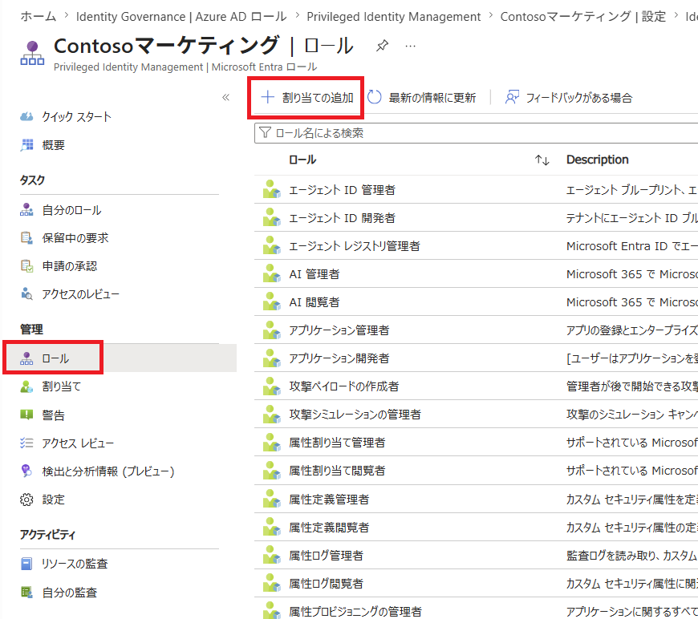

---
lab:
    title: '21 - PIMでEntraロールを割り当てる'
    learning path: '04'
---

# ラボ19：PIMでEntraロールを割り当てる

#### 推定時間: 10 分

### タスク 1 - ロールの割り当て

1. [Microsoft Entra ID](https://entra.microsoft.com/) に`admin@XXXXXXXXXXX.onmicrosoft.com`でサインインします。

1. 左側のナビゲーション メニューの 「IDガバナンス」セクションの「エンタイトルメント管理」 をクリックします。

1. 「エンタイトルメント管理」ブレードの「Privileged Identity Management」の「Azure AD ロール」 をクリックします。

1. 「Contosoマーケティング | クイック スタート」ブレード左側のナビゲーションツリーより 「ロール」 をクリックします。

1. 上部のメニューで 「+ 割り当ての追加」 をクリックします。

    

1. 「ロールの選択」 ドロップダウンリストをクリックし、「コンプライアンス管理者」 をクリックします。

1. 「メンバーが選択されていない」 をクリックします。

1. 「Adele Vance」 をクリックしてから、「選択」 をクリックします。

1. 「次へ」をクリックします。

1. 「割り当て」 をクリックします。

   ​    

### タスク 2 - Adele Vanceでサインインする

1. 新しい InPrivate ブラウザー ウィンドウを開きます。

2. [Microsoft Entra ID](https://entra.microsoft.com/) に`Adelev@XXXXXXXXXXX.onmicrosoft.com`でサインインします。

   (初期パスワードはSkillableから取得した「User Password」です。)

9. 「左側のナビゲーション メニューの 「IDガバナンス」セクションの「Privileged Identity Management」 をクリックします。

4. 「Privileged Identity Management」のブレードで「自分のロール」をクリックします。
   

11. 「自分のロール | 割り当てられたロール」 ブレードで「資格のある割り当て」が表示され、登録したロールが表示されます。

この演習では、PIMを使用してAdeleにロールを割り当てを実施しました。
