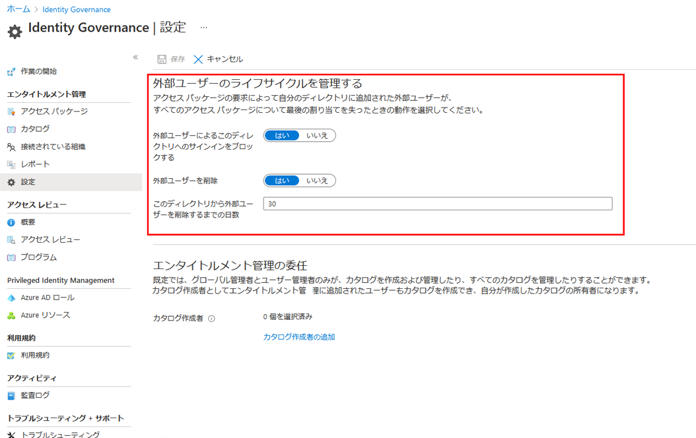

---
lab:
    title: '19 - 外部ユーザーのライフサイクルを管理する'
    learning path: '04'
---

# ラボ19：外部ユーザーのライフサイクルを管理する  

#### 推定時間: 5 分

## タスク 1 - Azure AD Identity Governance の設定で外部ユーザーのライフサイクルを管理する

1. [Azure Active Directory]( https://portal.azure.com/#blade/Microsoft_AAD_IAM/ActiveDirectoryMenuBlade/Overview) に`admin@ctcXXXX.onmicrosoft.com`でサインインします。

1. 左側のナビゲーション メニューの 「Identity Governance」 をクリックします。

1. 「Identity  Governance」ブレードの「設定」 を選択します。

1. 上部のメニューで、「編集」 を選択します。

    

1. 「外部ユーザーのライフサイクルを管理する」ウィンドウで、次の情報を使用し「保存」をクリックします。

    > 注:指定の無い項目は、「空欄」または「デフォルト値」で結構です。

    | 設定                                                         | 値   |
    | :----------------------------------------------------------- | ---- |
    | 外部ユーザーによるこのディレクトリへのサインインをブロックする | はい |
    | 外部ユーザーを削除                                           | はい |
    | このディレクトリから外部ユーザーを削除するまでの日数         | 0    |

この演習では、外部ユーザーのライフサイクルに関する設定について確認しました。

