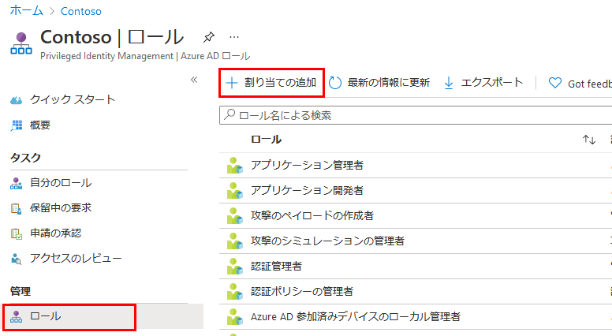
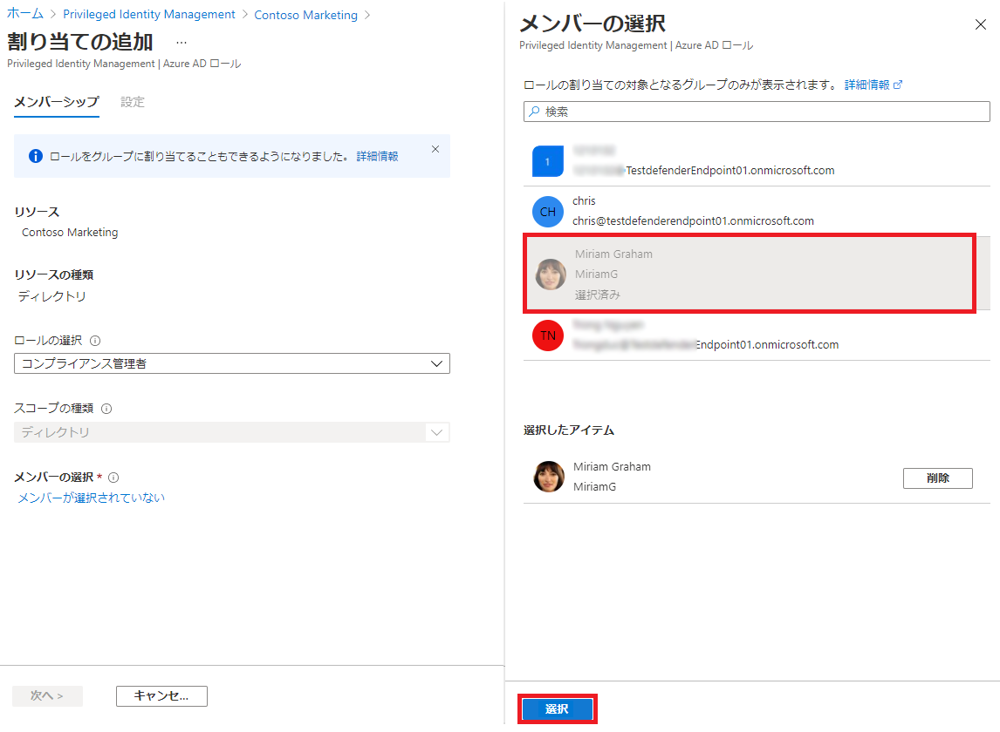

---
lab:
    title: '21 - PIMでEntraロールを割り当てる'
    learning path: '04'
---

# ラボ20：PIMでEntraロールを割り当てる

#### 推定時間: 10 分

### タスク 1 - ロールの割り当て

1. [Microsoft Entra ID]( https://portal.azure.com/#blade/Microsoft_AAD_IAM/ActiveDirectoryMenuBlade/Overview) に`admin@XXXXXXXXXXX.onmicrosoft.com`でサインインします。

1. 左側のナビゲーション メニューの 「Identity Governance」 をクリックします。

1. 「Identity  Governance」ブレードの「Azure AD ロール」 をクリックします。

1. 「Contosoマーケティング | クイック スタート」ブレード左側のナビゲーションツリーより 「ロール」 をクリックします。

1. 上部のメニューで 「+ 割り当ての追加」 をクリックします。

    

1. 「ロールの選択」 ドロップダウンリストをクリックし、「コンプライアンス管理者」 をクリックします。

1. 「メンバーが選択されていない」 をクリックします。

1.  「Miriam Graham」 をクリックしてから、「選択」 をクリックします。

    

1. 「次へ」をクリックします。

1. 「割り当て」 をクリックします。

      

### タスク 2 - Miriam Grahamでサインインする

1. 新しい InPrivate ブラウザー ウィンドウを開きます。
2. [Azure Portal](https://portal.azure.com) に`MiriamG@ctcXXXX.onmicrosoft.com`でサインインします。(パスワードの更新が求められた場合は、「Pa55w.rd1234」に設定してください)
3. 「リソース、サービス、ドキュメントの検索」 バーから、Microsoft Entra ID を探し、ブレードを開きます。
4. 「Contosoマーケティング | 概要」ブレードで画面を下にスクロールし「マイ フィード」 の中にある「ロール情報の表示」をクリックします。
5. 「Miriam Graham | 割り当てられたロール」 ブレードで「資格のある割り当て」タブをクリックすると、登録したロールが表示されます。

この演習では、PIMを使用してMiriamへロールを割り当てを実施しました。
