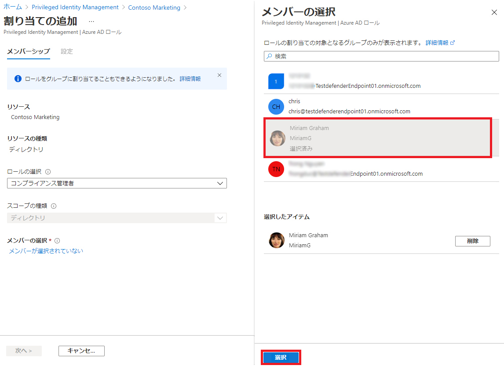

---
lab:
    title: '21 - PIMでAzureADロールを割り当てる'
    learning path: '04'
---

# ラボ21：PIMでAzureADロールを割り当てる

#### 推定時間: 10 分

### タスク 1 - ロールの割り当て

1. [Azure Active Directory]( https://portal.azure.com/#blade/Microsoft_AAD_IAM/ActiveDirectoryMenuBlade/Overview) に`admin@ctcXXXX.onmicrosoft.com`でサインインします。

1. 左側のナビゲーション メニューの 「Identity Governance」 をクリックします。

1. 「Identity  Governance」ブレードの「Azure AD ロール」 をクリックします。

1. 「Privileged Identity Management | クイック スタート」ブレードの「AzureADロール」をクリックします。

1. 「Contosoマーケティング | クイック スタート」ブレード左側のナビゲーションツリーより 「ロール」 をクリックします。

1. 上部のメニューで 「+ 割り当ての追加」 をクリックします。

    

1. 「ロールの検索」 メニューをクリックし、「コンプライアンス管理者」 をクリックします。

1. 「メンバーのクリック」 で 「Miriam Graham」 をクリックしてから、「次へ」 をクリックします。

    

1. 「割り当て」 をクリックします。

    

### タスク 2 - Miriam Grahamでサインインする

1. 新しい InPrivate ブラウザー ウィンドウを開きます。
2. [Azure Portal](https://portal.azure.com) に`MiriamG@ctcXXXX.onmicrosoft.com`でサインインします。
3. 「リソース、サービス、ドキュメントの検索」 バーから、Azure Active Directory を探し、ブレードを開きます。
4. 「Contosoマーケティング | 概要」ブレードの「マイ フィード」 より「プロファイルの表示」をクリックします。
5. 「割り当てられたロール」 をクリックしてから、「資格のある割り当て」 をクリックします。
6. 「Miriam Graham | 割り当てられたロール」ブレードの「資格のある割り当て」を表示し、登録したロールが表示されます。

この演習では、PIMを使用してMiriamへロールを割り当てを実施しました。
