---
lab:
    title: '00 - ラボのセットアップ'
    learning path: '00'
    module: 'モジュール 00 - ラボ環境のセットアップ'
---

# ラボ 00: ラボ環境のセットアップ

## ラボ シナリオ

今後のラボを完了する準備をするには、新しい Azure サブスクリプションを作成し、Azure AD P2 ライセンスを要求する必要があります。

#### 推定時間: 30分

## 準備 1 - Microsoftアカウントの作成とOffice365(E3)試用版のアクティブ化

1. [[Office 365 E3の試用版](https://go.microsoft.com/fwlink/p/?LinkID=403802&clcid=0x411&culture=ja-jp&country=JP )]へアクセスします。

2. 「始めましょう」と画面に表示されます。講師よりチャットまたはPDFで送付された`ctcXXXX@outlook.jp`を入力します。

   > 注:XXXXはご自身のアカウント番号を入力してください。

    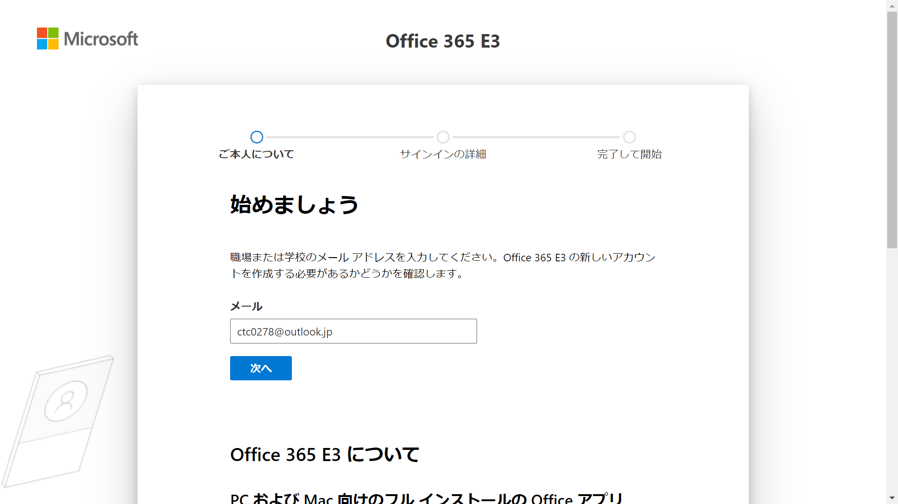

3. 「新しいアカウントを作成する必要があるようです。始めましょう。」と表示されたら、「アカウントのセットアップ」をクリックします。

4. 「アンケートのお願い」画面で、次の情報を使用して「次へ」をクリックします。

   > 注:指定の無い項目は、「空欄」または「デフォルト値」で結構です。

   > 注:XXXXはご自身のアカウント番号を入力してください。

   | 設定         | 値               |
   | :----------- | :--------------- |
   | 姓           | ctc              |
   | 名           | XXXX             |
   | 電話番号     | あなたの電話番号 |
   | 会社名       | ctcXXXX          |
   | 会社の規模   | 1人              |
   | 国または地域 | 日本             |

5. 「アンケートのお願い」画面でSMSまたは音声による電話認証が求められます。画面に従って認証を行ってください。

   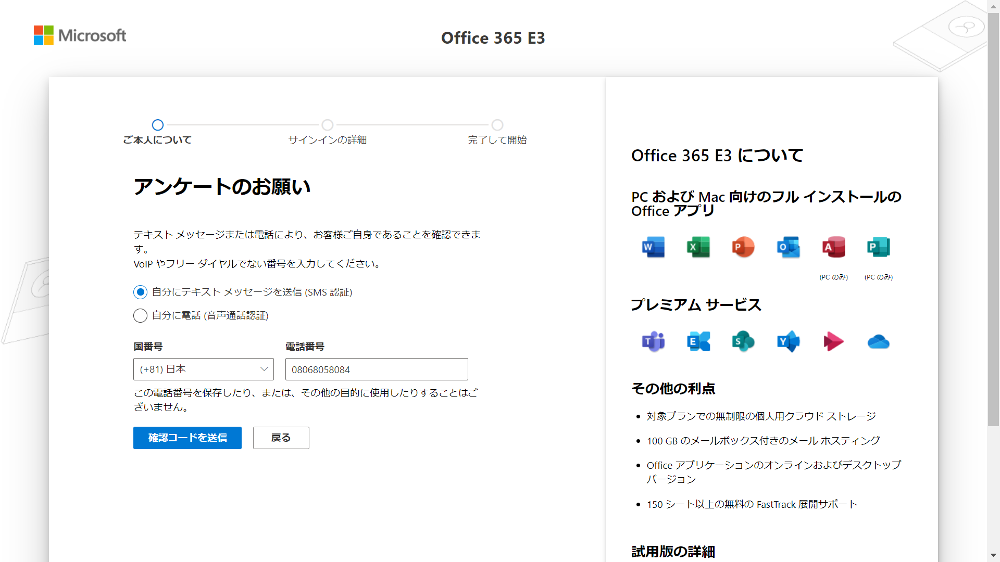

6. 「サインインする方法」画面が表示されます。次の情報を使用して「次へ」をクリックします。

   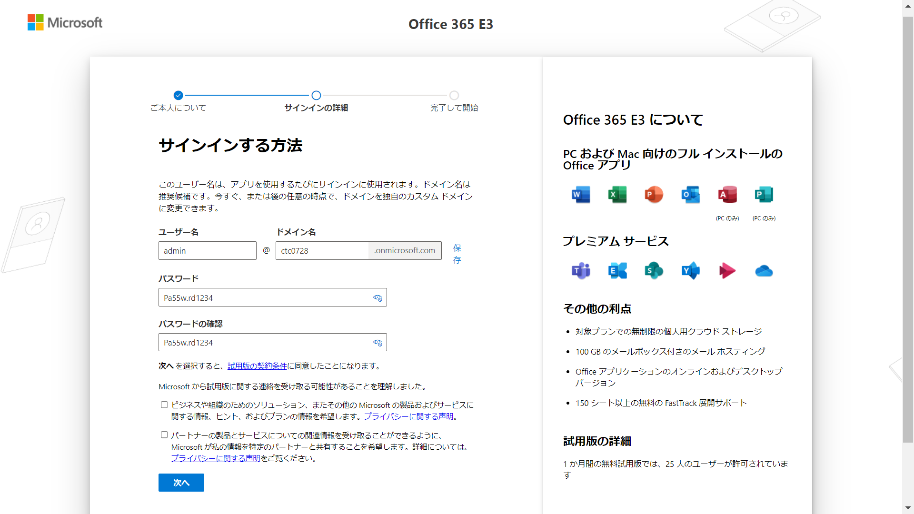

   > 注:XXXXはご自身のアカウント番号を入力してください。

   | 設定             | 値           |
   | :--------------- | :----------- |
   | ユーザー名       | admin        |
   | ドメイン名       | ctcXXXX      |
   | パスワード       | Pa55w.rd1234 |
   | パスワードの確認 | Pa55w.rd1234 |

7. 「詳細の確認」画面が表示されます。「作業の開始」をクリックします。

8. サインインが求められます。次の情報を使用してサインインを完了してください。

   > 注:XXXXはご自身のアカウント番号を入力してください。

   | 設定       | 値                              |
   | :--------- | :------------------------------ |
   | ユーザー名 | `admin@ctcXXXX.onmicrosoft.com` |
   | パスワード | Pa55w.rd1234                    |

9. 「サインインの状態を維持しますか？」は「はい」「いいえ」どちらでも結構です。

10. 「‎Office‎ のインストール」画面が表示されます。画面右下の「‎セットアップを終了する」をクリックします。

    > 演習では、デフォルトの値のまま実施するため、セットアップを終了しています。

11. 終了する理由を聞かれます。「その他」を選択します。

12. 「Microsoft365 管理センター」が表示されます。

    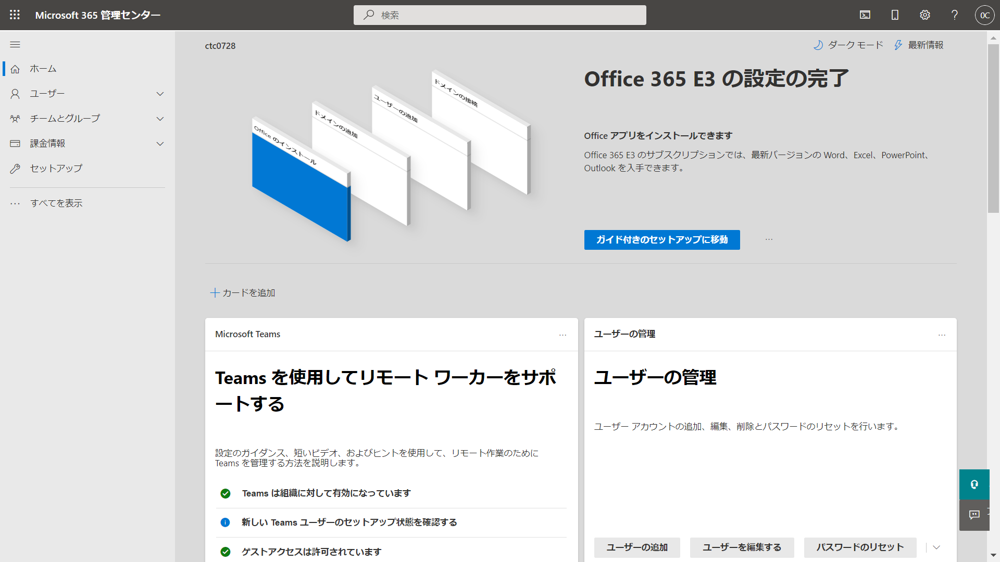

13. 左側のナビゲーション メニューより「ユーザー」 をクリックし、さらに「アクティブなユーザー」をクリックします。

14. 「アクティブなユーザー」画面にある「複数のユーザーを追加」をクリックします。

15. 「ユーザーの一覧を追加する」ウィンドウで「ユーザー情報を含むSVをアップロードする」に☑チェックを入れます。

16. 自分のPC上で、メモ帳などのテキストエディタを開き、以下の情報をコピー/編集し、CSVで保存します。

    > 注:XXXXはご自身のアカウント番号を入力してください。

    > CSVの名前は何でもOKです。(英数字を推奨)

    ```
    ユーザー名,名,姓,表示名,役職,部署,事業所番号,職場の電話,携帯電話,FAX,連絡用メール アドレス,住所,市区町村,都道府県,郵便番号,国または地域
    AdeleV@ctcXXXX.onmicrosoft.com,Adele,Vance,Adele Vance,,,,,,,,,,,,united states
    AlexW@ctcXXXX.onmicrosoft.com,Alex,Wilber,Alex Wilber,,,,,,,,,,,,united states
    AllanD@ctcXXXX.onmicrosoft.com,Allan,Deyoung,Allan Deyoung,,,,,,,,,,,,united states
    BiancaP@ctcXXXX.onmicrosoft.com,Bianca,Pisani,Bianca Pisani,,,,,,,,,,,,united states
    DebraB@ctcXXXX.onmicrosoft.com,Debra,Berger,Debra Berger,,,,,,,,,,,,united states
    DeliaD@ctcXXXX.onmicrosoft.com,Delia,Dennis,Delia Dennis,,,,,,,,,,,,united states
    GradyA@ctcXXXX.onmicrosoft.com,Grady,Archie,Grady Archie,,,,,,,,,,,,united states
    MiriamG@ctcXXXX.onmicrosoft.com,Miriam,Graham,Miriam Graham,,,,,,,,,,,,united states
    RaulR@ctcXXXX.onmicrosoft.com,Raul,Razo,Raul Razo,,,,,,,,,,,,united states
    ```
    
17. 作成したCSVをアップロードし、「次へ」をクリックします。

    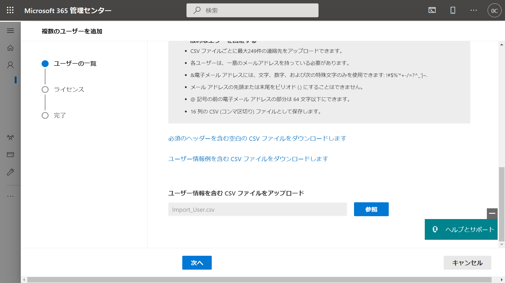

18. 「ライセンス」画面が表示されます。「ライセンスを割り当てない(推奨されない」を選択します。

    > 注:演習では、ライセンスを付与する手順を実施します。そのため今はライセンス付与する必要はありません。

19. 9人のユーザーが登録されたことを確認し、「ユーザーの追加」をクリックします。

20. 「9ユーザーを追加しました」と表示されます。「閉じる」をクリックします。

21. 「アクティブなユーザー」画面で、自ユーザー(ctcXXXX)を除く、全てのユーザーを選択します。

    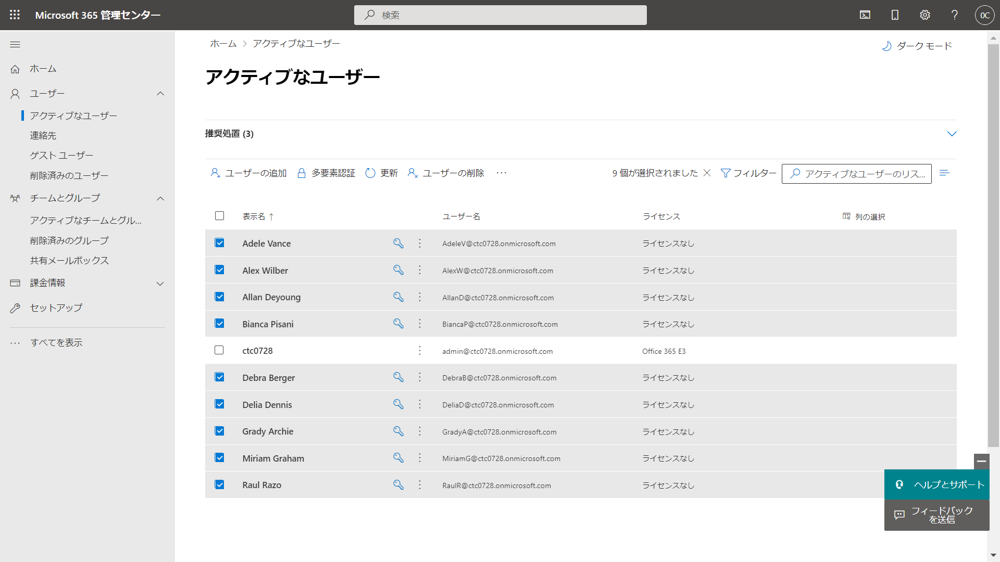

22. 「パスワードのリセット」をクリックします。

    > 注:画面サイズによっては「パスワードのリセット」は表示されません。その場合は画面の中央にある「・・・」をクリックすると表示されます。

23. 「パスワードのリセット」ウィンドウで全ての☑チェックを外します。

    > 注:全てのユーザーに統一したパスワードを設定させます。

24. パスワードは「Pa55w.rd1234」と入力し、「パスワードのリセット」をクリックします。

25. 「パスワードがリセットされました」と表示されれば、完了です。


## 準備 2 - テナントにAzureサブスクリプションを関連付け

1. [https://www.microsoftazurepass.com](https://www.microsoftazurepass.com ) にアクセスしてください。

1. 「Start」をクリックし`admin@ctcXXXX.onmicrosoft.com`でサインインを行います。

   > 注:前の準備で同じブラウザを使用している場合、自動サインインされます。

   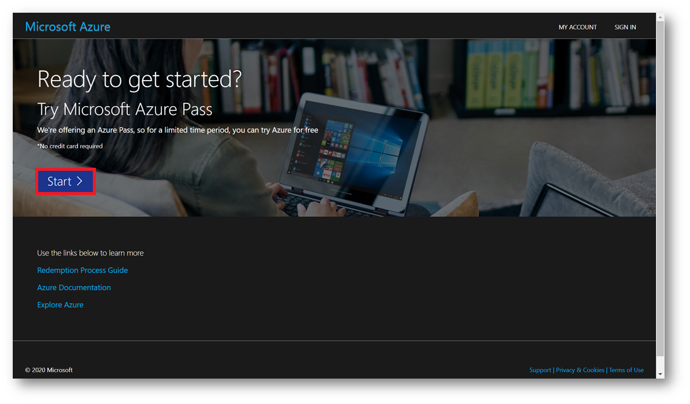

1. [Confirm Microsoft Account]を押して、promo code を入力し、[Claim Promo Code]を 押してください。

   > 注:Promo code は講師よりチャットまたは PDF で提供されます。

   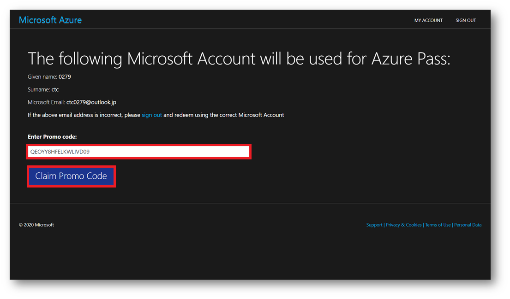

1. 入力後、画面が遷移するまで、そのままお待ちください。

1. 画面が切り替わりましたら、以下の項目を入力してください。 入力が完了しましたら、[次へ]を押してください。

   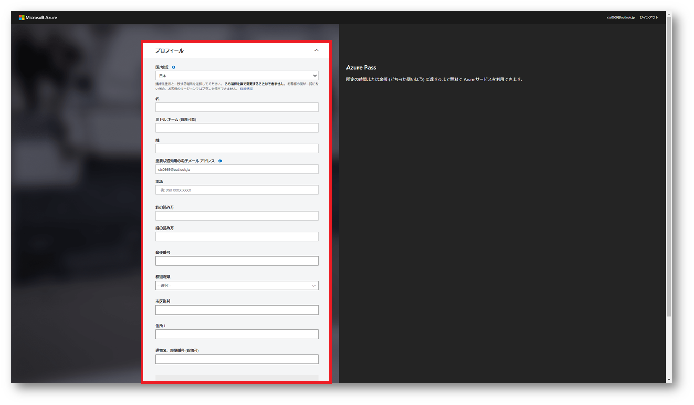

   > 注:XXXXはご自身のアカウント番号を入力してください。

   > 住所はCTCラーニングセンターの住所です。そのまま入力してください。

   | 設定                       | 値                   |
   | -------------------------- | -------------------- |
   | 国/地域                    | 日本                 |
   | 名                         | XXXX                 |
   | 姓                         | ctc                  |
   | 重要な通知用メールアドレス | `ctcXXXX@outlook.jp` |
   | 電話                       | 規定値のまま         |
   | 名の読み方                 | XXXX                 |
   | 姓の読み方                 | ctc                  |
   | 郵便番号                   | 102-0071             |
   | 都道府県                   | 東京都               |
   | 市区町村                   | 千代田区             |
   | 住所                       | 富士見１丁目１１−５  |

1. 「サブスクリプション契約、オファーの詳細、プライバシーに関する声明に同意します。」 にチェックを入れ、「サインアップ」を押してください。

   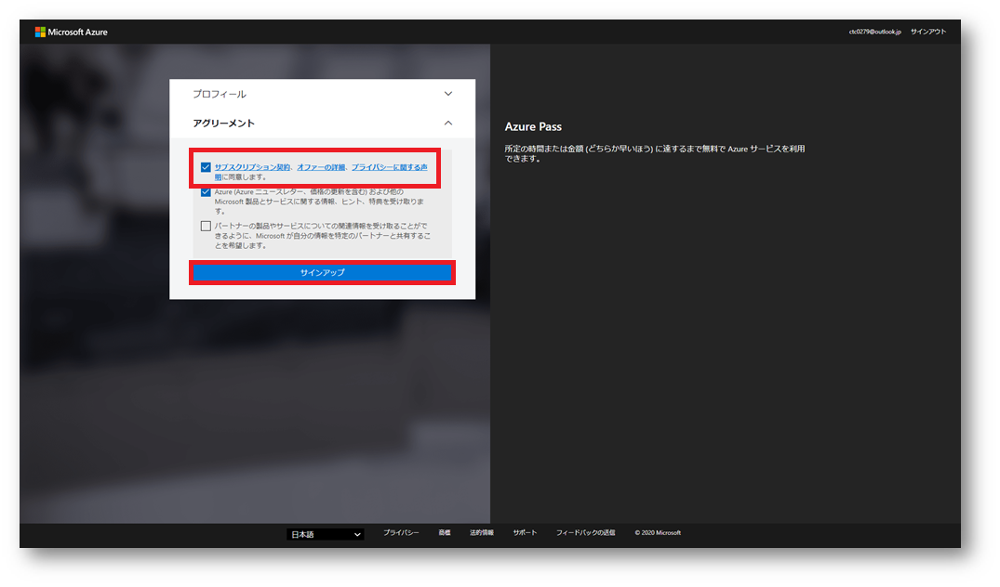

1. 画面が切り替わりましたら、「このサインアップエクスペリエンスに満足していますか？」 を評価し、送信を押してください。

   しばらくすると画面が Azure Portal に切り替わります。

   

1. Azure Portal の画面に切り替わりましたら、準備完了です。必要に応じて、[ツアーの開始]か[後で行う]を選択してください。

   > 注:もう一度、ツアーを見る場合は画面右上の[？]アイコンを押して、[ガイド ツアーの起動] を選択してください。）

   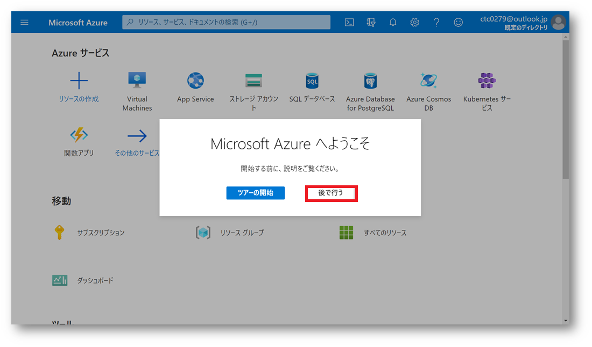


## 準備 3 - Azure Active Directory Premium P2 試用版ライセンスを追加

1. 上部の検索ダイアログより「Azure Active Directory」 を検索して選択します。

   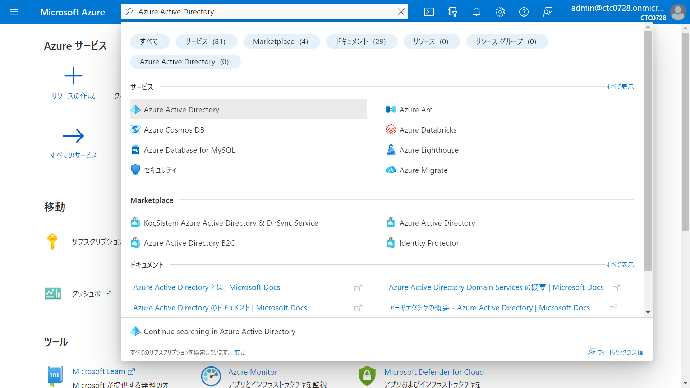

1. 左側のナビゲーション メニューで 「ランセンス」 を選択します。

1. 画面の右側で「無償試用版を入手する」を選択します。

   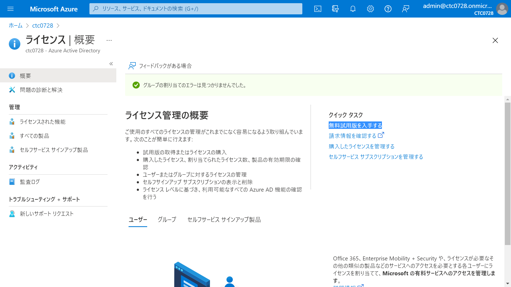

1. 「アクティブ化」ウィンドウの AZURE AD PREMIUM P2 で 「無料試用版」 を選択し、 「アクティブ化」 を選択します。

   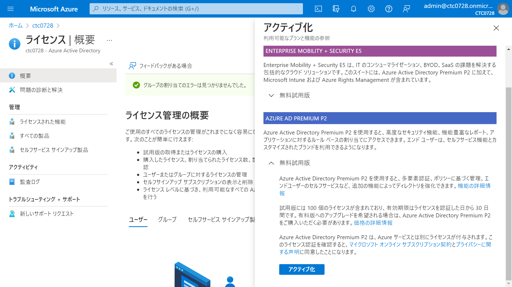

1. 左側のナビゲーション メニューで 「すべての製品」 を選択します。

1. 組織名の下に Azure AD Premium P2 が表示されるまで、ブラウザーを更新します。

   > 注:これには数分かかることがあります。

1. 「ライセンス | すべての製品」ブレードに「Azure Active Directory Premium P2」と「Office 365 E3」の2つライセンスが表示されたことを確認します。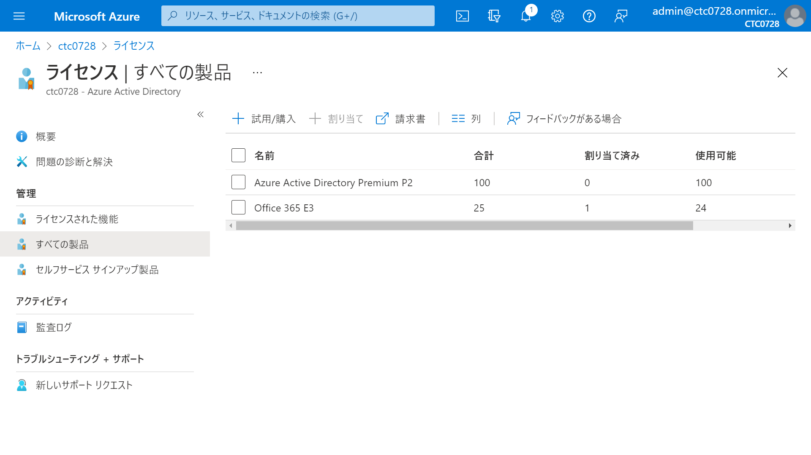


お疲れ様でした。すべての準備が完了しました。

> 参考:本演習で使用するサブスクリプションやライセンスについて
>
> 　-Office 365 E3 無料試用版
>
> 　 このライセンスは30日間、Office365が使用可能です。最大25ユーザーまでライセンス付与できます。
>
> 　-Azure Pass スポンサープラン
>
> 　 このライセンスは30日間または$100に達するまで使用可能です。様々なリソースを作成することが可能です。
>
> 　-Azure Active Directory Premium P2
>
> 　 このライセンスは30日間、使用可能です。 Premium P2がないと設定できないAzureADの設定があります。
