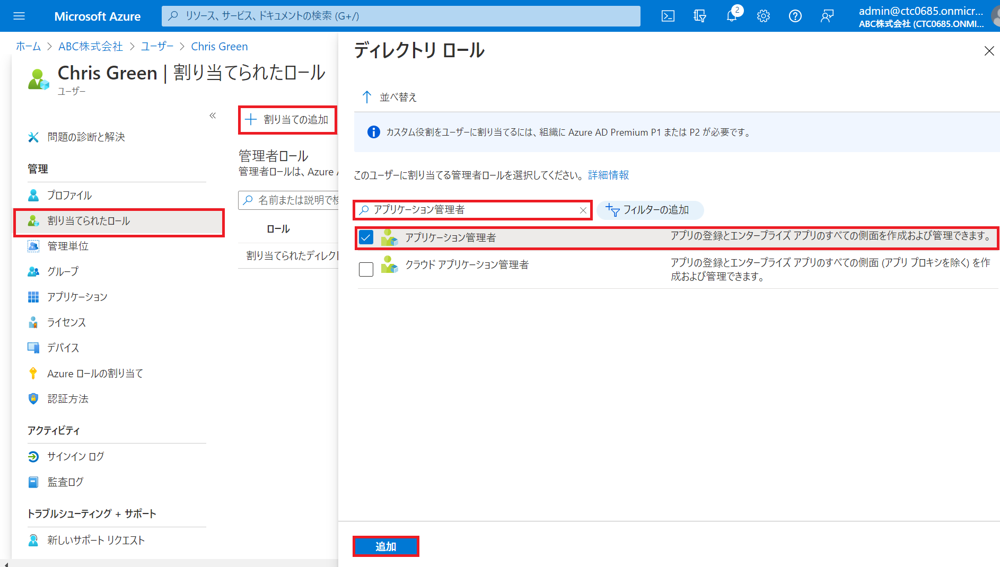

---
lab:
    title: '01 - ユーザー ロールを管理する'
    learning path: '01'
    module: 'モジュール 01 – ID 管理ソリューションを実装する'
---

# ラボ 01: ユーザー ロールを管理する

## ラボ シナリオ

あなたの会社では最近、アプリケーション管理者として業務を遂行する新しい従業員を採用しました。

新しいユーザーを作成し、セキュリティ ロールを割り当てる必要があります。

#### 推定時間: 10 分

### タスク 1 - 新しいユーザーを追加する

1. [https://portal.azure.com](https://portal.azure.com) に`admin@ctcXXXX.onmicrosoft.com`でサインインします。

     > 注:XXXXはご自身のアカウント番号を入力してください。

2. Azure Portalにサインイン後、上部の検索ダイアログより「Azure Active Directory」 を検索してクリックします。

3. Azure Active Directoryの画面が表示されます。左側のナビゲーション メニューより「ユーザー」 をクリックします。

4. 「+ 新しいユーザー」 をクリックします。

5. 「新しいユーザー」ブレードが表示されます。  次の情報を使用して「作成」をクリックします。

    > 注:指定の無い項目は、「空欄」または「デフォルト値」で結構です。

    | 設定 | 値 |
    | :--- | :--- |
    | ユーザー名| ChrisG |
    | 名前| Chris Green |
    | 名| Chris |
    | 姓| Green |
    | パスワード | 自分でパスワードを設定する |
    | 初期パスワード | Pass@word1 |

6. 作成後に「ユーザー|すべてのユーザー」ブレードが表示されます。作成したユーザーがあることを確認してください。

### タスク 2 - ログインしてアプリを作成する

1. 新しい InPrivate ブラウザー ウィンドウを開きます。

    > 注:演習の中ではWebブラウザの機能を使って別セッションでサインインします。
    >
    > 　  どのWebブラウザもウィンドウ右上の設定ボタンから表示することが可能です。
    >
    > 　  Microsoft Edgeでは「InPrivate」ウィンドウ
    >
    > 　  Google Chromeでは「シークレット」ウィンドウ
    >
    > 　  Mozilla Fire Foxでは「プライベート」ウィンドウ

2. Chris Green として、Azure portal ([https://portal.azure.com](https://portal.azure.com)) を開きます。

    > 注:XXXXはご自身のアカウント番号を入力してください。

    | 設定 | 値 |
    | :--- | :--- |
    | ユーザー名| `ChrisG@ctcXXXX.onmicrosoft.com` |
    | パスワード| Pass@word1 |

3. パスワードを更新します。

    | 設定 | 値 |
    | :--- | :--- |
    | 現在のパスワード| Pass@word1 |
    | 新しいパスワード| Pa55w.rd1234 |
    | パスワードの確認| Pa55w.rd1234 |

4. 「サインインの状態を維持しますか?」と表示される場合があります。「いいえ」を選択してください。

    > 注:誤って「はい」を選択しても、演習に影響はありません。

5. 「Microsoft Azure へようこそ」ダイアログが表示された場合は、「後で行う」ボタンをクリックします。

6. Azure Portalの検索ダイアログより「エンタープライズ アプリケーション」を検索してクリックします。

7. 「エンタープライズ アプリケーション」ブレードが表示されます。「+ 新しいアプリケーション」をクリックしてください。

8. 「Azure AD ギャラリーの参照」ブレードが表示されます。「アプリケーションを検索」ダイアログに「AWS single sign-on」と入力します。

9. 検索結果に「AWS IAM Identity Center (successor to AWS Single Sign-On)」が表示されます。クリックしてください。

10. 画面右側に「AWS IAM Identity Center (successor to AWS Single Sign-On)」と表示されますが、「作成」がクリックできないことを確認してください。

    > 注:これはアプリケーションを登録する権限がないため、作成することが出来ません。

11. Azure Portalの右上隅にある `ChrisG@ctcXXXX.onmicrosoft.com` の名前をクリックして、サインアウトします。

     

### タスク 3 - ユーザーにロールを割り当てる

1. `admin@ctcXXXX.onmicrosoft.com`でサインインしているWebブラウザに戻ります。

2. 「Azure Active Directory」ブレードに移動します。

3. 左側のナビゲーション メニューの「ユーザー」をクリックします。

4. Chris Green のアカウントをクリックします。

5. 左側のナビゲーション メニューの「割り当てられたロール」をクリックします。

6. 「+ 割り当ての追加」をクリックして、「名前または説明で検索します」ダイアログに「アプリケーション管理者」と入力します。

7.  「アプリケーション管理者」ロールにチェックを入れ、「追加」をクリックします。

     

8. 「Chris Green | 割り当てられたロール」ブレード内に追加した「アプリケーション管理者」ロールが表示されたことを確認します。

     > 注:ロールは追加してから反映に30秒～60秒ほど時間が掛かります。何度か更新ボタンをしてください。
     
     

### タスク 4 - アプリケーションのアクセス許可を確認する

1. 新しい InPrivate ブラウザー ウィンドウを開きます。

2. Chris Green として、Azure portal ([https://portal.azure.com](https://portal.azure.com)) を開きます。

    | 設定 | 値 |
    | :--- | :--- |
    | ユーザー名| `ChrisG@ctcXXXX.onmicrosoft.com` |
    | パスワード| Pa$$w.rd1234 |

3. Azure Portalの検索ダイアログより「エンタープライズ アプリケーション」を検索してクリックします。

4. 「エンタープライズ アプリケーション」ブレードが表示されます。「+ 新しいアプリケーション」をクリックしてください。

5. 「Azure AD ギャラリーの参照」ブレードが表示されます。「アプリケーションを検索」ダイアログに「AWS single sign-on」と入力します。

6. 検索結果に「AWS single sign-on」が表示されます。クリックしてください。

7. 画面右側に「AWS single sign-on」と表示されますが、「作成」がクリック出来ることを確認し、アプリケーションの登録を行ってください。

8. Azure Portalの右上隅にある `ChrisG@ctcXXXX.onmicrosoft.com` の名前をクリックして、サインアウトします。

    

### タスク 5 - Chris Green からアプリケーション管理者を削除する

1. `admin@ctcXXXX.onmicrosoft.com`でサインインしているWebブラウザに戻ります。

2. 「Azure Active Directory」ブレードに移動します。

3. 左側のナビゲーション メニューの「ロールと管理者」をクリックし、一覧から アプリケーション管理者 のロールクリックします。

4. 「アプリケーション管理者 | 割り当て」ブレードで「Chris Green 」の名前が表示されます。

5. 「Chris Green」 の横にあるボックスにチェックを入れます。

6. ダイアログの上部にあるオプションから「X 割り当ての削除」をクリックします。

7. 確認ボックスが開いたら、「はい」と答えます。

8. 割り当ての一覧から「Chris Green」 が消えたことを確認します。

     > 注:割り当てを解除することにより、再び「Chris Green」はアプリケーションの登録ができなくなりました。

     > 注:権限は無くなりましたが、登録したアプリケーションが無効になることはありません。

この演習では、Azure ADロールを割り当てる演習を実施して頂きました。
