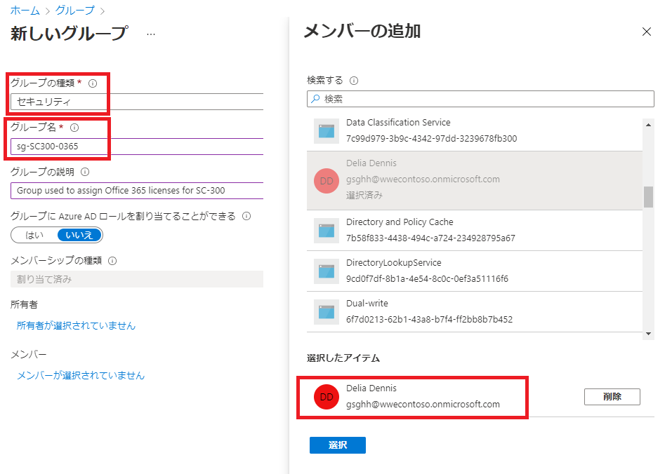
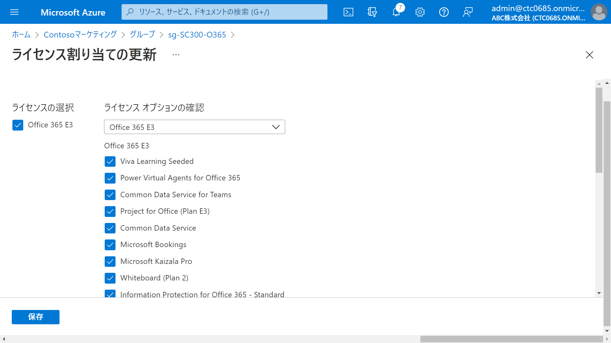
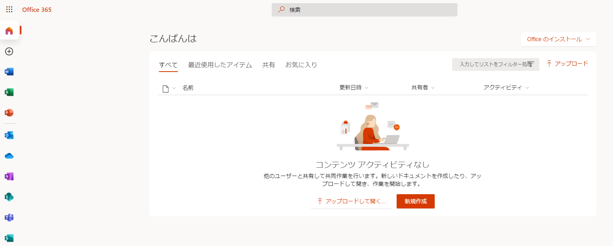

---
lab:
    title: '03 - グループ メンバーシップを使用してライセンスを割り当てる'
    learning path: '01'
    module: 'モジュール 02 - ID の作成、構成、管理を行う'
---

# ラボ 03: グループ メンバーシップを使用してライセンスを割り当てる

## ラボ シナリオ

あなたの組織は Azure AD のセキュリティ グループを使用してライセンスを管理することに決めました。

新しいセキュリティ グループを設定し、そのグループにライセンスを割り当て、グループ メンバーのライセンスが更新されたことを確認する必要があります。

#### 推定時間: 10 分

### タスク 1 - Delia Dennis が Office 365 にアクセスできるかどうかを確認する

1. 新しい InPrivate ブラウザー ウィンドウを開きます。

2. Delia Dennisとして[https://www.office.com](https://www.office.com) に接続します。

    | 設定 | 値 |
    | :--- | :--- |
    | ユーザー名 | `DeliaD@ctcXXXX.onmicrosoft.com` |
    | パスワード| Pa55w.rd1234 |

3. Office.com の Web サイトに接続する必要がありますが、ライセンスがないことを示すメッセージが表示されます。

    

4. ブラウザー ウィンドウを閉じます。

### タスク2 - Azure Active Directory でセキュリティ グループを作成する

1. [Azure Active Directory]( https://portal.azure.com/#blade/Microsoft_AAD_IAM/ActiveDirectoryMenuBlade/Overview) に`admin@ctcXXXX.onmicrosoft.com`でサインインします。

2. 左側のナビゲーション メニューの「グループ」 を選択します。

3. 「グループ」ブレードのメニューで、「新しいグループ」 を選択します。

4. 次の情報を使用し「作成」をクリックします。

    > 注:指定の無い項目は、「空欄」または「デフォルト値」で結構です。

    | 設定 | 値 |
    | :--- | :--- |
    | グループの種類| セキュリティ |
    | グループ名| sg-SC300-O365 |
    | メンバーシップの種類| 割り当て済み |
    | 所有者| `admin@ctcXXXX.onmicrosoft.com` |
    | メンバー | Delia Dennis |

    

5. 「作成」ボタンをクリックします。

6. 完了したら、sg-SC300-O365 という名前のグループが 「グループ | すべてのグループ」 ブレード内のリストに表示されていることを確認します。

    

### タスク3 - グループにライセンスを割り当てる

1. 「すべてのグループ」 リストで 「sg-SC300-O365」 を選択します。

2. 左側のナビゲーション メニューの「ライセンス」 を選択します。

3. 「+ 割り当て」 を選択します。

4. 「ライセンス割り当ての更新」ブレードの 「ライセンスの選択」 で、「Office 365 E3」 のチェック ボックスをオンにします。

5. 「ライセンスオプションの確認」は「Office365 E3」を選択し、「保存」をクリックします。

    > 注:各製品のチェックボックスは規定値のままでOkです。

    

6. 保存後は、画面遷移などありません。右上の×ボタンを押すか、前の画面に戻ってください。

    > 注:誤って、Webブラウザの×(ブラウザを閉じる)を押さないように注意してください。

7. 「g-SC300-O365 | ライセンス」ブレードで、「Office365 E3」が一覧に表示されたことを確認してください。

    

### タスク 4 - Office 365 ライセンスを確認する

1. 新しい InPrivate ブラウザー ウィンドウを開きます。

2. Delia Dennisとして[https://www.office.com](https://www.office.com) に接続します。

    | 設定       | 値                               |
    | :--------- | :------------------------------- |
    | ユーザー名 | `DeliaD@ctcXXXX.onmicrosoft.com` |
    | パスワード | Pa55w.rd1234                     |

4. Office.com Web サイトに接続すると、利用できるOffice アプリケーションが確認できます。

    
    
4. ブラウザー ウィンドウを閉じます。

    

この演習では、グループアカウントを作成し、グループ内のユーザーにOffice365のライセンスを付与しました。

> 参考：グループアカウントでは、入れ子のグループを作成することが可能です。
>
> 　　　ですが、入れ子グループへのライセンス付与は出来ません。ご注意ください。
>
> 　　　[入れ子 (ネスト) グループへの権限付与について](https://jpazureid.github.io/blog/azure-active-directory/nesting-group/)
