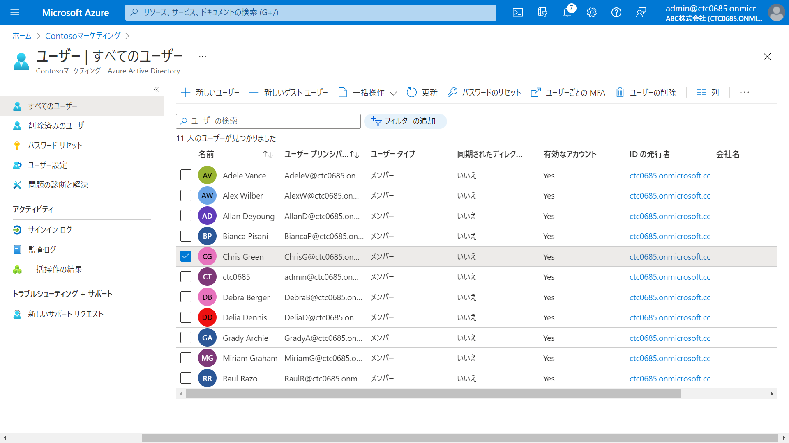

---
lab:
    title: '04 - 削除済みユーザーの復元'
    learning path: '01'
    module: 'モジュール 02 - ID の作成、構成、管理を行う'
---

# ラボ 04: 削除済みユーザーの復元

## ラボ シナリオ

アカウントを削除した後、復元する必要がある場合があります。

最近削除されたアカウントを復元できるかどうかを確認する必要があります。

#### 推定時間: 5 分

### タスク1 - Azure Active Directory からユーザーを削除する

1. [Azure Active Directory]( https://portal.azure.com/#blade/Microsoft_AAD_IAM/ActiveDirectoryMenuBlade/Overview) に`admin@ctcXXXX.onmicrosoft.com`でサインインします。

1. 左側のナビゲーション メニューの「ユーザー」 を選択します。

1. 「ユーザー | すべてのユーザー」 ブレードで、「Chris Green」 を選択します。

    
    
1. ユーザー アカウントを選択した状態で、 「ユーザーの削除」 を選択します。

1. ダイアログ ボックスを確認してから、「OK」 を選択します。

    

## タスク2 - 削除済みユーザーの復元

1. 左側のナビゲーション メニューの「削除されたユーザー」 を選択します。
1. 削除したユーザーのリストを確認し、「Chris Green」を選択します。
1. メニューで 「ユーザーの復元」 を選択します。
1. ダイアログ ボックスを確認してから、「OK」 を選択します。
1. 左側のナビゲーション メニューの「すべてのユーザー」 を選択します。
1. 「Chris Green」が復元されたことを確認します。

この演習では、ユーザーアカウントの削除と復元を行いました。
