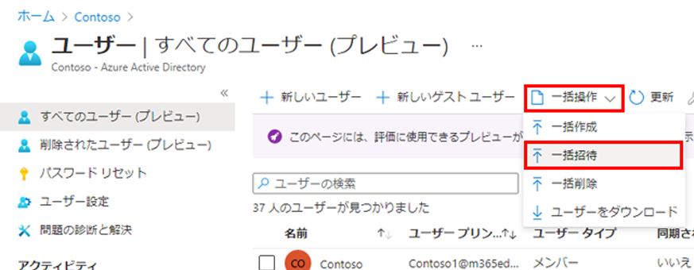
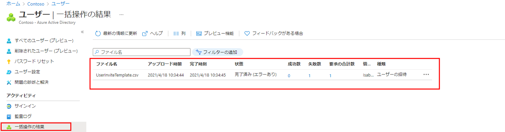

---
lab:
    title: '10 - ゲスト ユーザーを一括招待する'
    learning path: '01'
    module: 'モジュール 03 - 外部 ID の実装と管理を行う'
---

# ラボ 10: ゲスト ユーザーを一括招待する

## ラボ シナリオ

最近では、他社との提携が行われています。当面は、パートナー企業の従業員がゲストとして追加されます。

複数のゲスト ユーザーを一度にインポートできるようにする必要があります。

#### 推定時間: 10 分

## 演習 1 - ゲスト ユーザーを一括招待する

1. [Azure Active Directory]( https://portal.azure.com/#blade/Microsoft_AAD_IAM/ActiveDirectoryMenuBlade/Overview) に`admin@ctcXXXX.onmicrosoft.com`でサインインします。

1. 左側のナビゲーション メニューの「ユーザー」 を選択します。

1. 「ユーザー」ブレードのメニューで、「一括操作」 > 「一括招待」 を選択します。

     

1. 「ユーザー一括招待」ウィンドウで、招待プロパティを持つサンプル CSV テンプレートへの 「ダウンロード」 を選択します。

1. メモ帳などのエディターなどを使用して CSV ファイルを表示します。

1. 次の情報を入力し、ファイルを保存します。

    > 注:メールアドレスはダミーです。実在しません。

    ```
    version:v1.0
    招待するメール アドレス [inviteeEmail] 必須,リダイレクト URL [inviteRedirectURL] 必須,招待メッセージの送信 (true または false) [sendEmail],カスタマイズされた招待メッセージ [customizedMessageBody]
    Example: Istokes@fabrikam.com, https://myapplications.microsoft.com, TRUE, Welcome to the Contoso organization!
    ctctedu-guest01@ctctedu.com, https://myapplications.microsoft.com, TRUE, Welcome to the Contoso organization!
    ctctedu-guest02@ctctedu.com, https://myapplications.microsoft.com, TRUE, Welcome to the Contoso organization!
    ctctedu-guest03@ctctedu.com, https://myapplications.microsoft.com, TRUE, Welcome to the Contoso organization!
    ctctedu-guest04@ctctedu.com, https://myapplications.microsoft.com, TRUE, Welcome to the Contoso organization!
    ctctedu-guest05@ctctedu.com, https://myapplications.microsoft.com, TRUE, Welcome to the Contoso organization!
    ```

1. 「ユーザー一括招待」ページの 「CSV ファイルをアップロード」 で、編集したデータを選択します。

1. 「送信」をクリックし、一覧に登録したゲストユーザーが表示されることを確認します。

    > 注:送信後に「完了した」などの通知はありません。送信後すぐに一覧を更新してください。

1. 左側のナビゲーション メニューの「一括操作の結果」をクリックします。操作ログが確認できます。


この演習では、ゲストユーザーをCSVファイルを用いて一括招待する手順を実施しました。

> 参考:CSVで指定する必須項目
>
> - 招待するメール アドレス - 招待が送信されるユーザーのメールアドレス
>
> - リダイレクト URL - 招待されたユーザーが招待を承認した後に転送される URL
>

