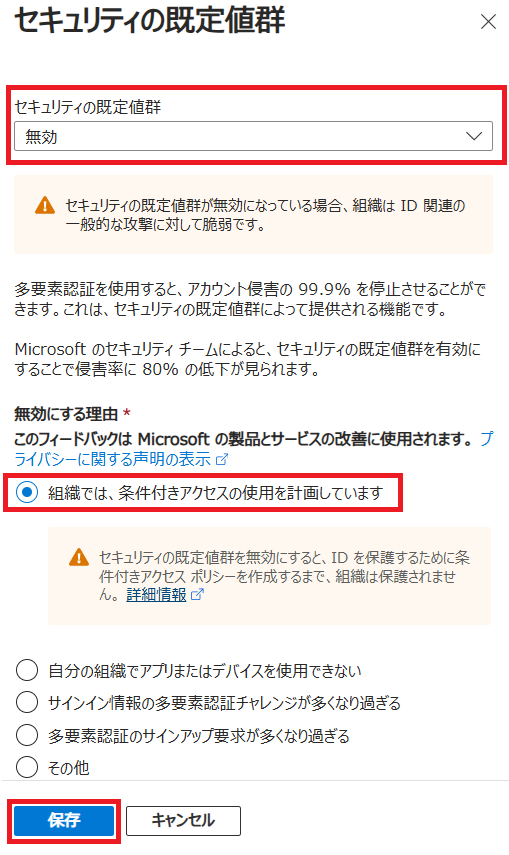

---
lab:
    title: '14 - Azure AD の Multi-Factor Authentication を有効にする'
    learning path: '02'
    module: 'モジュール 03 -条件付きアクセスの計画、実装、管理を行う'
---

# ラボ 14 - セキュリティの既定値群を使用する

## ラボ シナリオ

組織で Azure Active Directory のセキュリティの既定値群の設定を構成する必要があります。
    **これは完全にオプションのラボです!!**  メニュー オプションがどこにあるかを調べるために、- セキュリティの既定値群をオン/オフにすることができます。  セキュリティの既定値群をオンにした場合、条件付きアクセスを含む後のラボは機能しないことに注意してください。

#### 推定時間: 7 分

### 演習 - 事前作業

セキュリティの既定値群を有効化できるようにするために、既存の条件付きアクセス ポリシーを削除または無効化する必要があります。以前のラボで、Delia に対して MFA を強制するためのポリシーを構築したことを思い出してください。以下の手順を実行する間に、これを無効化する必要があります。

1. Azure Portal にログインします。
2. Azure Active Directory を開きます。
3. メニューのセキュリティ セクションから、「**セキュリティ**」を選択してから、「**条件付きアクセス**」を選択します。
4. オンまたはレポートのみに設定されている条件付きアクセス ポリシーをクリックして、それらをオフに変更します。

## セキュリティの既定値群を有効化する

ディレクトリでセキュリティの既定値群を有効にする方法:

1. ディレクトリのグローバル管理者アカウントを使用して [https://portal.azure.com](https://portal.azure.com) を参照し、サインインします。

1. **「ポータル メニューの表示」** ハンバーガー アイコンを選択し、**「Azure Active Directory」** を選択します。

    

1. 左側のナビゲーションの「管理」セクションで **「プロパティ」** を選択します。

1. 「プロパティ」ブレードの下部にある **「セキュリティの既定値群の管理」** を選択します。

1. **「セキュリティの既定値群を有効にする」** トグルを **「はい」** に設定します。

1. これは、既に有効になっている可能性があります。

1. **「保存」** を選択します。

### セキュリティの既定値群を無効にする

セキュリティの既定値群を置き換える条件付きアクセス ポリシーを実装する組織では、セキュリティの既定値群を無効にする必要があります。

ディレクトリでセキュリティの既定値群を無効にする方法:

1. ディレクトリのグローバル管理者アカウントを使用して [https://portal.azure.com](https://portal.azure.com/) を参照し、サインインします。

1. **「ポータル メニューの表示」** ハンバーガー アイコンを選択し、**「Azure Active Directory」** を選択します。

1. 「プロパティ」ブレードの下部にある **「セキュリティの既定値群の管理」** を選択します。

1. **「セキュリティの既定値群を有効にする」** トグルを **「いいえ」** に設定します。

    

1. **「保存」** を選択します。
