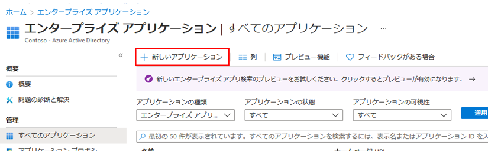
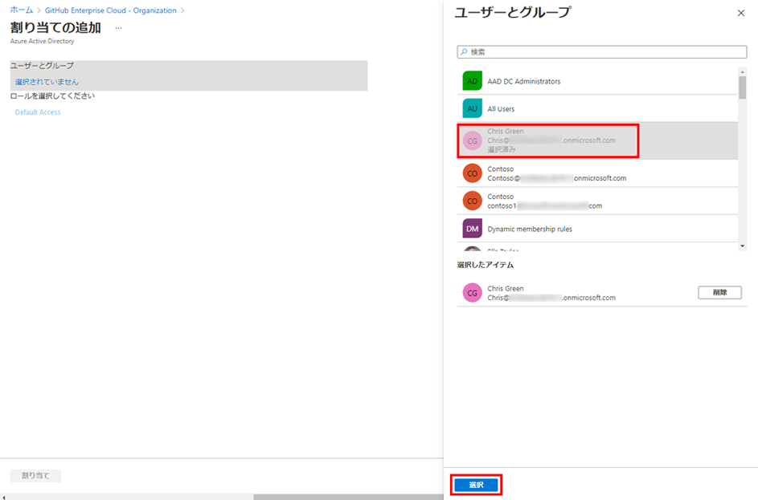

---
lab:
    title: '20 - アプリのアクセス管理を実装する'
    learning path: '03'
    module: 'モジュール 01 -SSO 用エンタープライズ アプリの統合の計画と設計を行う'
---

# ラボ 20 - アプリのアクセス管理を実装する

## ラボ シナリオ

組織では、特定のユーザーまたはグループのみがエンタープライズ アプリケーションにアクセスできる必要があります。

ユーザーを特定のアプリケーションに割り当てる必要があります。

#### 推定時間: 5 分

### タスク 1 - Azure AD テナントにアプリを追加する

1. [Azure Active Directory]( https://portal.azure.com/#blade/Microsoft_AAD_IAM/ActiveDirectoryMenuBlade/Overview) に`admin@ctcXXXX.onmicrosoft.com`でサインインします。

1. 左側のナビゲーション メニューの「エンタープライズ アプリケーション」 をクリックします。

1. 「エンタープライズ アプリケーション」ウィンドウで 「+ 新しいアプリケーション」 をクリックします。

    

1. 「Azure AD ギャラリーの参照」ブレードの 「アプリケーションの検索」 ボックスに 「GitHub」 と入力します。

    

1. 結果から 「GitHub Enterprise Cloud – Enterprise Account」 をクリックします。

1. 「GitHub Enterprise Cloud – Enterprise Account」 で「作成」 をクリックします。

1. 作成後に「GitHub Enterprise Cloud - Enterprise Account | 概要」ブレードにリダイレクトされます。

    

### タスク 2 - アプリにユーザーを割り当てる

1. 「GitHub Enterprise Cloud - Enterprise Account | 概要」ブレードの 「ユーザーとグループ」 をクリックします。

1. 「GitHub Enterprise Cloud - Enterprise Account | ユーザーとグループ」ブレードの「+ ユーザー/グループの追加」 をクリックします。

1. 「割り当ての追加」ブレードの「ユーザーとグループ」で「Chris Green」を選択し、「割り当て」を行います。

    

1. 「割り当て」 をクリックします。

### タスク 3 - 割り当てられたアプリを確認する

1. 新しい InPrivate ブラウザー ウィンドウを開きます。

2. [https://myapps.microsoft.com/](https://myapps.microsoft.com/) に`ChrisG@ctcXXXX.onmicrosoft.com`でサインインします。

3. 「マイアプリ」画面に「GitHub Enterprise Cloud - Enterprise Account」が表示されます。

   > 注:表示された「GitHub Enterprise Cloud - Enterprise Account」をクリックすると「リクエストの処理中に問題が発生しました」
   >
   > 　 と表示されますが、正しい動作です。SSOの設定や構成を行っていないためです。
   >
   > 　 このLabはアプリの登録までの操作確認となります。

4. ブラウザーを閉じます。

この演習では、エンタープライズアプリを登録し、ユーザーに割り当てをする操作を確認しました。

> 参考:「GitHub Enterprise Cloud - Enterprise Account」に対してSSOを実装する方法
>
> 前提としてGithubのEnterprise Account契約が必要になります。
>
> Microsoftでは以下のURLでチュートリアルを公開しています。
>
> 　■チュートリアル:Azure Active Directory シングル サインオン (SSO) と GitHub Enterprise Cloud - Enterprise Account の統合
>
> 　　https://docs.microsoft.com/ja-jp/azure/active-directory/saas-apps/github-enterprise-cloud-enterprise-account-tutorial
