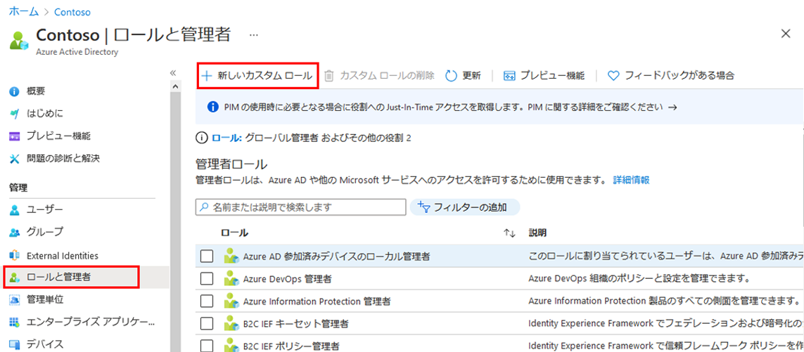
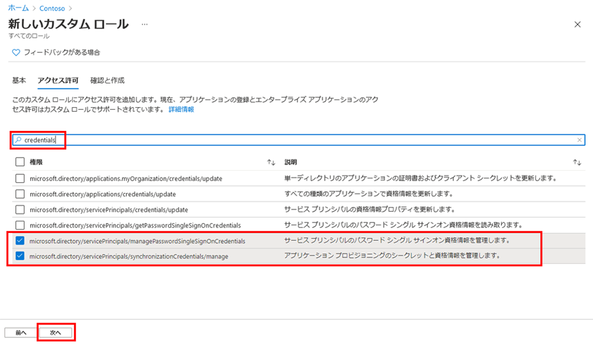

---
lab:
    title: '21 - 新しいカスタム ロールを作成してアプリ登録を管理するためのアクセス権を付与する'
    learning path: '03'
    module: 'モジュール 01 - SSO 用エンタープライズ アプリの統合の計画と設計を行う'
---

# ラボ 21 - 新しいカスタム ロールを作成してアプリ登録を管理するためのアクセス権を付与する

## ラボ シナリオ

アプリ管理用の新しいカスタム ロールを作成する必要があります。アプリケーションプロビジョニングをするためのロールを作成します。

この新しいロールは、資格情報管理の実行に必要な特定の権限のみに限定する必要があります。

#### 推定時間: 5 分

## タスク 1 - 新しいカスタム ロールを作成してアプリ登録を管理するためのアクセス権を付与する

1. [Azure Active Directory]( https://portal.azure.com/#blade/Microsoft_AAD_IAM/ActiveDirectoryMenuBlade/Overview) に`admin@ctcXXXX.onmicrosoft.com`でサインインします。

2. 左側のナビゲーション メニューの **「ロールと管理者」** をクリックします。

4. **「ロールと管理者」**ブレードで、メニューから **「+新しいカスタム ロール」** をクリックします。

    

4.  **「新しいカスタム ロール」**ブレードの**「基本」**タブで、次の情報を使用し「**次へ**」をクリックします。

   > 注:指定の無い項目は、「空欄」または「デフォルト値」で結構です。
   
   | **設定** | **値**                 |
   | :------- | ---------------------- |
   | 名前     | **My Custom App Role** |
   
4. **「新しいカスタム ロール」**ブレードの**「アクセス許可」**タブで、次の情報を使用し「**次へ**」をクリックします。

   > 注:指定の無い項目は、「空欄」または「デフォルト値」で結構です。
   
   > 注:指定された2つの権限に☑を入れてください。
   
   | **設定** | **値**                                                       |
   | :------- | ------------------------------------------------------------ |
   | 権限     | **microsoft.directory/servicePrincipals/managePasswordSingleSignOnCredentials** |
   |          | **microsoft.directory/servicePrincipals/synchronizationCredentials/manage** |
   
   
   
6. **「新しいカスタム ロール」**ブレードの**「確認と作成」**タブで「**作成**」をクリックします。

7. **「Contosoマーケティング | ロールと管理者」**ブレードにリダイレクトされます。一覧に**「My Custom App Role」**があることを確認してください。

この演習では、カスタムロールの作成を実施しました。

> 参考:演習で登録した2つのロールとは
>
> | ロール名                                                     | 詳細                                                         |
> | ------------------------------------------------------------ | ------------------------------------------------------------ |
> | microsoft.directory/servicePrincipals/managePasswordSingleSignOnCredentials | サービス プリンシパルのパスワード シングル サインオン資格情報を読み取る |
> | microsoft.directory/servicePrincipals/synchronizationCredentials/manage | アプリケーション プロビジョニングのシークレットと資格情報を管理する |
>
> アプリケーション プロビジョニングを行う場合、作成中のアプリケーションまたはサービス プリンシパルのシングル サインオンを有効にして強制するために必要な最小限のアクセス許可です。 エンタープライズ アプリケーションを一連のユーザーまたはグループに割り当てることができます。
