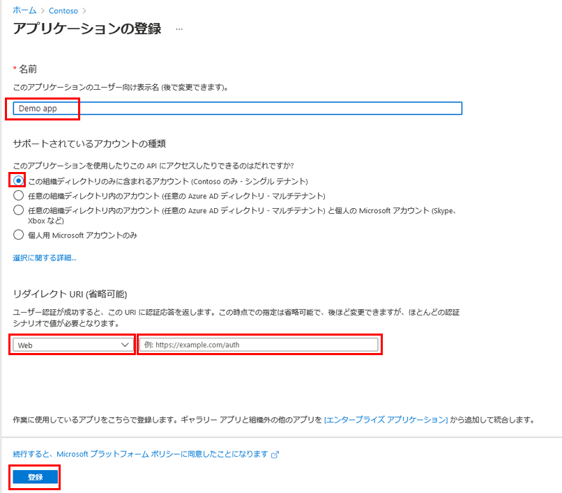
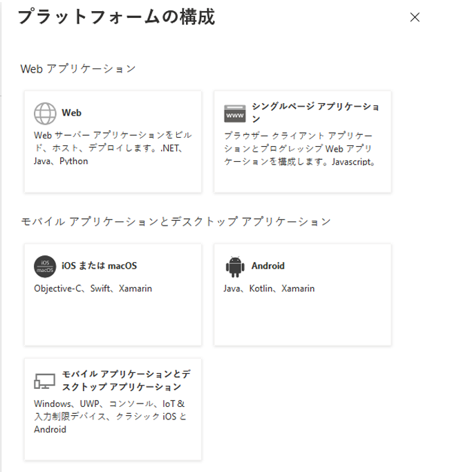
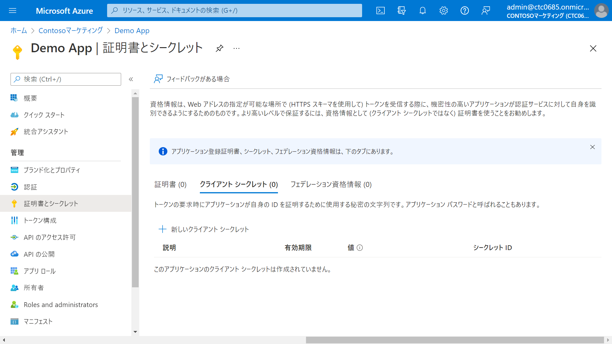
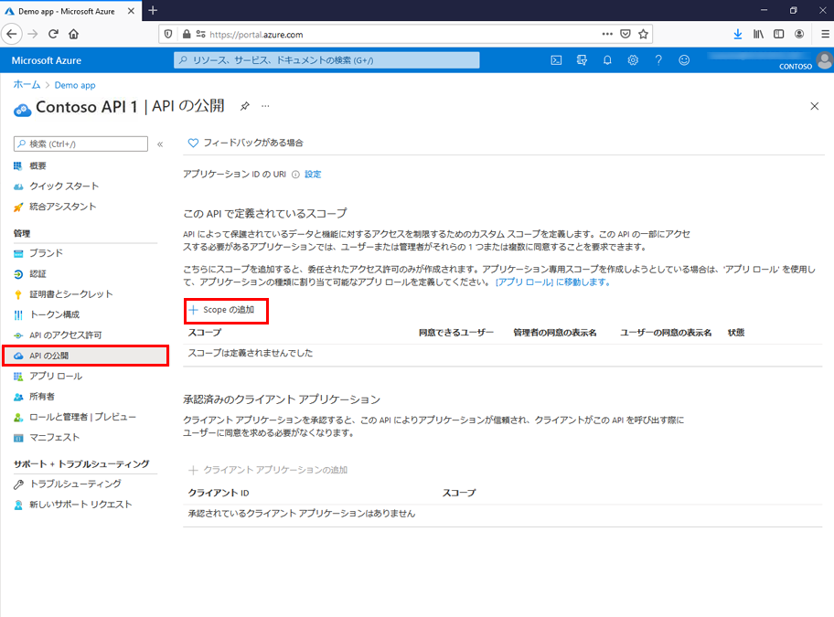

---
lab:
    title: '22 - アプリケーションを登録する'
    learning path: '03'
    module: 'モジュール 03 - アプリの登録を実装する'
---

# ラボ 22 - アプリケーションを登録する

## ラボ シナリオ

アプリケーションを登録すると、アプリケーションと Microsoft ID プラットフォームとの間の信頼関係が確立されます。

この信頼関係は一方向です。アプリは Microsoft ID プラットフォームを信頼しますが、その逆はありません。

#### 推定時間: 20 分

## タスク 1 - アプリケーションを登録する

1. [Azure Active Directory]( https://portal.azure.com/#blade/Microsoft_AAD_IAM/ActiveDirectoryMenuBlade/Overview) に`admin@ctcXXXX.onmicrosoft.com`でサインインします。

1. 左側のナビゲーション メニューの 「アプリの登録」 をクリックします。

1. 「Contosoマーケティング | アプリの登録」 ブレードで、「+ 新規登録」 をクリックします。

1. 「アプリケーションの登録」ブレードで、次の情報を使用し「登録」をクリックします。

    > 注:指定の無い項目は、「空欄」または「デフォルト値」で結構です。

    | 設定                               | 値                                                           |
    | :--------------------------------- | ------------------------------------------------------------ |
    | 名前                               | Demo App                                                     |
    | サポートされているアカウントの種類 | この組織ディレクトリのみに含まれるアカウント (Contosoマーケティング のみ - シングル テナント) |

    

1. 完了すると、「Demo App」 ブレードへリダイレクトされます。

> 参考：リダイレクト URIとは
>
> リダイレクト URIはアプリが正しく承認され、認証コードまたはアクセス トークンが付与されると、承認サーバーがユーザーを送り出す場所です。
>
>  承認サーバーは、リダイレクト URI にこのコードまたはトークンを送信するため、アプリ登録プロセスの一環として正しい場所を登録することが重要です。
>
> https://docs.microsoft.com/ja-jp/azure/active-directory/develop/reply-url

## タスク 2 - プラットフォーム設定を構成する

> 注:このタスクは項目を確認するだけのタスクです。設定や構成する手順は無いため、スキップしてOKです。

1. 「Demo App」ブレードの「認証」 をクリックします。

1. 「プラットフォーム構成」 で 「プラットフォームを追加」 をクリックします。

1. 「プラットフォームの構成」 で、設定できるプラットフォームを確認します。

    

    
    
    > 参考:「プラットフォーム構成」 とは
    >
    > リダイレクト URI など、アプリケーションの種類ごとの設定は、Azure portal の 「プラットフォーム構成」 で構成します。
    >
    > Web やシングルページ アプリケーションなどの一部のプラットフォームでは、リダイレクト URI を手動で指定する必要があります。
    >
    > モバイルやデスクトップなどの他のプラットフォームでは、他の設定を構成するときに自動的に生成されるリダイレクト URI からクリックできます。
    >
    > | プラットフォーム| 構成設定|
    > | :--- | :--- |
    > | Web| アプリの 「リダイレクト URI」 (認証後に Microsoft ID プラットフォームによってユーザーのクライアントがリダイレクトされ、セキュリティ トークンが送信される場所) を入力します。サーバーで実行される標準の Web アプリケーションについては、このプラットフォームをクリックします。 |
    > | シングルページ アプリ| アプリの 「リダイレクト URI」 (認証後に Microsoft ID プラットフォームによってユーザーのクライアントがリダイレクトされ、セキュリティ トークンが送信される場所) を入力します。JavaScript、または Angular、Vue.js、React.js、Blazor WebAssembly などのフレームワークでクライアント側の Web アプリをビルドしている場合は、このプラットフォームをクリックします。 |
    > | iOS/macOS| アプリの 「バンドル ID」 を入力します。これは、*Info.plist* の XCode または「ビルド設定」で見つけることができます。バンドル ID を指定すると、リダイレクト URI が自動的に生成されます。 |
    > | Android| AndroidManifest.xml ファイルにあるアプリのパッケージ名を入力し、署名ハッシュを生成して入力します。これらの設定を指定すると、リダイレクト URI が生成されます。 |
    > | モバイル アプリケーションとデスクトップ アプリケーション| 「Suggested redirect URIs」 (推奨されるリダイレクト URI) の 1 つをクリックするか、「カスタム リダイレクト URI」 を指定します。デスクトップ アプリケーションの場合は、[https://login.microsoftonline.com/common/oauth2/nativeclient](https://login.microsoftonline.com/common/oauth2/nativeclient) をお勧めします。最新の Microsoft Authentication Library (MSAL) を使用していない、またはブローカーを使用していないモバイル アプリケーションには、このプラットフォームをクリックします。また、デスクトップ アプリケーションにも、このプラットフォームをクリックします。 |

## タスク 3 - 資格情報を追加する

> 注:このタスクは項目を確認するだけのタスクです。設定や構成する手順は無いため、スキップしてOKです。

1. 「Demo App」ブレードの 「証明書とシークレット」 をクリックします。

1. 「Demo App | 証明書とシークレット」 の画面中央に以下の項目が設定できることを確認します。

   　「証明書」「クライアントシークレット」「フェデレーション資格情報」

> 参考:アプリ登録の資格情報とは
>
> 資格情報は、Web API にアクセスする confidential client application (機密クライアントアプリケーション) によって使用されます。
>
> confidential client applicationの例として、Web アプリ、その他の Web API、またはサービス型およびデーモン型アプリケーションなどがあります。
>
> 資格情報により、アプリケーションはそれ自体として認証され、実行時にユーザーによる操作は必要ありません。
>
> 証明書とクライアント シークレット (文字列) の両方を資格情報として Confidential クライアント アプリの登録に追加できます。

> 参考:機密クライアント アプリケーションとは
>
> サーバー上で実行されるアプリ (Web アプリ、Web API アプリ、さらにはサービス アプリやデーモン アプリ) です。 
>
> これらはアクセスが困難であると考えられているため、アプリケーション シークレットを保持することができます。
>
>  機密クライアントは、構成時のシークレットを保持することができます。 クライアントの各インスタンスに個別の構成 (クライアント ID とクライアント シークレットを含む) があります。
>
>  これらの値を、エンド ユーザーが抽出することは困難です。
>
>  Web アプリは最も一般的な機密クライアントです。 
>
> クライアント ID は Web ブラウザーを介して公開されますが、シークレットはバック チャネルでのみ渡され、直接公開されることはありません。
>
> https://docs.microsoft.com/ja-jp/azure/active-directory/develop/msal-client-applications

> 参考:証明書の追加
>
> 証明書は、*公開キー*とも呼ばれ、クライアント シークレットよりも高いレベルの保証を提供するため、推奨される資格情報の種類です。
>
> 信頼された公開証明書を使用する場合は、証明書とシークレット機能を使用して証明書を追加できます。
>
> 証明書は、「.cer」「.pem」「.crt」のいずれかのファイル形式である必要があります。

> 参考:クライアント シークレットの追加
>
> クライアント シークレットは、*アプリケーション パスワード*とも呼ばれ、アプリで自身を識別するために証明書の代わりに使用できる文字列値です。
>
> 2 種類の資格情報のうち、使いやすい方です。
>
> 多くの場合は開発時に使用されますが、証明書より安全性が低いと見なされています。
>
> 運用環境で実行するアプリケーションでは、証明書を使用する必要があります。

## タスク 4 - Web API を登録する

1. 左側のナビゲーション メニューの 「アプリの登録」 をクリックします。

1. 「Contosoマーケティング | アプリの登録」 ブレードで、「+ 新規登録」 をクリックします。

1. 「アプリケーションの登録」ブレードで、次の情報を使用し「登録」をクリックします。

    > 注:指定の無い項目は、「空欄」または「デフォルト値」で結構です。

    | 設定                               | 値                                                           |
    | :--------------------------------- | ------------------------------------------------------------ |
    | 名前                               | Demo App API                                                 |
    | サポートされているアカウントの種類 | この組織ディレクトリのみに含まれるアカウント (Contosoマーケティング のみ - シングル テナント) |

1. 左側のナビゲーション メニューの「API の公開」 をクリックし、画面内の 「Scopeの追加」 をクリックします。

    

1. 「スコープの追加」ウィンドウで、自動的に生成された「アプリケーション ID URI」 を確認し、「保存してから続ける」をクリックします。

    >注:「アプリケーション ID URI」はユニークな値に変更することも可能です。

1. 「スコープの追加」 ウィンドウで、次の情報を使用し「スコープの追加」をクリックします。

    > 注:指定の無い項目は、「空欄」または「デフォルト値」で結構です。

    | 設定                      | 値                                                           |
    | :------------------------ | ------------------------------------------------------------ |
    | 名前                      | Employees.Read.All                                           |
    | 同意できるのはだれですか? | 管理者とユーザー                                             |
    | 管理者の同意の表示名      | 従業員レコードへの読み取り専用アクセス                       |
    | 管理者の同意の説明        | すべての従業員データへの読み取り専用アクセスをアプリケーションに許可します。 |
    | ユーザーの同意の表示名    | 従業員レコードへの読み取り専用アクセス                       |
    | ユーザーの同意の説明      | 従業員データへの読み取り専用アクセスをアプリケーションに許可します。 |
    | 状態                      | 有効                                                         |

    > 参考:各フィールドの説明
    >
    > | フィールド| 説明|
    > | :--- | :--- |
    > | スコープ名| スコープの名前。一般的なスコープの名前付け規則は、<resource>.<operation>.<constraint> です。|
    > | 同意できるユーザー| このスコープに「ユーザーが同意できるか」、「管理者の同意が必要か」を設定できます。。より高い特権のアクセス許可にするには、「管理者のみ」をクリックします。 |
    > | 管理者の同意の表示名| 管理者のみに表示される、スコープの目的についての簡単な説明です。 |
    > | 管理者の同意の説明| 管理者のみに表示される、スコープによって付与されるアクセス許可の詳細な説明です。 |
    > | ユーザーの同意の表示名| スコープの目的に関する簡単な説明。「同意できるユーザー」を「管理者とユーザー」に設定した場合にのみユーザーに表示されます。|
    > | ユーザーの同意の説明| スコープによって付与されるアクセス許可の詳細な説明。「同意できるユーザー」を「管理者とユーザー」に設定した場合にのみユーザーに表示されます。|

1. 「Demo App API | API の公開」ブレードの「この API で定義されているスコープ」の一覧に作成したスコープが表示されたことを確認します。

    

## タスク 5 - 管理者の同意が必要なスコープを追加する

1. 左側のナビゲーション メニューの「API の公開」 をクリックし、画面内の 「Scopeの追加」 をクリックします。

1. 「スコープの追加」 ウィンドウで、次の情報を使用し「スコープの追加」をクリックします。

    > 注:指定の無い項目は、「空欄」または「デフォルト値」で結構です。
    
    | 設定                      | 値                                                           |
    | :------------------------ | ------------------------------------------------------------ |
    | 名前                      | Employees.Write.All                                          |
    | 同意できるのはだれですか? | 管理者のみ                                                   |
    | 管理者の同意の表示名      | 従業員レコードへの書き込みアクセス                           |
    | 管理者の同意の説明        | すべての従業員データへの書き込みアクセスをアプリケーションに許可します。 |
    | 状態                      | 有効                                                         |
    
3. 「Demo App API | API の公開」ブレードの「この API で定義されているスコープ」の一覧に作成したスコープが表示されたことを確認します。

    

## タスク 6 - 公開されたスコープを使用する

1. 前のタスクで作成した、「Demo App」 を開きます。
   
1. 「Demo App」ブレードで、左側のナビゲーション メニューの「APIのアクセス許可」をクリックします。

1. 「Demo App | API のアクセス許可」ブレードで、「アクセス許可の追加」 をクリックします。

1. 「API アクセス許可の要求」ウィンドウで「自分の API」 タブをクリックします。

1. 「Demo Web API」 をクリックします。
   
1. アクセス許可にクリックされている２つのスコープをクリックし、「アクセス許可の追加」 をクリックします。
   
    - Employees.Read.All 従業員レコードへの読み取り専用アクセス    
    - Employees.Write.All 従業員レコードへの書き込みアクセス
    
1. 「Demo App | API のアクセス許可」ブレード画面中央にある「Contoso マーケティングに管理者の同意を与えます」をクリックします。
   
1. 「管理者の同意の確認を与えます。」と表示されるので「はい」をクリックします。
   
    

この演習では、独自のアプリケーションとAPIを登録し、APIアクセス許可を実装しました。

> 注:Web API へのアクセス許可をする理由
>
> クライアント アプリの登録に Web API へのアクセス許可が付与されると、Microsoft ID プラットフォームによってクライアントに OAuth 2.0 アクセス トークンが発行されます。クライアントから Web API を呼び出すと、アクセス トークンが表示されます。そのスコープ (scp) 要求は、クライアントのアプリ登録で指定したアクセス許可に設定されています。公開するスコープは、必要に応じて後から追加することもできます。Web API を使用すると、複数の操作に関連付けられた複数のスコープを公開できることを考慮してください。リソースは、受け取った OAuth 2.0 アクセス トークンのスコープ (scp) 要求を評価することによって、実行時に Web API へのアクセスを制御します。
>

