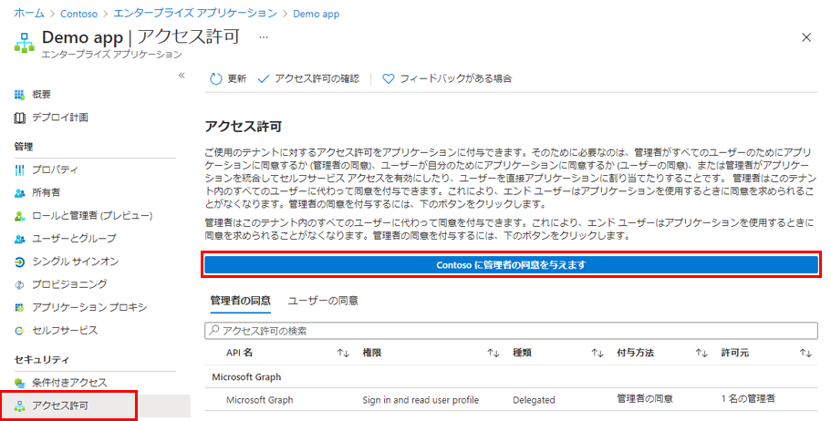

---
lab:
    title: '23 - アプリケーションに対してテナント全体の管理者の同意を付与する'
    learning path: '03'
    module: 'モジュール 03 - アプリの登録を実装する'
---

# ラボ 23: アプリケーションに対してテナント全体の管理者の同意を付与する

## ラボ シナリオ

組織で開発したアプリケーション、または Azure AD テナントに直接登録されているアプリケーションの場合は、Azure portal の「アプリの登録」から、テナント全体の管理者の同意を付与できます。

#### 推定時間: 10 分

## タスク 1 - エンタープライズ アプリで管理者の同意を付与する

テナントでアプリケーションが既にプロビジョニングされている場合、エンタープライズ アプリケーションを通じて、テナント全体の管理者の同意を付与できます。

1. [Azure Active Directory]( https://portal.azure.com/#blade/Microsoft_AAD_IAM/ActiveDirectoryMenuBlade/Overview) に`admin@ctcXXXX.onmicrosoft.com`でサインインします。

1. 左側のナビゲーション メニューの 「エンタープライズ アプリケーション」 をクリックします。

1. 「エンタープライズ アプリケーション | すべてのアプリケーション」 ブレードで、前のラボで作成した「Demo App」をクリックします。

1. 「Demo App | 概要」ブレードの左側のナビゲーション メニューより 「アクセス許可」 を選択します。

1. 「Demo App | アクセス許可」ブレードより「Contoso マーケティングに管理者の同意を与えます」 をクリックします。

    

1. プロンプトが表示されたら、`admin@ctcXXXX.onmicrosoft.com`でサインインします。

1. 「要求されているアクセス許可　組織のレビュー」 ダイアログボックスで情報を確認し、「承諾」 を選択します。

この演習では、エンタープライズアプリケーションで管理者の同意を付与しました。

> 注:「エンタープライズアプリケーション」と「アプリ登録」の同意の違い
>
> エンタープライズアプリケーションで同意設定を行うと、テナント全体の管理者へ同意を設定することになります。
>
> 個別にAPIで設定する場合は「アプリ登録」、テナント全体に設定する場合は「エンタープライズアプリケーション」になります。
