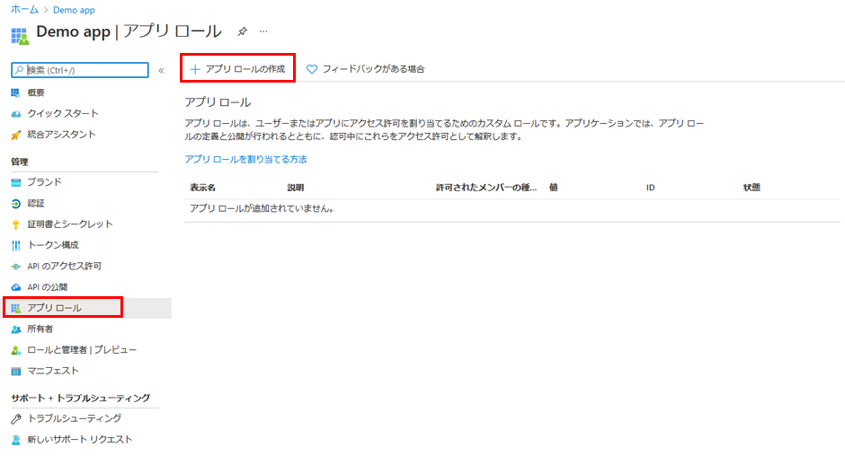

---
lab:
    title: '24 - アプリにアプリ ロールを追加してトークンで受け取る'
    learning path: '03'
    module: 'モジュール 03 - アプリの登録を実装する'
---

# ラボ 24: アプリにアプリ ロールを追加してトークンで受け取る

## ラボ シナリオ

ロールベースのアクセス制御 (RBAC) は、アプリケーションにおいて承認を実施する一般的なメカニズムです。

RBAC を使用するとき、管理者は個々のユーザーまたはグループではなく、ロールにアクセス許可を付与します。

その後、管理者はロールをさまざまなユーザーやグループに割り当てて、コンテンツや機能にだれがアクセスできるかを制御できます。

あなたは、RBAC ロールの実装を計画しており、手順の実行方法を理解していることを確認する必要があります。

#### 推定時間: 10 分

## タスク 1 - アプリ ロール UI を使用してアプリ ロールを宣言する

Azure portal のユーザー インターフェイスを使用してアプリ ロールを作成するには、次のようにします。

1. [Azure Active Directory]( https://portal.azure.com/#blade/Microsoft_AAD_IAM/ActiveDirectoryMenuBlade/Overview) に`admin@ctcXXXX.onmicrosoft.com`でサインインします。

2. 左側のナビゲーション メニューの 「アプリの登録」 を選択し、以前に作成した「Demo App」アプリをクリックします。

5. 「Demo App」ブレードの「アプリ ロール」 を選択し、「アプリ ロールの作成」 をクリックします。

    

4. 「アプリ ロールの作成」 ウィンドウで、次の情報を使用し「適用」をクリックします。

    > 注:指定の無い項目は、「空欄」または「デフォルト値」で結構です。

    | 設定                              | 値                                 |
    | :-------------------------------- | ---------------------------------- |
    | 表示名                            | アンケートライター                 |
    | 許可されたメンバーの種類          | ユーザーまたはグループ             |
    | 値                                | Survey.Create                      |
    | 説明                              | ライターはアンケートを作成できます |
    | このアプリ ロールを有効にしますか | ☑チェックをいれる                  |

5. 「Demo App | アプリ ロール」に作成したアプリロールが表示されます。

6. 作成したアプリロールの「ID」の値をメモ長などで保存します。

    > 注:「ID」は演習の後半で使用します。

    

## タスク 2 - ロールにユーザーとグループを割り当てる

1. [Azure Active Directory]( https://portal.azure.com/#blade/Microsoft_AAD_IAM/ActiveDirectoryMenuBlade/Overview) に`admin@ctcXXXX.onmicrosoft.com`でサインインします。

2. 左側のナビゲーション メニューの 「エンタープライズ アプリケーション」 をクリックします。

3. 「エンタープライズ アプリケーション | すべてのアプリケーション」 ブレードで、前のラボで作成した「Demo App」をクリックします。

4. 「Demo App | 概要」ブレードの「ユーザーとグループ」 を選択します。

6. 「Demo App | ユーザーとグループ」ブレードの、「+ ユーザーまたはグループの追加」 をクリックします。

6. 「ユーザーとグループ」で「Grady Archie」を選択し、「割り当て」を行います。

   > 注:「ロールを選択してください」では自動的に「アンケートライター」が選択されています。

7. 追加したユーザーとグループが 「ユーザーとグループ」 のリストに表示されることを確認します。

   

## タスク 3 - Graph Explorer を使用して、Gredy に割り当てられたロールを確認する

1. [Microsoft Graph Exploer](https://developer.microsoft.com/ja-jp/graph/graph-explorer)にアクセスします。

   > 参考:Microsoft Graph と Graph Explorer
   >
   > Microsoft Graph は、Microsoft 365、Windows 10、および Enterprise Mobility + Security の膨大な量のデータにアクセスする際に使用できる統合型プログラミング モデルを提供します。
   >
   > Microsoft Graph の豊富なデータを使用して、数百万人のユーザーを操作する組織やコンシューマー向けのアプリを作成できます。
   >
   > Graph Explorerは、クエリ実行を試す環境です。開発や検証に利用します。
   >
   > https://docs.microsoft.com/ja-jp/graph/overview

1. 左側の「Microsoftの職場または学校のアカウントで」をクリックし、`GradyA@ctcXXXX.onmicrosoft.com`のアカウントで認証します。

1. 「要求されているアクセス許可」 で「承諾」 をクリックし、サインインします。

1. 画面内に「`https://graph.microsoft.com/v1.0/me`」と書かれたフォームがあります。以下のURLに置き換えます。

   ```
   https://graph.microsoft.com/v1.0/me/appRoleAssignments
   ```

1. 「クエリの実行」をクリックします。画面下部に結果が表示されました。

1. 上段の「appRoleId」の値が、メモを取った「ID」と一致していることを確認します。


この演習では、独自のアプリロールを作成し、ユーザーに付与し、Graph Explorerを用いて確認しました。


