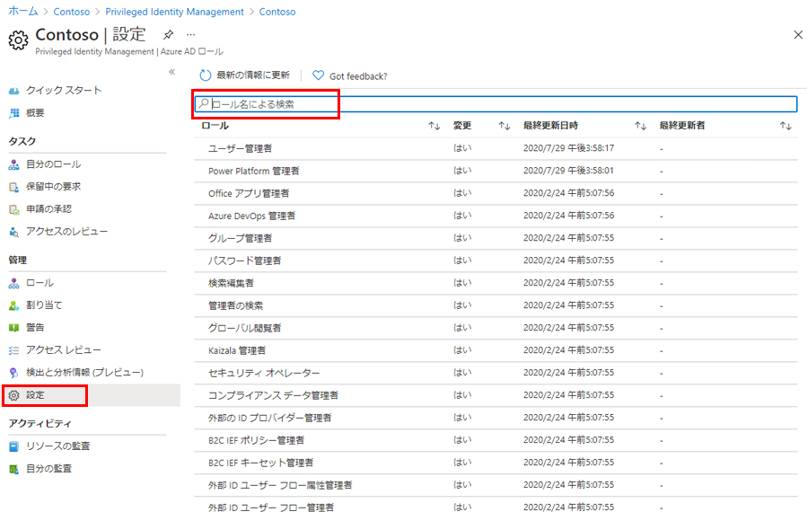
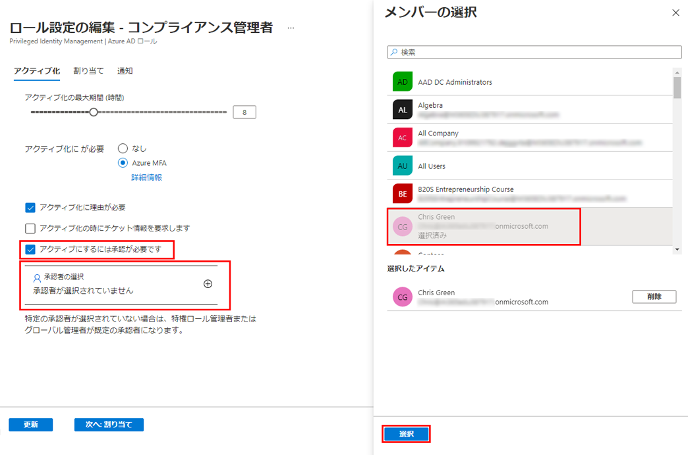

---
lab:
    title: '28 - Azure AD ロール用に Privileged Identity Management を構成する'
    learning path: '04'
    module: 'モジュール 03 - 特権アクセスの計画と実装を行う'
---

# ラボ 28: Azure AD ロール用に Privileged Identity Management を構成する

## ラボ シナリオ

特権ロール管理者は、ロール候補の割り当てをアクティブ化しているユーザーの操作性を変更するなど、Azure Active Directory (Azure AD) 組織の Privileged Identity Management (PIM) をカスタマイズできます。PIM の構成について理解する必要があります。

#### 推定時間: 15 分

## タスク 1 - Azure AD ロールの設定を構成する

1. [Azure Active Directory]( https://portal.azure.com/#blade/Microsoft_AAD_IAM/ActiveDirectoryMenuBlade/Overview) に`admin@ctcXXXX.onmicrosoft.com`でサインインします。

1. 左側のナビゲーション メニューの 「Identity Governance」 をクリックします。

1. 「Identity  Governance」ブレードの「Azure AD ロール」 をクリックします。

1. 「Privileged Identity Management | クイック スタート」ブレードの「AzureADロール」をクリックします。

1. 「Contosoマーケティング | クイック スタート」ブレード左側のナビゲーションツリーより 「設定」 をクリックします。

    

1. ロールの一覧を確認してから、「ロール名による検索」 に 「コンプライアンス」 と入力します。

1. 結果から 「コンプライアンス管理者」 をクリックします。

1. 「ロール設定の詳細 - コンプライアンス管理者」ブレードより 「編集」 をクリックします。

    

1. 「アクティブにするには承認が必要です」 チェック ボックスをオンにします。

1. 承認者に「Chris Green」を選択します。

1. 最後に「更新」をクリックします。

この演習では、Privileged Identity Managementを使ってAzureADロールの承認者を設定しました。

