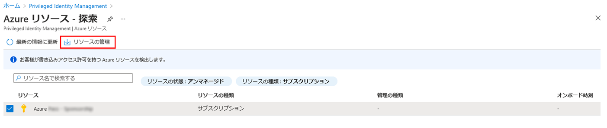

---
lab:
    title: '30 - Privileged Identity Management で Azure リソース ロールを割り当てる'
    learning path: '04'
    module: 'モジュール 03 - 特権アクセスの計画と実装を行う'
---

# ラボ 30: Privileged Identity Management で Azure リソース ロールを割り当てる

## ラボ シナリオ

Azure Active Directory (Azure AD) Privileged Identity Management (PIM) では、組み込みの Azure リソース ロールと、以下を含むカスタム ロールを管理できます。

- 所有者

- ユーザー アクセス管理者

- 共同作成者

- セキュリティ管理者

- セキュリティ マネージャー

ユーザーを Azure リソース ロールの候補にする必要があります。

#### 推定時間: 10 分

## タスク 1 - Azure リソース ロールを割り当てる

1. [Azure Active Directory]( https://portal.azure.com/#blade/Microsoft_AAD_IAM/ActiveDirectoryMenuBlade/Overview) に`admin@ctcXXXX.onmicrosoft.com`でサインインします。

2. 左側のナビゲーション メニューの 「Identity Governance」 をクリックします。

3. 「Identity  Governance」ブレードの「Azure リソース」 をクリックします。

4. 「Privileged Identity Management | Azure リソース」ブレードの 「リソースの検出」 をクリックします。

5. 「Azure リソース - 探索」ブレードで「Azure Pass スポンサープラン」をクリックし、 「リソースの管理」 をクリックします。

    

6. 「クリックしたリソースを管理のためにオンボードしています」 ダイアログ ボックスで、「OK」 をクリックします。

7. オンボードが完了したら、「Azure リソース - 探索」ブレードを閉じます。

8. 「Privileged Identity Management | Azure リソース」ブレードで、追加したサブスクリプションをクリックします。

    

9. 「Azure Pass - スポンサー プラン | 概要」ブレード左側のナビゲーション メニューで、 「ロール」 をクリックします。

10. 「Azure Pass - スポンサー プラン | ロール」で 「+ 割り当ての追加」 をクリックします。

11. 「割り当ての追加」ブレードで、「ロールの選択」 は「API Management サービス共同作成者」 を指定します。

12. 「メンバーの選択」 で 「Miriam Graham」 をクリックし 、「次へ」 をクリックします。

13. 「割り当て」 をクリックします。

この演習では、PIMを使用してAzureロールを割り当てる設定を実施しました。
