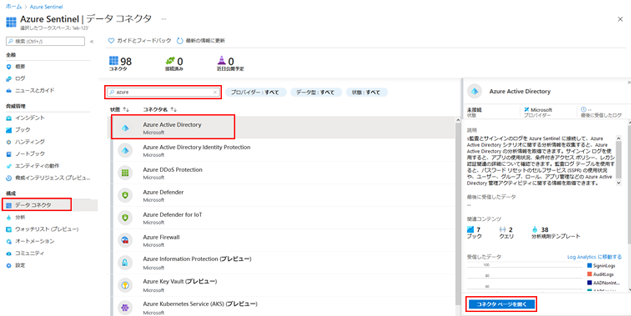
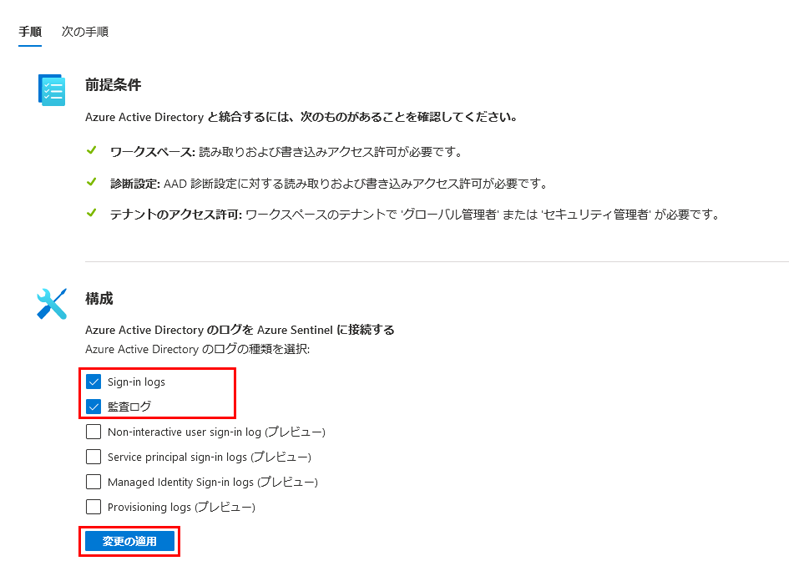

---
lab:
    title: '31 - Azure Active Directory (Azure AD) から Microsoft Sentinel へデータを接続する'
    learning path: '04'
    module: 'モジュール 04 - Azure Active Directory の監視と保守を行う'
---

# ラボ 31: Azure Active Directory (Azure AD) から Microsoft Sentinel へデータを接続する

## ラボ シナリオ

あなたの会社では、セキュリティ情報イベント管理 (SIEM) ソリューションの使用を開始する予定です。

Microsoft Sentinel にアクセスできることはわかっているので、それを Azure AD に接続することに慣れる必要があります。

#### 推定時間: 10 分

## タスク 1 - Microsoft Sentinel ワークスペースを作成および追加する

Microsoft Sentinel で使用できるワークスペースがまだない場合は、これらの手順を使用します。

1. [Azure Portal](https://portal.azure.com) に`admin@ctcXXXX.onmicrosoft.com`でサインインします。

2. **「Microsoft Sentinel」** を検索してクリックします。

3. **「Microsoft Sentinel」**ブレードのメニューで、**「+ 作成」** をクリックします。

4. **「新しいワークスペースの作成」** をクリックします。

5. **「Log Analytics ワークスペースの作成」**ブレードで、次の情報を使用し**「確認および作成」**をクリック、そのまま**「作成」**します。

    > 注:指定の無い項目は、「空欄」または「デフォルト値」で結構です。

    | 設定| 値|
    | :--- | :--- |
    | サブスクリプション| **Azure Pass スポンサープラン** |
    | リソース グループ| **SentinelRG** |
    | 名前| **Lab-workspace-ctcXXXX** |
    | 地域 | **Japan East** |

6. 完了したら、新しいワークスペースを選び、**「追加」** をクリックして Microsoft Sentinel にワークスペースを追加します。

7. 完了後に**「Microsoft Sentinel 無料試用版が有効」**と表示されますので、**「OK」**をクリックします。

    

## タスク 2 - Azure Active Directory に接続する

1. **「Microsoft Sentinel | ニュースとガイド」**ブレードの **「データ コネクタ」** をクリックします。

1. **「データ コネクタ」** リストで、**「Azure Active Directory」** を選び、**「コネクタ ページを開く」** をクリックします。

    

1. **「Sign-In Logs」** と **「監査ログ」** のチェック ボックスをオンにしてから、**「変更の適用」** をクリックします。

    

1. Azure Active Directory コネクタ ページを閉じます。

この演習では、Azure Active DirectoryからMicrosoft Sentinel へデータ接続を実装しました。
