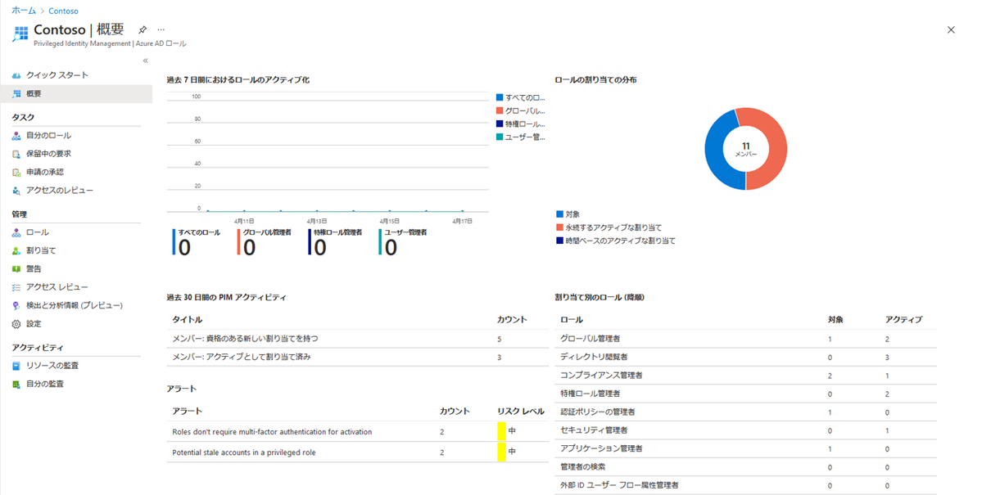

---
lab:
  title: 11 - Privileged Identity Management で Azure リソース ロールを割り当てる
  learning path: '02'
  module: Module 02 - Implement an authentication and access management solution
---

# ラボ 111 - Assign Azure resource roles in Privileged Identity Management （Privileged Identity Management で Azure リソース ロールを割り当てる）

### ログインの種類 = Azure リソース ログイン

## ラボのシナリオ

Microsoft Entra Privileged Identity Management (PIM) は、組み込みの Azure リソース ロールと、以下を含むカスタム ロール (ただしこれらに限定されません) を管理できます。

- 所有者
- ユーザー アクセス管理者
- 共同作成者
- セキュリティ管理者
- Security Manager

ユーザーを Azure リソース ロールの候補にする必要があります。

#### 推定時間:10 分

### 演習 1 - Azure AD リソースを使用した PIM

**※ Skillable環境では、本演習に必要な権限がIDにないため、最後の手順がエラーとなります。そのため手順の参考程度にとどめてください。**

#### タスク 1 - Azure リソース ロールを割り当てる

1. [https://entra.microsoft.com](https://entra.microsoft.com) にグローバル管理者でサインインします。(必要に応じて、Azure Portalと同じ手順で日本語表記に変更してください。)

2. **[Privileged Identity Management]** を検索してから選択します。

3. [Privileged Identity Management] ページの左側のナビゲーションで **[Azure リソース]** を選択します。

4. [サブスクリプション] ドロップダウンで、MOC Subscription-lodXXXXXXXX という項目を選択します。 次に、画面の下部にある **[リソースの管理]** を選択します。

5. [Azure リソース - 検出] ページで、サブスクリプションを選択します。

6. **[概要]** ページで、情報を確認します。

   

7. 左側のナビゲーション メニューで、**[管理]** の下にある **[ロール]** を選択して、Azure リソースのロールの一覧を表示します。

8. 上部のメニューで **[+ 割り当ての追加]** を選択します。

9. [割り当ての追加] ページで、 **[ロールの選択]** メニューを選択し、 **[API Management サービス共同作成者]** を選択します。

10. **[メンバーの選択]** で **[メンバーが選択されていません]** を選択します-4839。

11. [メンバーまたはグループの選択] で、ロールが割り当てられる組織の管理者ロール **User1-XXXXXXXX@LODSPRODMCA.onmicrosoft.com** を検索します。 (ほかの受講者のユーザーも環境に含まれているため、XXXXXXXX が自分の番号であることを確認してください) 次に、**[選択]** を選択します。

12. **[次へ]** を選択します。

13. **[設定]** タブの **[割り当ての種類]** で **[対象]** を選択します。

   - **[対象]** 割り当ての場合、このロールのメンバーは、ロールを使用するにはアクションを実行する必要があります。 要求されるアクションには、多要素認証 (MFA) チェックの実行、業務上の妥当性の指定、指定された承認者に対する承認要求などがあります。

   - **アクティブ**割り当てでは、メンバーがロールを使用するためのアクションを実行する必要はありません。 アクティブとして割り当てられたメンバーには常に、そのロールに割り当てられた特権があります。

14. 開始日時と終了日時を変更して割り当て期間を指定します。

15. 完了したら、 **[割り当て]** を選択します。

16. 新しいロールの割り当てが作成されると、状態の通知が表示されます。
