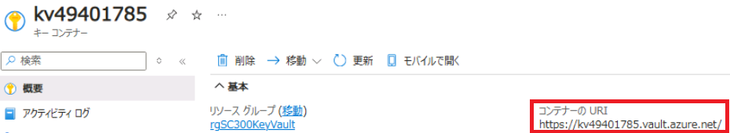
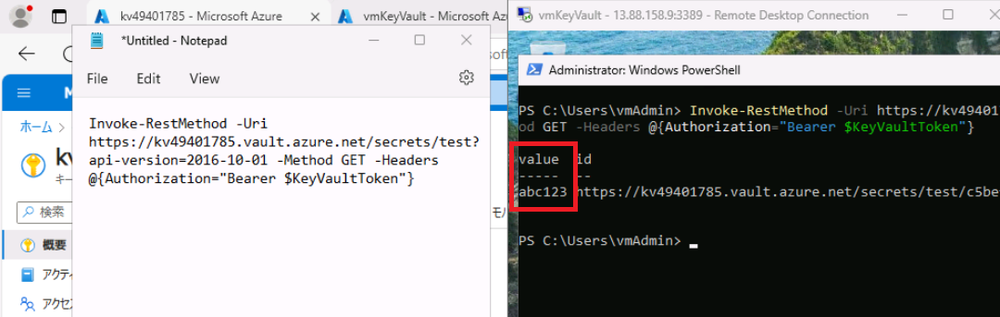
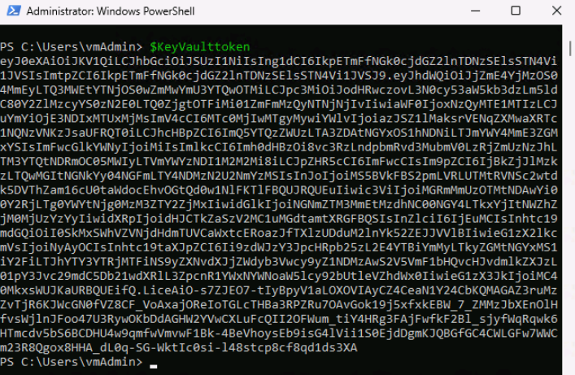
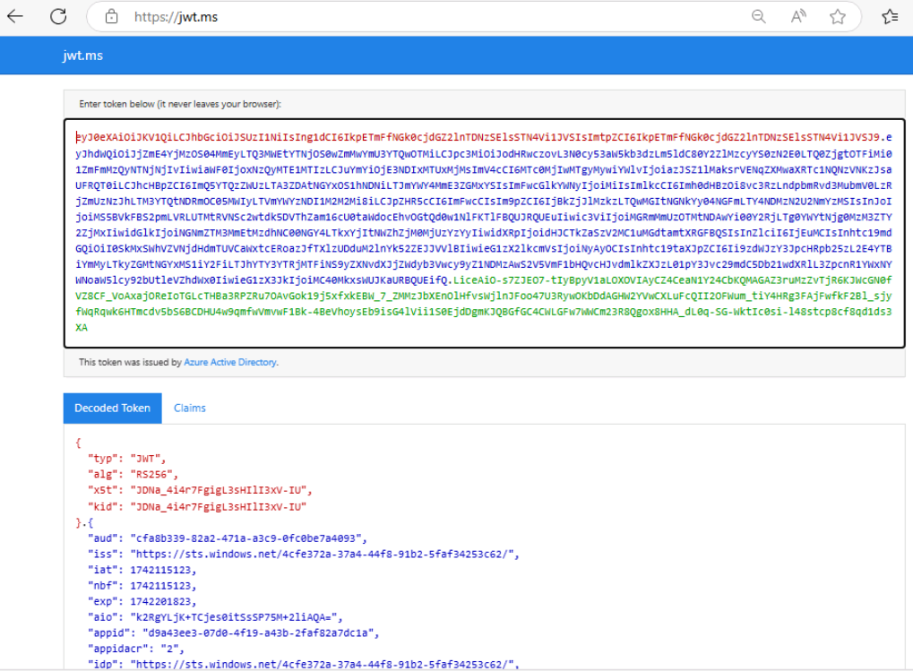

---
lab:
  title: 16 - マネージド ID に Azure Key Vault を使用する
  learning path: '02'
  module: Module 02 - Implement an Authentication and Access Management Solution
---

# ラボ 116 - Using Azure Key Vault for Managed Identities

## ラボのシナリオ

Azure リソース用マネージド ID を使うとき、Microsoft Entra 認証をサポートするリソースに対して認証するためのアクセス トークンをコードで取得できます。ただし、すべての Azure サービスで Microsoft Entra 認証がサポートされているわけではありません。 Azure リソースのマネージド ID をこれらのサービスと共に使用するには、Azure Key Vault にサービス資格情報を保存し、マネージド ID を使用して Key Vault にアクセスして、資格情報を取得します。

#### 推定時間:35 分

### 演習 1 - Azure Key Vault を使用して仮想マシン ID を管理する

#### タスク 1 - キー コンテナーを作成する

1. [https://portal.azure.com]( https://portal.azure.com) にサインインします。

1. 左側のナビゲーション バーの上部で、**[+ リソースの作成]** を選択します。

1. [Marketplace を検索] ボックスに「**Key Vault**」と入力します。  

1. 結果から **[Key Vault]** を選択します。

1. **［作成］** を選択します

1. 次に示すように、必要なすべての情報を入力します。 このラボで使用しているサブスクリプションを選択していることを確認してください。

    **[基本]タブ**

 - **リソース グループ** - **rgSC300KeyVault**  を選択

 - **キー コンテナー名** - **kvXXXXXXXX**　

   **[アクセス構成]タブ**

 - **アクセス許可モデル - コンテナーのアクセス ポリシー** 

   **[確認および作成タブ** 

 - **［作成］** をクリックします。

#### タスク 2 - Windows 仮想マシンを作成する

1. **[Microsoft Azure]** のロゴをクリックし、ホームページに戻ります。

1. **[+ リソースの作成]** を選択します。

1. [サービスとマーケットプレースを検索してください] 検索バーに「**Windows 11**」と入力し、Enterキーを押下します。

1. **[Windows 11]** のタイルの下の方にある、[作成] の右のドロップダウンを展開し、 **[Windows 11 Enterprise、version 22H2]** を選択します。

1. [基本]タブで、以下の通り入力します。

   |         フィールド | 値                                                           |
   | -----------------: | :----------------------------------------------------------- |
   |   リソースグループ | rgSC300KeyVault                                              |
   |              VM 名 | vmKeyVault                                                   |
   |         リージョン | westus                                                       |
   | 可用性のオプション | インフラストラクチャ冗長は必要ありません                     |
   | セキュリティの種類 | Standard                                                     |
   |             サイズ | Standard_D2s_v3（「すべてのサイズを表示」をクリックして、「VMサイズの選択」ウィンドウに移動。検索欄に「D2s_V3」等入力して検索し、見つけたものをクリックし、「選択」ボタンをクリックします。） |
   |     管理ユーザー名 | vmAdmin                                                      |
   |           Password | Pa55w.rdXXXXXXXX                                             |
   |         ライセンス | 「マルチテナントをホストする権利を持つ有効な Windows 10/11 ライセンスを所有しています。」のチェックをオンにします。 |

1. **[次へ]** ボタンを3回ほどクリックして、**[管理]** タブに移動します。

1. **[管理]** タブで、**[システム割り当てマネージド ID の有効化]** の横のボックスをオンにします。

1. **[確認および作成]**、**[作成]** の順に選択します。5分程度待ってから進めてください。

#### タスク 3 - シークレットを作成する

1. リソース、サービス、ドキュメントの検索」にて **Key Vault**  で検索してみつかる **キーコンテナー** をクリックし、移動します。

1. 作成したキーコンテナー(kvXXXXXXXX)の名前をクリックします。

1. 左側のメニューで **[オブジェクト]** を開き、**[シークレット]** を選択します。

1. **[生成/インポート]** を選択します。

1. [シークレットの作成] 画面の [アップロード オプション] で、 **[手動]** を選択したままにします。

1. シークレットの名前と値を指定します。  値は任意のものを指定できます。 

1. アクティブ化した日付と有効期限の日付をクリアのままにし、[有効] を [はい] のままにします。 

1. **[作成]** を選択して、シークレットを作成します。

#### タスク 4 - Key Vault へのアクセス許可を付与する

1. 新しく作成した Key Vault に移動します。

1. 左側のメニューで、 **[アクセス ポリシー]** を選択します。

1. **[+ 作成]** を選択します。

1. [アクセス ポリシーの追加] セクションで、[テンプレートから構成する]  の下にあるプルダウン メニューから **[シークレット管理]** を選択します。

1. [次へ] ボタンを使用して **[プリンシパル]** タブに進みます。

1. 検索フィールドに、タスク 2 で作成した VM の名前「**vmKeyVault**」を入力します。 結果一覧で VM を選択 **(※注意)**  し、 [選択] をクリックします。

1. [次へ] ボタンを使用して **[確認および作成]** タブに進みます。

1. **［作成］** を選択します。

　**(※注意)　「vmKeyVault」が2つ以上ある場合は、講師から別の資料を受け取り、そちらに従って自分のものを確認してください。**

#### タスク 5 - PowerShell を使用して Key Vault シークレットを使用してデータにアクセスする

1. **[Microsoft Azure]** のロゴをクリックし、ホームページに戻ります。

1. **[仮想マシン]** を選択します。

1. **[vmKeyVault]** の名前を選択します。

1. 上の方の **[接続]** - **[接続]** を選択します。

1. **[RDPファイルのダウンロード]** をクリックします。ブラウザーに表示される **[Keep]** - **[Open file]** をクリックしてリモートデスクトップ接続を実施します。ユーザー名は  **vmAdmin** 、パスワードは **Pa55w.rdXXXXXXXX** を入力します。

1. 「Choose privacy settings for your device」画面で  **[Next]** を数回選択後、 **[Accept]** を選択して終了します。

1. 仮想マシンで **[スタート] ボタン(Windows アイコン)** を選択します。

1. 「**PowerShell**」と入力し、Windows PowerShell を起動します。

     (「Windows PowerShell ISE」 と間違えないようご注意ください)

1. リモートデスクトップ接続のウィンドウを最大化ではなく、少し小さいサイズにします。ラボ環境のWindowsの方で notepad のコマンドを実行するなどしてメモ帳を立ち上げます。この後PowerShellに直接コードをペーストできないため、 「手順のコード→稲妻ボタンでメモ帳にペースト→ メモ帳からコピーし、右クリックでPowerShellにペースト」の順に実施していきます。

1. テナント上で Web 要求を呼び出し、VM の特定のポートでローカル ホストのトークンを取得します。  そのため以下のPowerShellコマンドを実行します。

    ```
    $Response = Invoke-RestMethod -Uri 'http://169.254.169.254/metadata/identity/oauth2/token?api-version=2018-02-01&resource=https%3A%2F%2Fvault.azure.net' -Method GET -Headers @{Metadata="true"}
    ```

    

1. 以下のコマンドを実行し、アクセス トークンを応答から抽出します。  

      ```
      $KeyVaultToken = $Response.access_token
      ```

1. 下記の Invoke-WebRequest コマンドを使用して、Key Vault で以前に作成したシークレットを取得し、Authorization ヘッダーにアクセス トークンを渡します。

      (以下の通り、メモ帳でコマンドを修正する必要があります)

  - your-key-vault-URI -- Azure portal のキー コンテナーの [概要] ページの [コンテナーのURI] セクションから取得

    

  - secret-name --  キー コンテナーの [シークレット] ページから取得 (「タスク３」で、ご自身で付けたシークレット名です)

    ```
    Invoke-RestMethod -Uri https://<your-key-vault-URI>/secrets/<secret-name>?api-version=2016-10-01 -Method GET -Headers @{Authorization="Bearer $KeyVaultToken"}
    ```

　コマンド応答に表示される「value」の値が、ご自身で設定したシークレットの値であることを確認してください。 




**以上で演習は終了です。お疲れ様でした！！**


※ 以下、余力がある方向けの補足です。$KeyVaultToken とコマンドを入力すると、権限の実体であるトークンが確認できます。



https://jwt.ms にブラウザーからアクセスし、上記のトークン ( ey から始まる文字列すべて) を貼り付けると、見やすく解析してくれます。




