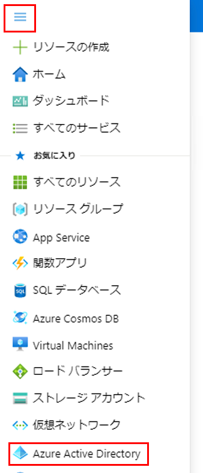
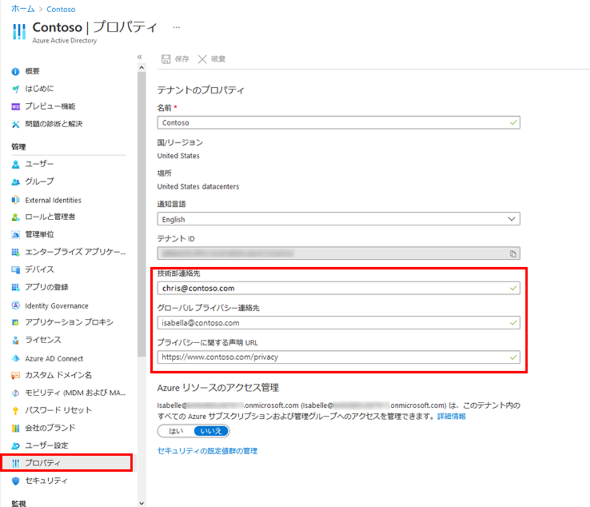

---
lab:
    title: '02 - テナントのプロパティを操作する'
    learning path: '01'
    module: 'モジュール 01 – ID 管理ソリューションを実装する'
---

# ラボ 02: テナントのプロパティを操作する

## ラボ シナリオ

テナントに関連付けられているさまざまなプロパティを特定し、更新する必要があります。

#### 推定時間: 10 分

## 演習 1 - テナントの表示名を変更する

### タスク 1 - テナント名と技術部連絡先を設定する

1. [https://portal.azure.com](https://portal.azure.com) に`admin@ctcXXXX.onmicrosoft.com`でサインインします。

2. **「ポータル メニューの表示」** ハンバーガー アイコンを選択し、**「Azure Active Directory」** を選択します。

    

3. 左側のナビゲーション メニューの **「プロパティ」** を選択します。

4. 「**既定のテナント| プロパティ**」ブレードで、次の情報を入力して「**保存**」を選択します。

    > 注:指定の無い項目は、「空欄」または「デフォルト値」で結構です。

    > 注:XXXXはご自身のアカウント番号を入力してください。

| **設定** | **値** |
| :--- | :--- |
| 名前 | **Contoso マーケティング** |
| 技術部連絡先 | **`admin@ctcXXXX.onmicrosoft.com`** |

5. 画面内に表示されていた「**既定のテナント**」から「**Contosoマーケティング**」に変わったことを確認してください。

      

## 演習 2 - プライバシー情報を設定する

### タスク 1 - グローバル プライバシー連絡先、プライバシーに関する声明の URL など、Azure AD にプライバシー情報を追加する

1. 左側のナビゲーション メニューの **「プロパティ」** を選択します。

    

1. 「**既定のテナント| プロパティ**」ブレードで、次の情報を入力して「**保存**」を選択します。

    > 注:XXXXはご自身のアカウント番号を入力してください。

    > 注:PDFのデータはサンプルのデータです。

| **設定**                       | **値**                                                       |
| :----------------------------- | :----------------------------------------------------------- |
| グローバルプライバシーの連絡先 | **`AllanD@ctctXXXX.onmicrosoft.com`**                        |
| プライバシーに関する声明 URL   | **`https://ctctedu.blob.core.windows.net/sc-300-lab/ContosoTerm.pdf`** |

### タスク 2 - プライバシーに関する声明を確認する

1. Azure Portalの右上隅にある **`admin@ctcXXXX.onmicrosoft.com`** の名前をクリックします。
1. ドロップダウン メニューから「**アカウントを表示**」を選択します。
1. 「**マイアカウント**」のページが表示されます。
1. 左側のナビゲーション メニューの 「**設定とプライバシー**」を選択します。
1. 画面中央の**「プライバシー」** タブを選択します。
1. 「**Contosoマーケティング の組織のプライバシーに関する声明**」を「**表示**」します。
1. 先に指定したサンプルのPDF「**Contoso マーケティング利用規約**」が表示されます。
1. PDF が含まれているブラウザー タブを閉じます。
1. **マイ アカウント**　アイテムを表示しているブラウザー タブを閉じます。

この演習では、テナントのプロパティ設定に関する演習を実施して頂きました。
