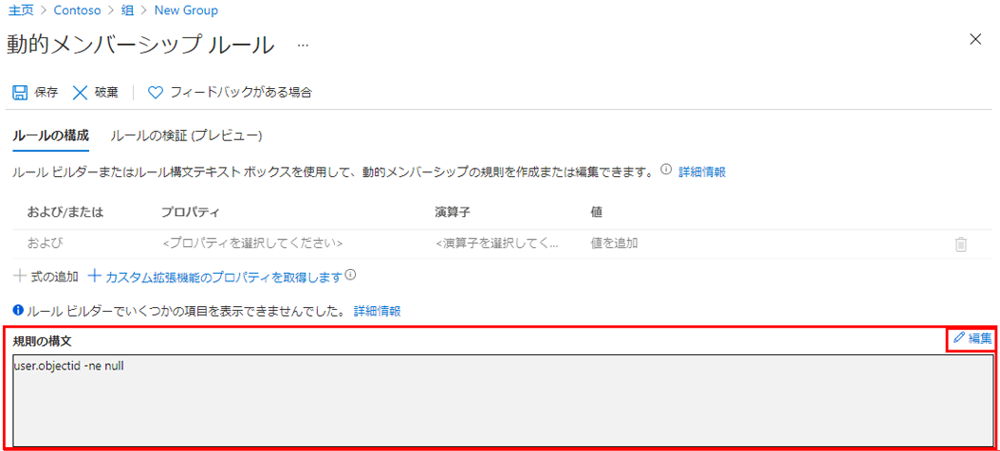

---
lab:
    title: '11 - 動的グループを使用する'
    learning path: '01'
    module: 'モジュール 03 - 外部 ID の実装と管理を行う'
---

# ラボ 11: 動的グループを使用する

## ラボ シナリオ

会社の規模が大きくなると、手作業でのグループ管理は時間がかかりすぎます。ディレクトリを標準化したことで、動的グループを活用できるようになりました。運用環境で動的グループを作成できるようにするためには、新しい動的グループを作成する必要があります。

#### 推定時間: 10 分

## 演習1 - すべてのユーザーをメンバーとして持つ動的グループを作成する

### タスク 1 - 動的グループを作成する

1. [Azure Active Directory]( https://portal.azure.com/#blade/Microsoft_AAD_IAM/ActiveDirectoryMenuBlade/Overview) に`admin@ctcXXXX.onmicrosoft.com`でサインインします。

2. 左側のナビゲーション メニューの**「グループ」** を選択し、**「新しいグループ」** を選択します。

3. 次の情報を使用し「**作成**」をクリックします。

    > 注:指定の無い項目は、「空欄」または「デフォルト値」で結構です。

    | **設定**             | **値**                   |
    | :------------------- | :----------------------- |
    | グループの種類       | **セキュリティ**         |
    | グループ名           | **SC300-myDynamicGroup** |
    | メンバーシップの種類 | **動的ユーザー**         |

7. **「動的なユーザー メンバー」** で、**「動的クエリの追加」** を選択します。

8. **「規則の構文」** ボックスの右上にある **「編集」** を選択します。

9. 「規則の構文の編集」ウィンドウで、ボックスに次の式を入力します。

    ```powershell
    user.objectid -ne null
    ```

10. **「OK」** を選択します。「規則の構文」ボックスにルールが表示されます。

    

8. **「保存」** を選択します。

9. 「新しいグループ」ブレードに戻ります。**「作成」** を選択し、グループを作成します。

    

### タスク 2 - メンバーが追加されたことを確認する

1. **「グループ | すべてのグループ」**に表示された**「SC300-myDynamicGroup」** をクリックします。

2. 左側のナビゲーション メニューの**「メンバー」** を選択し、AzureAD内のユーザーが表示されていることを確認します。

   > 注:グループに参加するまで最大5分かかります。何度か再読み込みをお試しください。

3. 左側のナビゲーション メニューの**「動的メンバーシップ ルール」**をクリックします。

4. ここでルールの変更または追加ができることを確認してください。

   

この演習では、動的グループの作成を実施しました。

> 参考:サンプルの構文を紹介します。(反映には最長5分ほどかかります。)
>
> Option1：**ゲスト** ユーザーのみが含まれるグループを作成してみます。
>
> ```
> (user.objectid -ne null) and (user.userType -eq "Guest")
> ```
>
> Option2：Azure AD ユーザーの**メンバー**のみが含まれるグループを作成してみます。
>
> ```
> (user.objectid -ne null) and (user.userType -eq "Member")
> ```

