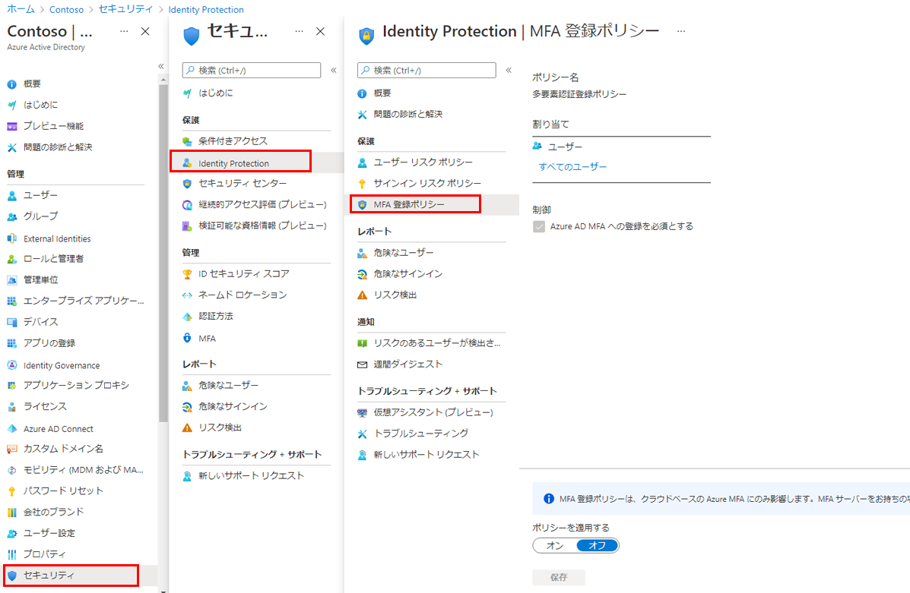

---
lab:
    title: '19 - Azure AD Multi-Factor Authentication 登録ポリシーを構成する'
    learning path: '02'
    module: 'モジュール 04 - Azure AD Identity Protection を管理する'
---

# ラボ 19 - Azure AD Multi-Factor Authentication 登録ポリシーを構成する

## ラボ シナリオ

Azure AD Multi-Factor Authentication は、ユーザー名とパスワードに加えて、その他の要素を使用することでユーザーを確認する手段を提供します。ユーザーが MFA プロンプトに応答できるようにするには、まず Azure AD Multi-Factor Authentication に登録する必要があります。Azure AD 組織の MFA 登録ポリシーがすべてのユーザーに割り当てられるように構成する必要があります。

#### 推定時間: 5 分

## タスク 1 - MFA登録ポリシーの構成

1. [Azure Active Directory]( https://portal.azure.com/#blade/Microsoft_AAD_IAM/ActiveDirectoryMenuBlade/Overview) に`admin@ctcXXXX.onmicrosoft.com`でサインインします。

1. 左側のナビゲーション メニューの**「セキュリティ」**をクリックします。

1. **「セキュリティ | はじめに」**ブレードで **「Identity Protection」** を選択します。

1. 左側のナビゲーション メニューの**「MFA 登録ポリシー」** を選択します。

    

1. **「Identity Protection | MFA 登録ポリシー」**ブレードで、次の情報を使用し「**保存**」をクリックします。

    > 注:指定の無い項目は、「空欄」または「デフォルト値」で結構です。

    | **設定**           | **値**                   |
    | :----------------- | ------------------------ |
    | ユーザー           | **個人とグループの選択** |
    |                    | **Raul Razo**            |
    | ポリシーを適用する | **オン**                 |

## タスク 2 - MFA登録ポリシーを確認する

> 注:このタスクは必須ではありません。スキップしてOKです。

1. 新しい InPrivate ブラウザー ウィンドウを開きます。
2. [https://www.office.com](https://www.office.com) に`RaulR@ctcXXXX.onmicrosoft.com`でサインインします。
3. **「詳細情報が必要」**と表示されます。**「次へ」**を選択してください。
4. **「アカウントのセキュリティ保護」**画面が表示されます。**「別の方法を設定します」**をクリックします。
5. **「どの方法を使用しますか」**では**「電話」**を選択し、確認をクリックしてください。
6. 自身の電話番号を入力し、SMSで届いたコードを入力し、**「次へ」**と**「完了」**までクリックしてください。
7. MFAの設定が完了しました。一度、サインアウトしてください。
8. もう一度、`DeliaD@ctcXXXX.onmicrosoft.com`でサインインを試みます。
9. サインインを行う途中「ID を確認する」と表示されます。**「+XX XXXXXXXXXXXにSMSを送信」**をクリックしてください。
10. 電話番号に届いたコードを入力し**「検証」**をクリックしてください。
11. サインインが完了します。

この演習では、MFA登録ポリシーを構成しました。
