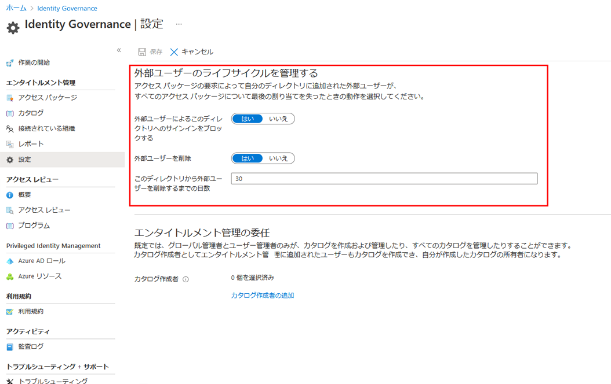

---
lab:
    title: '27 - Azure AD Identity Governance の設定で外部ユーザーのライフサイクルを管理する'
    learning path: '04'
    module: 'モジュール 01 - エンタイトルメント管理の計画と実装を行う'
---

# ラボ 27: Azure AD Identity Governance の設定で外部ユーザーのライフサイクルを管理する  

## ラボ シナリオ

アクセス パッケージ要求が承認されることでディレクトリに招待された外部ユーザーが、アクセス パッケージの割り当てを失ったときに行われる処理を選択できます。

ユーザーがアクセス パッケージの割り当てをすべて放棄した場合、または最後のアクセス パッケージの割り当てが期限切れになった場合に、行われる可能性があります。

既定では、アクセス パッケージの割り当てをすべて失った外部ユーザーは、ディレクトリへのサインインをブロックされます。

30 日後に、ゲスト ユーザー アカウントがディレクトリから削除されます。

#### 推定時間: 5 分

## タスク 1 - Azure AD Identity Governance の設定で外部ユーザーのライフサイクルを管理する

1. [Azure Active Directory]( https://portal.azure.com/#blade/Microsoft_AAD_IAM/ActiveDirectoryMenuBlade/Overview) に`admin@ctcXXXX.onmicrosoft.com`でサインインします。

1. 左側のナビゲーション メニューの **「Identity Governance」** をクリックします。

1. **「Identity  Governance」**ブレードの**「設定」** を選択します。

1. 上部のメニューで、**「編集」** を選択します。

    

1. **「外部ユーザーのライフサイクルを管理する」**ウィンドウで、次の情報を使用し「**保存**」をクリックします。

    > 注:指定の無い項目は、「空欄」または「デフォルト値」で結構です。

    | **設定**                                                     | **値**   |
    | :----------------------------------------------------------- | -------- |
    | 外部ユーザーによるこのディレクトリへのサインインをブロックする | **はい** |
    | 外部ユーザーを削除                                           | **はい** |
    | このディレクトリから外部ユーザーを削除するまでの日数         | **0**    |

この演習では、外部ユーザーのライフサイクルに関する設定について確認しました。

