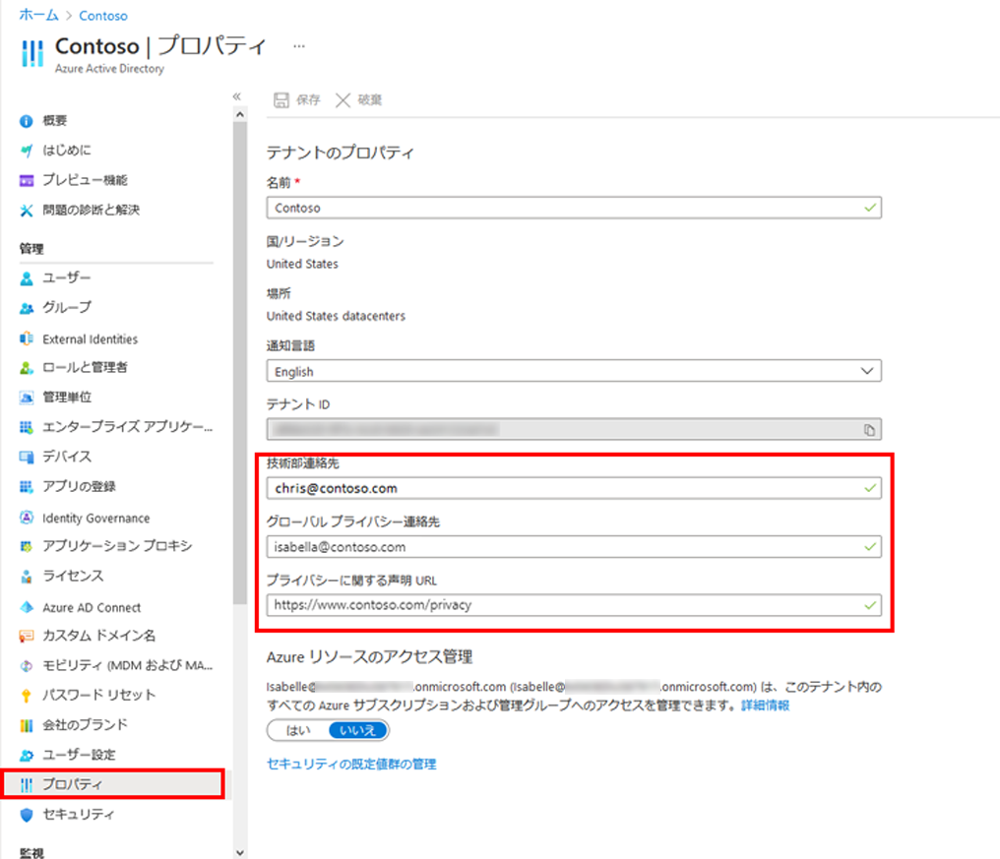

---
lab:
    title: 'ラボ 02: テナント全体のプロパティを設定する'
    learning path: '01'
    module: 'モジュール 01 – ID 管理ソリューションを実装する'
---

# ラボ 02: テナント全体のプロパティを設定する

## ラボ シナリオ

テナントに関連付けられているさまざまなプロパティを特定し、更新する必要があります。

#### 推定時間: 10 分

## 演習 1 - テナントの表示名を変更する

### タスク 1 - テナント名と技術部連絡先を設定する

1. [https://portal.azure.com](https://portal.azure.com) にグローバル管理者としてサインインします。

2. **「ポータル メニューの表示」** ハンバーガー アイコンを選択し、**「Azure Active Directory」** を選択します。

    

3. 左側のナビゲーションの「管理」セクションで **「プロパティ」** を選択します。

4. ダイアログで **「名前」** を変更します。

| **設定** | **値** |
| :--- | :--- |
| 名前 | Contoso マーケティング |

5. **「保存」** を選択してテナント プロパティを更新します。
6. Webブラウザーを再読み込みすると、画面右上のテナント名が**「CONTASO マーケティング」**に変更したこを確認してください。

## タスク 2 - テナントに関連付けられている国または地域およびその他の値を確認する

1. **「Azure Active Directory」** ブレードの「管理」セクションで、**「プロパティ」** を選択します。

2. **「テナントのプロパティ」** で、**「国または地域」** を見つけて、情報を確認します。

3. **「プロパティ」** ブレードの **「テナントのプロパティ」** で、**「場所」** を見つけて情報を確認します。

    （ここでは確認だけで、変更はありません。)
    
    

## タスク3 - テナント ID を見つける

Azure サブスクリプションには、Azure Active Directory (Azure AD) との信頼関係があります。サブスクリプションでは、ユーザー、サービス、デバイスを認証するために Azure AD が信頼されます。各サブスクリプションには、それに関連付けられているテナント ID があり、いくつかの方法で、お使いのサブスクリプションのテナント ID を見つけることができます。

1. **「Azure Active Directory」** ブレードの「管理」セクションで、**「プロパティ」** を選択します。

2. **「テナントのプロパティ」** で、**「テナント ID」** を見つけます。これは一意のテナント識別子です。

    **（注：このタスクは確認のみ行い、変更はありません。)**
    
    

## 演習 2 - プライバシー情報を設定する

### タスク 1 - グローバル プライバシー連絡先、プライバシーに関する声明の URL など、Azure AD にプライバシー情報を追加する

Microsoft では、社内の従業員と外部のゲストがポリシーを確認できるように、グローバル プライバシー連絡先と組織のプライバシーに関する声明の両方を追加することを強くお勧めします。プライバシーに関する声明はそれぞれの会社に合わせて独自に作成､変更されるため､弁護士に相談することを強くお勧めします｡

1. **「Azure Active Directory」** ブレードの「管理」セクションで、**「プロパティ」** を選択します。

1. 従業員のプライバシー情報を追加します｡

    | **設定**                       | **値**                                                       |
    | :----------------------------- | :----------------------------------------------------------- |
    | グローバル プライバシー連絡先  | `ChrisG@ctcXXXXoutlook.onmicrosoft.com` (例：`ChrisG@ctc0000outlook.onmicrosoft.com`) |
    | プライバシーに関する声明の URL | `https://ctctedu.blob.core.windows.net/sc-300-lab/ContosoTerm.pdf` |

    **（画像はサンプルです。値が異なります。）**

    

1. **「保存」** を選択します。

### タスク 2 - プライバシーに関する声明を確認する

1. 新しい InPrivate ブラウザー ウィンドウを開きます。

1. Chris Green として、Azure portal ([https://portal.azure.com](https://portal.azure.com)) を開きます。

     | **設定**   | **値**                                                       |
     | :--------- | :----------------------------------------------------------- |
     | ユーザー名 | `ChrisG@ctcXXXXoutlook.onmicrosoft.com`　(例:`ChrisG@ctc0000outlook.onmicrosoft.com`) |
     | パスワード | Pa$$w.rd1234                                                 |

1. UI の右上隅で、ユーザー名をクリックします。

1. ドロップダウン メニューから「**アカウントを表示**」を選択します。

     ##### 新しいブラウザー タブが自動的に開きます。

1. **「設定とプライバシー(Settings & Privacy)」** を選択します。

1. **「プライバシー」** タブを選択します。

1. **「組織の通知** - Contoso マーケティング organizational privacy statement の横にある **「表示」** アイテムをクリックします。

1. サンプルのプライバシーに関する声明を確認します。

1. PDF が含まれているブラウザー タブを閉じます。

1. **マイ アカウント**　アイテムを表示しているブラウザー タブを閉じます。
