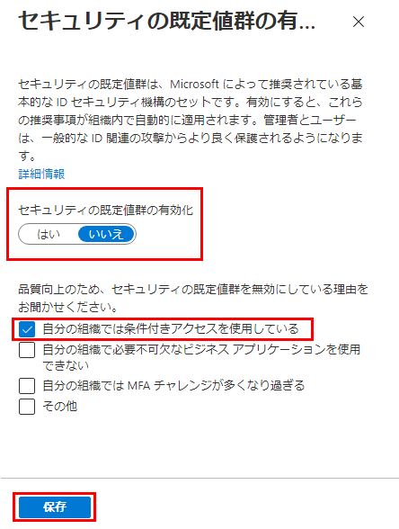

---
lab:
    title: '12 - セキュリティ デフォルトを操作する'
    learning path: '02'
    module: 'モジュール 03 -条件付きアクセスの計画、実装、管理を行う'
---

# ラボ 12 - セキュリティ デフォルトを操作する

## ラボ シナリオ

組織で Azure Active Directory のセキュリティの既定値群の設定を構成する必要があります。

#### 推定時間: 5 分

## 演習 1 - セキュリティの既定値群を設定にする

### タスク 1 - セキュリティの既定値群を無効にする

セキュリティの既定値群を置き換える条件付きアクセス ポリシーを実装する組織では、セキュリティの既定値群を無効にする必要があります。

1. [Azure Portal - Azure Active Directory]( https://portal.azure.com/#blade/Microsoft_AAD_IAM/ActiveDirectoryMenuBlade/Overview) にグローバル管理者としてサインインします。

1. 「プロパティ」ブレードの下部にある **「セキュリティの既定値群の管理」** を選択します。

1. **「セキュリティの既定値群を有効にする」** トグルを **「いいえ」** に設定します。

    

1. **「保存」** を選択します。
