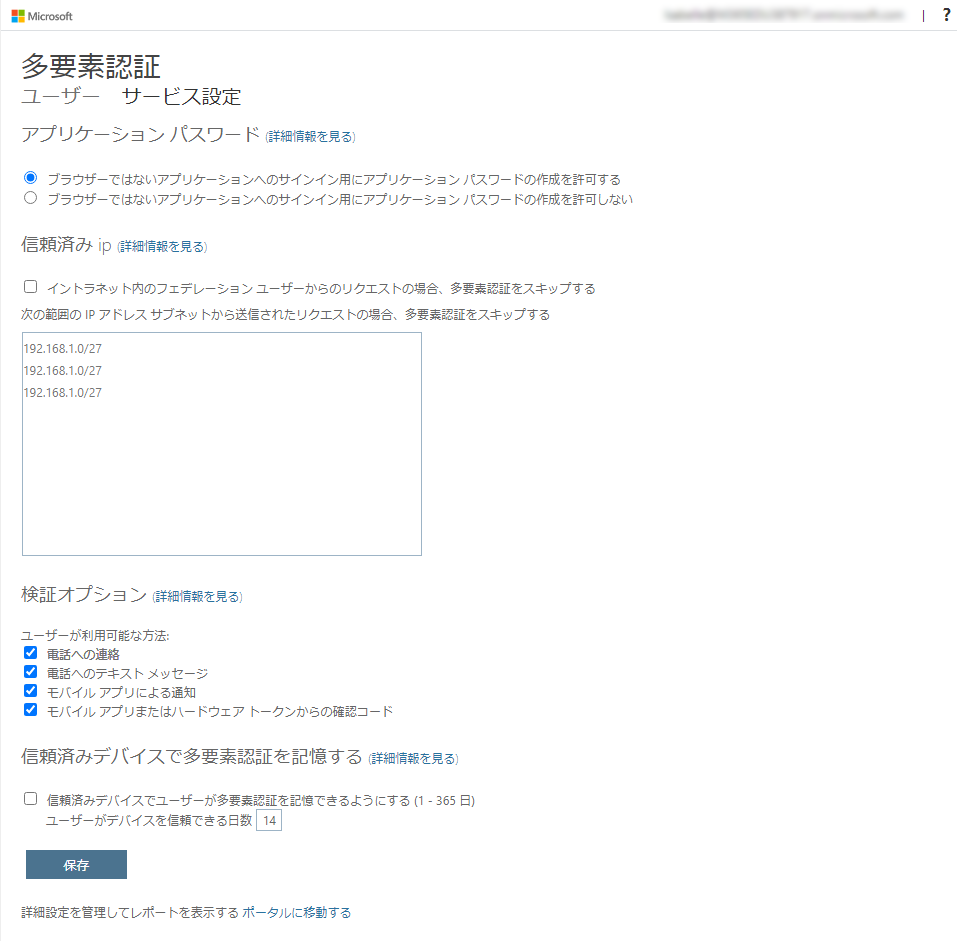

---
lab:
    title: '13 - MFA を有効にする'
    learning path: '02'
    module: 'モジュール 01 - Azure Multi-Factor Authentication の計画と管理を行う'
---

# ラボ 13 - MFA を有効にする

## ラボ シナリオ

組織のセキュリティを向上させるために、Azure Active Directory の多要素認証を有効にするよう指示されています。

#### 推定時間: 15 分

**重要** - この演習には Azure AD Premium ライセンスが必要です。

## 演習 1 - Azure で多要素認証を確認して有効にする

### タスク 1 - Azure Multi-Factor Authentication オプションを確認する

1. [https://portal.azure.com](https://portal.azure.com) にグローバル管理者としてサインインします。

2. 検索機能を使用して、**「multi-factor」** を検索します。

3. 検索結果で、「**Multi-Factor Authentication**」を選択します。

4. 「はじめに」ページの中央に表示されている **「構成」セクション** で、**「追加のクラウドベースの MFA 設定」** を選択します。

    

5. 新しいブラウザー ページには、Azure ユーザーの MFA オプションとサービス設定が表示されます。

    (この手順は確認だけで、設定変更はありません。)

    

    > **メモ**
    >
    > ここで、サポートされている認証方法を選択します。上の画面では、すべてが選択されています。
    >
    > ここでは "アプリ パスワード" の有効/無効を切り替えることもできます。これにより、多要素認証がサポートされないアプリに対して一意のパスワードを作成できます。この機能を使うと、ユーザーはそのアプリに固有のパスワードを利用し、Azure AD の ID で認証することができます。

### タスク 2 -Chris Green の MFA の条件付きアクセス ルールを設定する

次に、ネットワークにある特定のアプリにアクセスするゲスト ユーザーに MFA を強制する条件付きアクセス ポリシー ルールを設定する方法を確認してみましょう。

1. Azure portal に戻り、**「Azure Active Directory」** > **「セキュリティ」** > **「条件付きアクセス」** の順に選択します。

2. メニューで **「+新しいポリシー」**>**「新しいポリシーを作成する」** を選択します。

    

    

3. 名前を設定します。

    | 設定 | 値            |
    | ---- | ------------- |
    | 名前 | MFA_for_Chris |

4. 「**割り当て**」を設定します。

    | 設定                         | 値                             |
    | ---------------------------- | ------------------------------ |
    | ユーザーまたはワークロードID | ユーザーとグループ             |
    | 対象                         | ユーザーとグループの選択       |
    |                              | ユーザーとグループ に☑を入れる |
    | 選択                         | Chris Green                    |

5. **「クラウド アプリまたは操作」** を設定します。

    | 設定                                   | 値             |
    | -------------------------------------- | -------------- |
    | このポリシーが適用される対象を選択する | クラウドアプリ |
    | 対象                                   | アプリを選択   |
    | 選択                                   | Office365      |

6. 「**条件**」セクションを設定します。

    (指定した項目以外は**未構成**のまま)

    | 設定 | 値           |
    | ---- | ------------ |
    | 場所 | すべての場所 |

7. **「アクセス制御」** で **「許可」** を設定します。

    (指定した項目以外は**デフォルト**のまま)

    | 設定             | 値                               |
    | ---------------- | -------------------------------- |
    | アクセス権の付与 | 多要素認証を要求する に☑を入れる |

11. **「ポリシーの有効化」** を **「オン」** に設定します。

12. **「作成」** をクリックし、ポリシーを作成します。

12. これで選択したユーザーとアプリケーションに対して MFA が有効になりました。次回、ゲストがそのアプリにサインインしようとすると、MFA の登録が求められます。

    

### タスク 3 - ChrisG のログインをテストする

1. 新しい InPrivate ブラウザー ウィンドウを開きます。

2. Chris Green として、[https://www.office.com](https://www.office.com) を開き、サインインします。

   | **設定**   | **値**                                                       |
   | :--------- | :----------------------------------------------------------- |
   | ユーザー名 | `ChrisG@ctcXXXXoutlook.onmicrosoft.com`　(例:`ChrisG@ctc0000outlook.onmicrosoft.com`) |
   | パスワード | Pa$$w.rd1234                                                 |

3. この時点で、2 つのことのうちの 1 つが起こります。  Authenticator アプリをセットアップして MFA に登録する必要があるというメッセージが表示されます。  プロンプトに従って、個人の電話を使用して完了します。  

   > 注:続行する方法に関するいくつかのオプションを含むログイン失敗メッセージが表示される可能性があります。  この場合、「**再試行**」オプションをクリックします。

6. Chris 用に作成した条件付きアクセス ルールのため、Office 365 にアクセスするために MFA が必要になりました。

