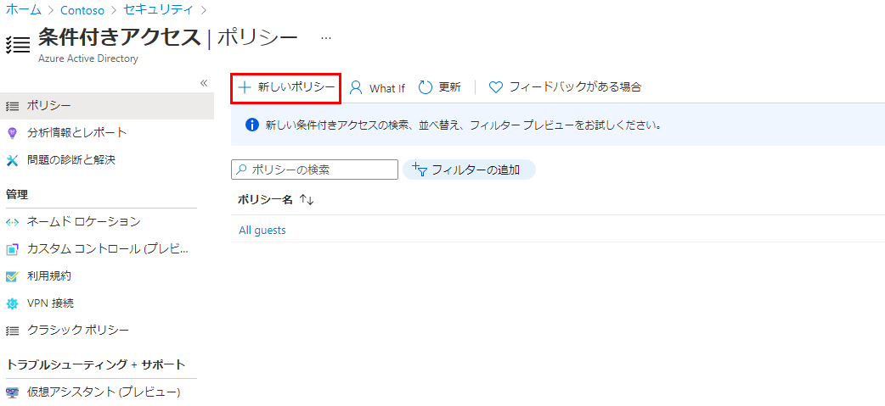

---
lab:
    title: '15 - 条件付きアクセス を実装する'
    learning path: '02'
    module: 'モジュール 03 -条件付きアクセスの計画、実装、管理を行う'
---

# ラボ 15 - 条件付きアクセス を実装する

## ラボ シナリオ

組織では、内部アプリケーションへのユーザーのアクセスを制限する必要があります。Azure Active Directory 条件付きアクセス ポリシーをデプロイする必要があります。

#### 推定時間: 12 分

## 演習 1 - ChrisGが Office365 にアクセスするのをブロックする条件付きアクセス ポリシーを設定する

## タスク 1 - 条件付きアクセスポリシーを作成する

Azure Active Directory 条件付きアクセスは Azure AD の高度な機能です。これにより、どのユーザーがリソースにアクセスできるかを制御する詳細なポリシーを指定できます。条件付きアクセスを使用すると、グループ、デバイスの種類、場所、ロールなどに基づいてユーザーのアクセスを制限することでアプリケーションを保護できます。

1. [Azure Portal - Azure Active Directory]( https://portal.azure.com/#blade/Microsoft_AAD_IAM/ActiveDirectoryMenuBlade/Overview) にグローバル管理者としてサインインします。

3. 「Azure Active Directory」ブレードで、**「管理」** の下にある **「セキュリティ」** を選択します。

4. 「セキュリティ」ブレードの左側のナビゲーションで **「条件付きアクセス」** を選択します。

4. 上部メニューで **「+ 新しいポリシー」** を選択します。

    

    

5. 名前を設定します。

    | 設定 | 値               |
    | ---- | ---------------- |
    | 名前 | Block  Office365 |

6. 「**割り当て**」を設定します。

    | 設定                         | 値                             |
    | ---------------------------- | ------------------------------ |
    | ユーザーまたはワークロードID | ユーザーとグループ             |
    | 対象                         | ユーザーとグループの選択       |
    |                              | ユーザーとグループ に☑を入れる |
    | 選択                         | Chris Green                    |

7. **「クラウド アプリまたは操作」** を設定します。

    | 設定                                   | 値             |
    | -------------------------------------- | -------------- |
    | このポリシーが適用される対象を選択する | クラウドアプリ |
    | 対象                                   | アプリを選択   |
    | 選択                                   | Office365      |

8. **「アクセス制御」** で **「許可」** を設定します。

    (指定した項目以外は**デフォルト**のまま)

    | 設定 | 値                 |
    | ---- | ------------------ |
    | 許可 | アクセスのブロック |

9. **「ポリシーの有効化」** を **「オン」** に設定します。

10. **「作成」** をクリックし、ポリシーを作成します。

## タスク 2 - 条件付きアクセス ポリシーをテストする

条件付きアクセス ポリシーをテストして、想定どおりに動作することを確認する必要があります。

1. 新しい InPrivate ブラウザー ウィンドウを開きます。
   
2. Chris Green として、[https://www.office.com](https://www.office.com) を開き、サインインします。

     | **設定**   | **値**                                                       |
     | :--------- | :----------------------------------------------------------- |
     | ユーザー名 | `ChrisG@ctcXXXXoutlook.onmicrosoft.com`　(例:`ChrisG@ctc0000outlook.onmicrosoft.com`) |
     | パスワード | Pa$$w.rd1234                                                 |

3. Office365 に正常にアクセスできないことを確認します。

    サインインしている場合は、タブを閉じ、1 分待ってから、もう一度やり直してください。

    タブを閉じ、「条件付きアクセス」ブレードに戻ります。

5. **「Block  Office365」** ポリシーを選択します。

6. **「ポリシーの有効化」** で **「オフ」** を選択し、**「保存」** を選択します。
