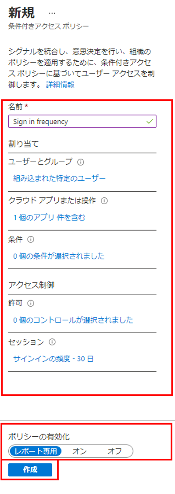

---
lab:
    title: '16 - 認証セッション コントロールを構成する'
    learning path: '02'
    module: 'モジュール 03 - 条件付きアクセスの計画、実装、管理を行う'
---

# ラボ16 - 認証セッション コントロールを構成する

## ラボ シナリオ

会社の大規模なセキュリティ構成の一部として、サインインの頻度を制御するために使用できる条件付きアクセス ポリシーをテストする必要があります。

#### 推定時間: 10 分

## タスク1-条件付きアクセス ポリシーを使用してサインイン頻度の制御を構成する

1. [Azure Portal - Azure Active Directory]( https://portal.azure.com/#blade/Microsoft_AAD_IAM/ActiveDirectoryMenuBlade/Overview) にグローバル管理者としてサインインします。

1. 「Azure Active Directory」 ブレードで、**「管理」** の下にある **「セキュリティ」** を選択します。

1. 「セキュリティ」ブレードの左側のナビゲーションで **「条件付きアクセス」** を選択します。

1. 上部メニューで **「新しいポリシー」** を選択します。

    

## タスク 2 - 条件付きアクセス ポリシーを設定する

1. 名前を設定します。

    | 設定 | 値               |
    | ---- | ---------------- |
    | 名前 | サインインの頻度 |

1. 「**割り当て**」を設定します。

    | 設定                         | 値                             |
    | ---------------------------- | ------------------------------ |
    | ユーザーまたはワークロードID | ユーザーとグループ             |
    | 対象                         | ユーザーとグループの選択       |
    |                              | ユーザーとグループ に☑を入れる |
    | 選択                         | Chris Green                    |

1. **「クラウド アプリまたは操作」** を設定します。

    | 設定                                   | 値             |
    | -------------------------------------- | -------------- |
    | このポリシーが適用される対象を選択する | クラウドアプリ |
    | 対象                                   | アプリを選択   |
    | 選択                                   | Office365      |

1. **「アクセス制御」** で **「セッション」** を設定します。

    (指定した項目以外は**デフォルト**のまま)

    | 設定       | 値               |
    | ---------- | ---------------- |
    | セッション | サインインの頻度 |
    |            | 30               |
    |            | 日間             |

1. **「ポリシーの有効化」** を **「レポート専用」** に設定します。

1. **「作成」** をクリックし、ポリシーを作成します。

    

    > **注** - レポート専用モードは、管理者が条件付きアクセス ポリシーを有効にする前に、その影響を評価することが可能です。レポート専用モードのリリースによる変更点は次のとおりです。
    >
    >  - 条件付きアクセス ポリシーをレポート専用モードで有効にできます。
    >  - サインイン中に、レポート専用モードになっているポリシーが評価されますが、強制はされません。
    >  - 結果は、サインイン ログの詳細にある「条件付きアクセス」および「レポート専用」タブに記録されます。
    >  - Azure Monitor サブスクリプションをお持ちのお客様は、条件付きアクセスに関する分析情報のブックを使用して、条件付きアクセス ポリシーの影響を監視できます。
