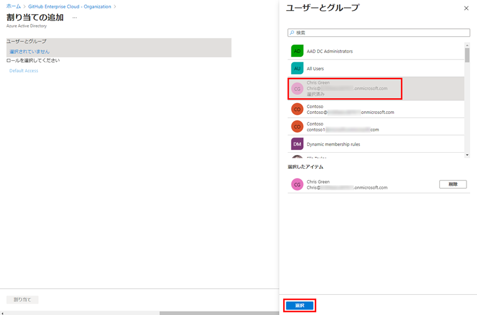

---
lab:
    title: '20 - アプリのアクセス管理を実装する'
    learning path: '03'
    module: 'モジュール 01 -SSO 用エンタープライズ アプリの統合の計画と設計を行う'
---

# ラボ 20 - アプリのアクセス管理を実装する

## ラボ シナリオ

組織では、特定のユーザーまたはグループのみがエンタープライズ アプリケーションにアクセスできる必要があります。ユーザーを特定のアプリケーションに割り当てる必要があります。

#### 推定時間: 5 分

## Azure AD テナントにアプリを追加する

1. [Azure Portal - Azure Active Directory]( https://portal.azure.com/#blade/Microsoft_AAD_IAM/ActiveDirectoryMenuBlade/Overview) にグローバル管理者としてサインインします。

1. 「Azure Active Directory」 ブレードの **「管理」** で **「エンタープライズ アプリケーション」** を選択します。

1. 「エンタープライズ アプリケーション」ウィンドウで **「+ 新しいアプリケーション」** を選択します。

    

1. 「Azure AD ギャラリーの参照 (プレビュー)」ブレードの **「アプリケーションの検索」** ボックスに **「GitHub」** と入力します。

    

1. 結果から **「GitHub Enterprise Cloud – Enterprise Account」** を選択します。

1. **「GitHub Enterprise Cloud – Enterprise Account」** で設定を確認し、**「作成」** を選択します。

1. 作成されると、「GitHub Enterprise Cloud – エンタープライズ アカウント」ブレードにリダイレクトされます。

## アプリにユーザーを割り当てる

1. 「GitHub Enterprise Cloud – Enterprise Account」ブレードで、**「管理」** セクションの **「ユーザーとグループ」** を選択します。

1. 「ユーザーとグループ」ページで、メニューから **「+ ユーザー/グループの追加」** を選択します。

1. 「割り当ての追加」ブレードで **「ユーザーとグループ」** を選択します。

1. 「ユーザーとグループ」ウィンドウで、グローバル管理者（ctc XXXX )を検索し、**「選択」** しますの順に選択します。

    **（画像はサンプルです。値が異なります)**

    

1. **「割り当て」** を選択します。
