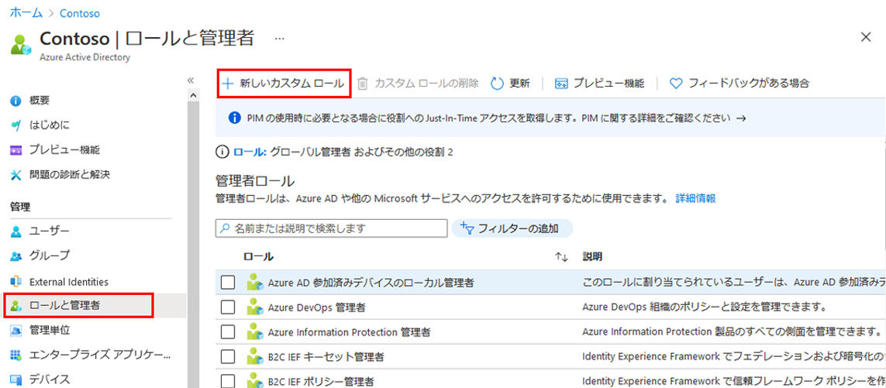

---
lab:
    title: '21 - アプリ登録用のカスタムロールを作成する'
    learning path: '03'
    module: 'モジュール 01 - SSO 用エンタープライズ アプリの統合の計画と設計を行う'
---

# ラボ 21 - アプリ登録用のカスタムロールを作成する

## ラボ シナリオ

アプリ管理用の新しいカスタム ロールを作成する必要があります。この新しいロールは、資格情報管理の実行に必要な特定の権限のみに限定する必要があります。

#### 推定時間: 5 分

## 新しいカスタム ロールを作成してアプリ登録を管理するためのアクセス権を付与する

1. [Azure Portal - Azure Active Directory]( https://portal.azure.com/#blade/Microsoft_AAD_IAM/ActiveDirectoryMenuBlade/Overview) にグローバル管理者としてサインインします。

3. 「Azure Active Directory」 ブレードの **「管理」** で **「ロールと管理者」** を選択します。

4. 「ロールと管理者」ブレードで、メニューから **「新しいカスタム ロール」** を選択します。

    

5. 「新しいカスタム ロール」ブレードの「基本」タブで「名前」ボックスに **「マイ カスタム アプリ ロール」** と入力します。

6. 残りのオプションを確認してから、**「次へ」** を選択します。

7. 「アクセス許可」タブで、使用可能なアクセス許可を確認します。

8. **「アクセス許可の名前または説明で検索」** ボックスで以下の二つの項目選択し**「次へ」** を選択します。

    | 設定         | 値                                                           |
    | ------------ | ------------------------------------------------------------ |
    | アクセス許可 | microsoft.directory/servicePrincipals/managePasswordSingleSignOnCredentials |
    |              | microsoft.directory/servicePrincipals/synchronizationCredentials/manage |

    

    > **これら 2 つを選ぶ理由** - アプリケーション プロビジョニングの場合、これら 2 つの項目は、作成中のアプリケーションまたはサービス プリンシパルのシングル サインオンを有効にして強制するために必要な最小限のアクセス許可です。 エンタープライズ アプリケーションを一連のユーザーまたはグループに割り当てることができます。  他の権限も付与される可能性があります。  使用可能なアクセス許可の完全なリストは、`https://docs.microsoft.com/azure/active-directory/roles/custom-enterprise-app-permissions` で入手できます。
    
10. 変更内容を確認し、**「作成」** を選択します。
