---

    lab:
     title: '26 -  利用規約を実装する
     learning path: '04'
     module: 'モジュール 01 - エンタイトルメント管理の計画と実装を行う'
---

---
# ラボ 26: 利用規約を実装する

## ラボ シナリオ

Azure AD 利用規約ポリシーは、エンド ユーザーに情報を提示するために使うことができる簡単な方法を提供します。この方法で情報を提示することにより、法律上やコンプライアンス上の要件を満たすうえで重要な免責事項が確実にユーザーに表示されます。この記事では、利用規約 (ToU) ポリシーの使用を開始する方法について説明します。

ToU ポリシーを作成して組織に適用する必要があります。

#### 推定時間: 20 分

## 演習 1 - 利用規約を設定し、それらをテストする

### タスク1 - 利用規約を追加する

利用規約のドキュメントが完成した後は、次の手順を使って追加します。

1. [Azure Portal - Azure Active Directory]( https://portal.azure.com/#blade/Microsoft_AAD_IAM/ActiveDirectoryMenuBlade/Overview) にグローバル管理者としてサインインします。

1. **「Identity Governance」** を選択します。

1. 左側のナビゲーション メニューの **「利用規約」** で、**「利用規約」** を選択します。

1. 「利用規約」ページの上部のメニューで、**「+ 新しい条件」** を選択します

    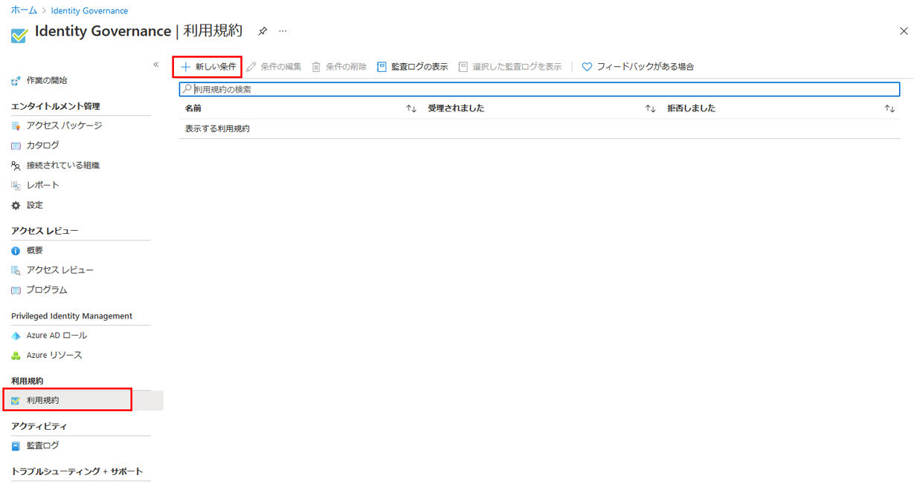

    | 設定                                         | 値                                                           |
    | -------------------------------------------- | ------------------------------------------------------------ |
    | 名前                                         | 利用規約のテスト                                             |
    | 表示名                                       | Contoso 利用規約                                             |
    | 利用規約のドキュメント                       | `https://ctctedu.blob.core.windows.net/sc-300-lab/ContosoTerm.pdf` ※事前に上記URLからPDFをダウンロードして指定してください。 |
    | 利用規約のドキュメントの言語                 | 日本語                                                       |
    | ユーザーに利用規約を展開する必要があります。 | オン                                                         |
    | 各デバイスでユーザーによる同意が必要         | オフ                                                         |
    | 同意の期限                                   | オン                                                         |
    | 以下の日付から期限切れになります             | 翌日の日にち                                                 |
    | 頻度                                         | 毎月                                                         |
    | もう一度同意を求めるまでの期間               | (空欄のまま)                                                 |

    

1. **「条件付きアクセス」** で **「カスタム ポリシー」** を選択します。

1. 完了したら、**「作成」** を選択します。

    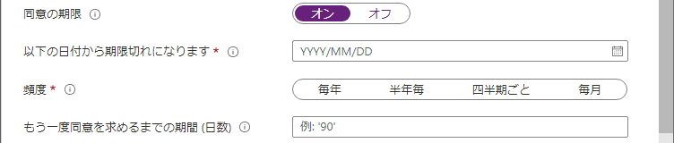

1. 利用規約が作成されると、「条件付きアクセス ポリシー」ページに自動的に移動します。以下の設定をします。

1. 名前を設定します。

    | 設定 | 値             |
    | ---- | -------------- |
    | 名前 | 利用規約を適用 |

1. 「**割り当て**」を設定します。

    | 設定                         | 値                             |
    | ---------------------------- | ------------------------------ |
    | ユーザーまたはワークロードID | ユーザーとグループ             |
    | 対象                         | ユーザーとグループの選択       |
    |                              | ユーザーとグループ に☑を入れる |
    | 選択                         | Chris Green                    |

1. **「クラウド アプリまたは操作」** を設定します。

    | 設定                                   | 値                     |
    | -------------------------------------- | ---------------------- |
    | このポリシーが適用される対象を選択する | クラウドアプリ         |
    | 対象                                   | すべてのクラウドアプリ |

1. 「**条件**」セクションを設定します。

     (指定した項目以外は**未構成**のまま)

     | 設定 | 値           |
     | ---- | ------------ |
     | 場所 | すべての場所 |

1. **「アクセス制御」** で **「許可」** を設定します。

     (指定した項目以外は**デフォルト**のまま)

     | 設定             | 値                           |
     | ---------------- | ---------------------------- |
     | アクセス権の付与 | 利用規約のテスト に☑を入れる |

1. **「ポリシーの有効化」** を **「オン」** に設定します。

1. **「作成」** をクリックし、ポリシーを作成します。

1. 完了したら、**「作成」** を選択します。

     

     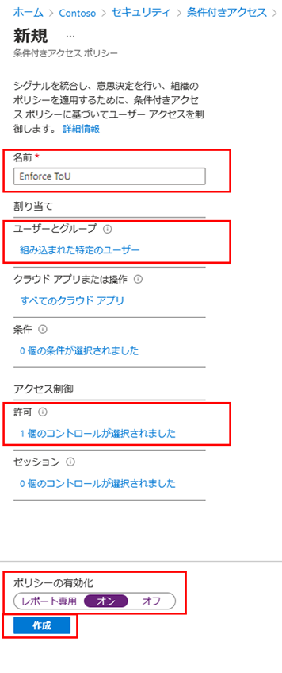

1. 自分のアカウントを使用することを選択した場合は、ブラウザーを最新の状態に更新できます。再度サインインするように求められます。サインインするときに、利用規約に同意する必要があります。

### タスク 2 - Chris としてログインする

1. 新しい InPrivate ブラウザー ウィンドウを開きます。

2. https://portal.azure.com に接続します。

    | **設定**   | **値**                                                       |
    | :--------- | :----------------------------------------------------------- |
    | ユーザー名 | `ChrisG@ctcXXXXoutlook.onmicrosoft.com`　(例:`ChrisG@ctc0000outlook.onmicrosoft.com`) |
    | パスワード | Pa$$w.rd1234                                                 |

3. MFA リクエストを使用して Chris のログインを検証します。

4. 利用規約を表示します。

7. **「同意」** または **「拒否」** を選択できます。

    > **注** - **「拒否」** を選択した場合、ChrisG としての今後のログイン時に、利用規約を再度表示して同意する必要があります。

### タスク3 - 同意したユーザーと拒否したユーザーのレポートを表示する

「利用規約」ブレードには、同意したユーザーと拒否したユーザーの数が表示されます。これらの数および同意したユーザーと拒否したユーザーは、利用規約が有効な間、保存されます。

1. Microsoft Azure の **「Identity Governance」 > 「利用規約」** で、自分の利用規約を見つけます。

1. 利用規約で、**「同意」** または **「拒否」** の下に表示される数値を選択し、現在のユーザーの状態を表示します。

    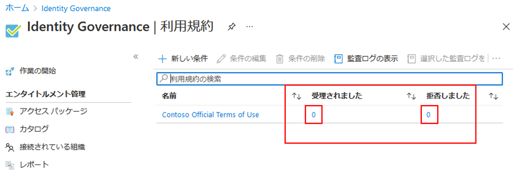

1. この演習では、同意または拒否された利用規約がない可能性があります。次の例では、**「同意」** の値が選択されています。利用規約に同意したユーザーのユーザー情報のレポートを見ることができます。

    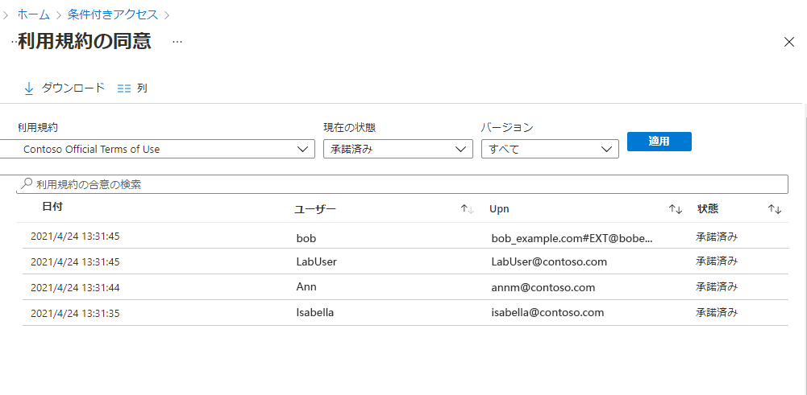

## ユーザーに表示される利用規約の外観

1. 利用規約を作成して適用すると、スコープ内のユーザーに利用規約のページが表示されるようになります。

    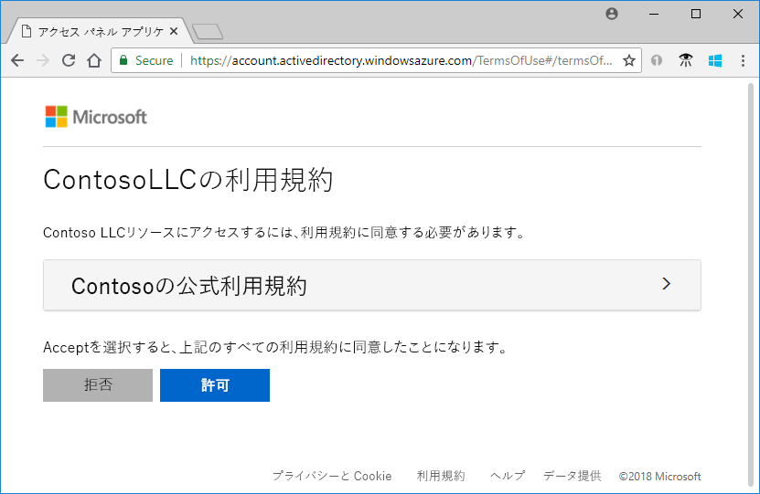

1. ユーザーは利用規約を表示し、必要な場合はボタンを使用して拡大/縮小できます。

    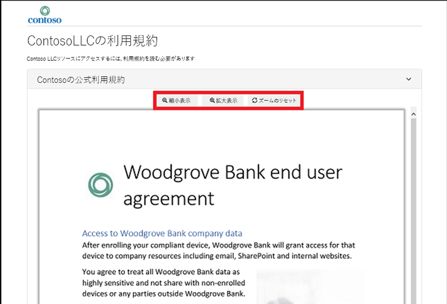

1. モバイル デバイスでは、次の例のような利用規約が表示されます。

    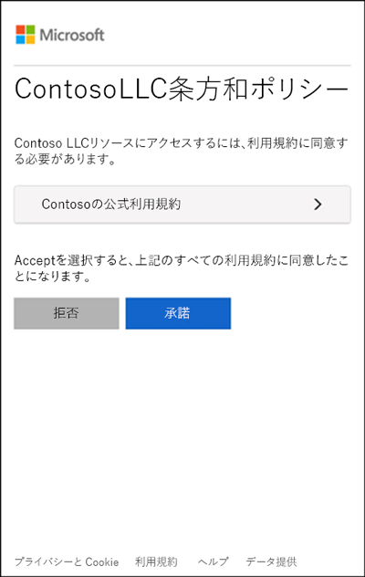

### ユーザーが利用規約を確認する方法

ユーザーは、以下の手順を使用して、同意した利用規約を確認できます。

1. [https://myapps.microsoft.com](https://myapps.microsoft.com/) を参照し、自分のユーザー アカウントを使用してサインインします。

1. 画面右上の「CG」を書かれたアイコンをクリックし、アカウントを表示をクリックします。

1. 「概要」ページで、「設定とプライバシーの表示」を選択します。

    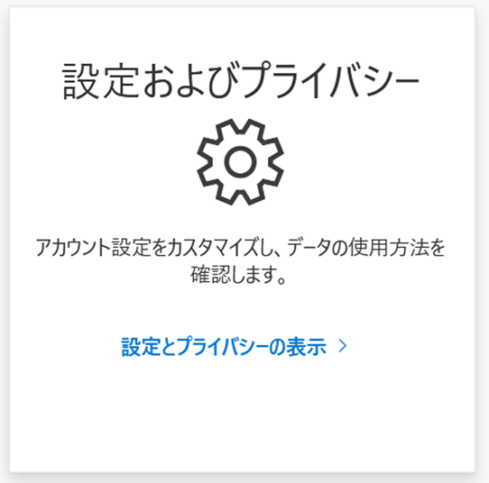

1. 「設定とプライバシー」ページで **「プライバシー」** タブを選択します。

    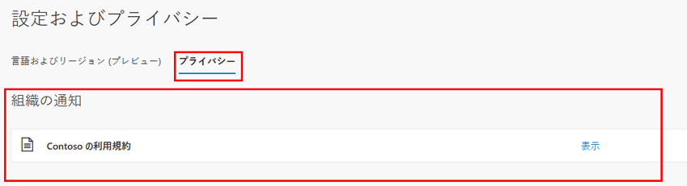

1. **「組織からの注意」** で、同意した利用規約を確認できます。

## 利用規約の詳細を編集する

利用規約の詳細の一部を編集できますが、既存のドキュメントを変更することはできません。詳細の編集方法を次の手順で説明します。

1. [https://portal.azure.com](https://portal.azure.com) にグローバル管理者としてサインインします。

1. 「Azure Active Directory」を開き、**「Identity Governance」** を選択します。

1. 左側のナビゲーション メニューの **「利用規約」** で、**「利用規約」** を選択します。

1. 編集する利用規約を選択します。

1. 上部メニューで **「条件の編集」** を選択します。

1. 「利用規約の編集」ウィンドウでは、次を変更できます。

    - **名前** – これは、エンドユーザーとは共有されない利用規約の内部名です。
    
    - **表示名** – これは、エンドユーザーが利用規約を閲覧する際に表示される名前です。

    - **ユーザーに利用規約の展開を要求する** – これを **「オン」** に設定すると、エンドユーザーが利用規約のドキュメントを承認する前に、その文書を展開するように強制されます。

    - **Update an existing terms of use document (既存の利用規約ドキュメントを更新します)**。

    - 既存の利用規約に言語を追加できます。各デバイスでユーザーによる同意が必要、期限切れの同意、再同意までの日数、条件付きアクセス ポリシーなど、その他の設定も変更したい場合は、新しい利用規約を作成する必要があります。

    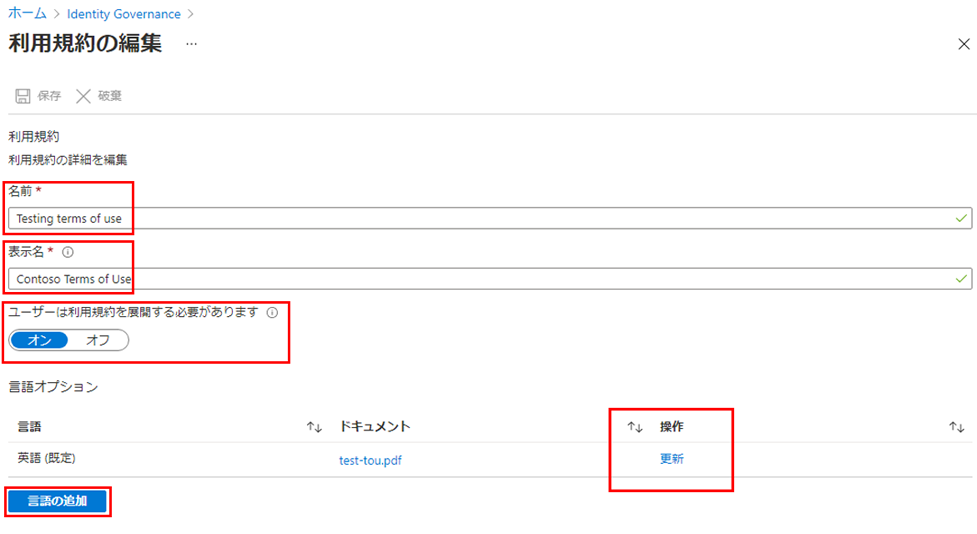

1. 完了したら、**「保存」** を選択して変更を保存します。

## 既存の利用規約ドキュメントを更新する

場合によっては、利用規約ドキュメントの更新が必要になることがあります。

1. 編集する利用規約を選択します。

1. **「利用規約の編集」** を選択します。

1. **「言語オプション」** のテーブルで、更新する利用規約の言語を確認し、**「操作」** 列の **「更新」** を選択します。

    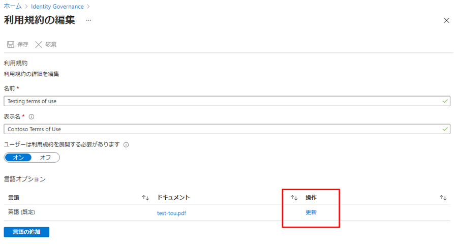

1. 「利用規約のバージョンの更新」ウィンドウでは、利用規約ドキュメントの新しいバージョンをアップロードできます。

1. さらに、次回のサインイン時にこの新しいバージョンに同意するようにユーザーに要求したい場合は、**「再同意を要求」** トグル ボタンを使用できます。ユーザーに再同意を要求しない場合、ユーザーの以前の同意は最新の状態に保たれ、以前に同意していない、または同意が失効した新規ユーザーにのみ新しいバージョンが表示されます。

    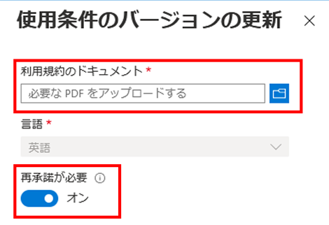

1. 新しい PDF をアップロードして再同意を決定したら、**「追加」** を選択します。

1. これで、「ドキュメント」列に最新バージョンが表示されます。
